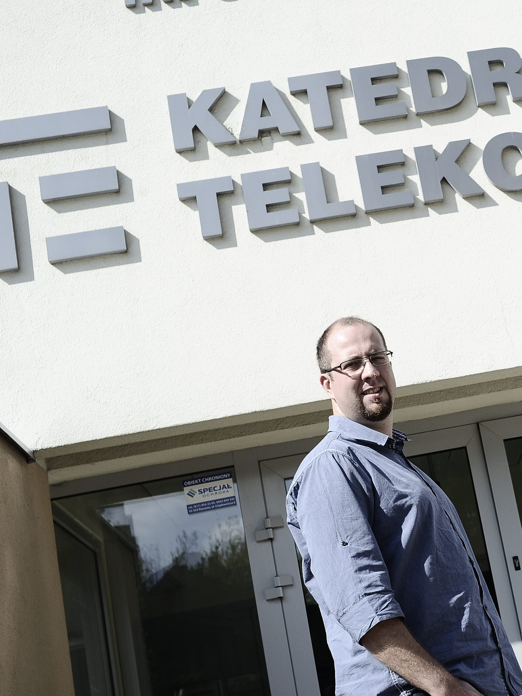
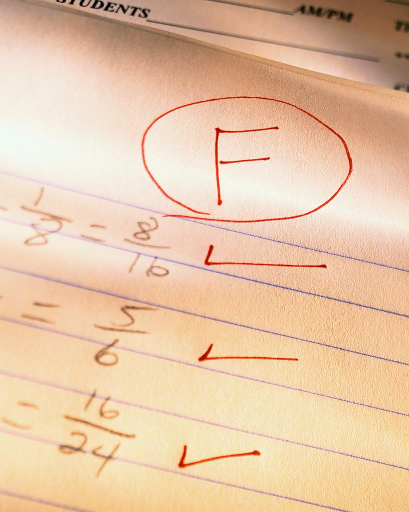
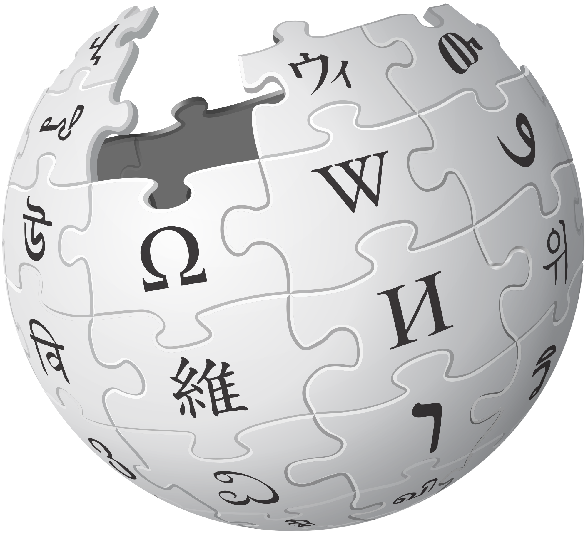
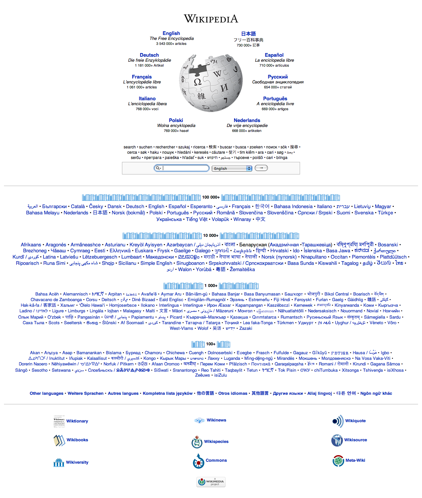
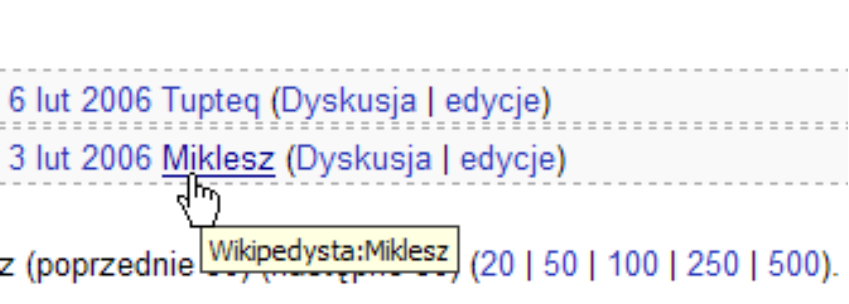
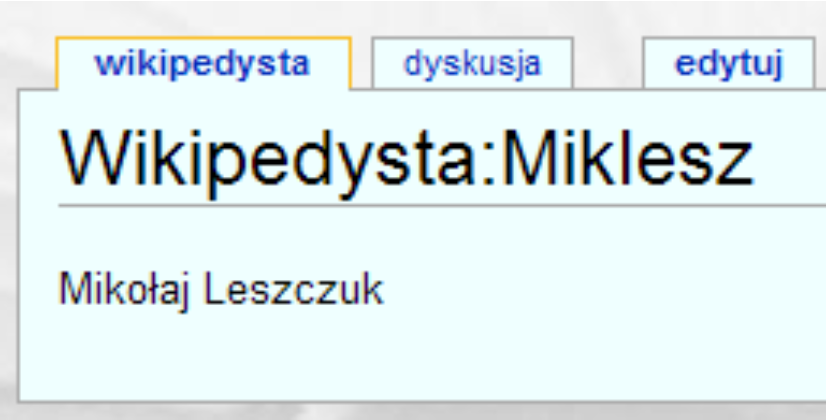
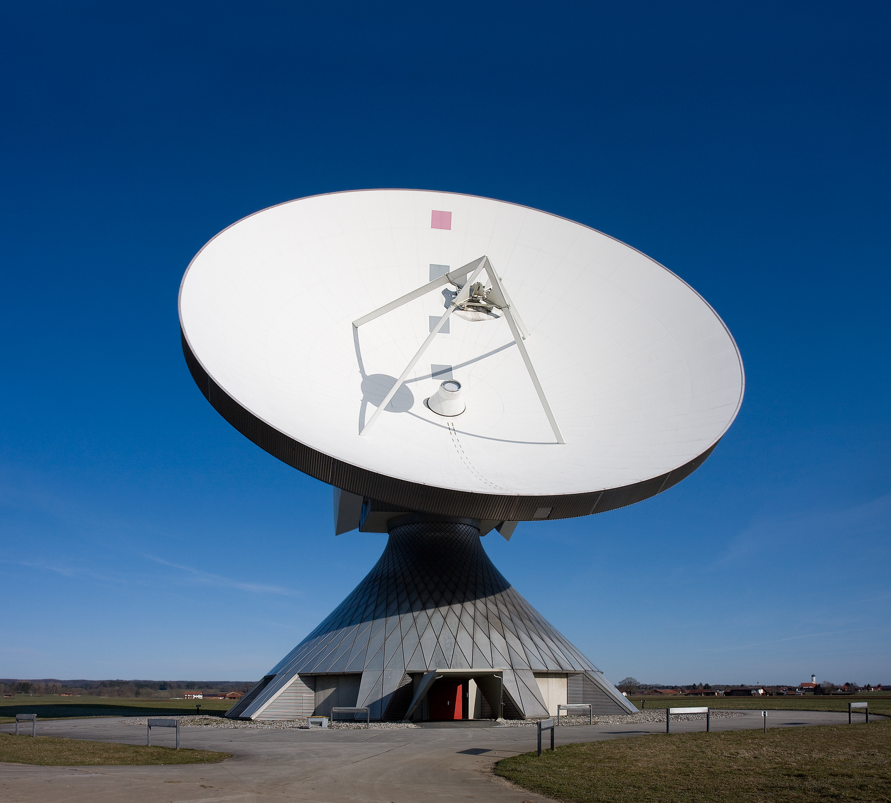

<!-- .slide: class="title-slide" -->

# Podstawy telekomunikacji

## Wprowadzenie do przedmiotu

Mikołaj Leszczuk

---

## Spis treści wykładu

- O mnie i kontakt
- Organizacja wykładu i egzamin
- Program przedmiotu
- Projekt w Wikipedii

---

<!-- .slide: class="section-slide" -->

# O mnie

Głównie: jak się ze mną skontaktować.

---

## Ogólne informacje

Mikołaj Leszczuk

- dr hab. inż.
- Akademia Górniczo-Hutnicza
- Instytut Telekomunikacji
- Kraków

---

## Kontakt ze mną

- Osobiście: w czasie wykładów i egzaminów oraz w Instytucie Telekomunikacji AGH
- E-mail: [mikolaj@leszcz.uk](mailto:mikolaj@leszcz.uk)
- Telefon: +48 607 720 398
- Przez dziekanat
- Materiały dydaktyczne: [github.com/miklesz/PT](https://github.com/miklesz/PT)

---

<!-- .slide: class="section-slide" -->

# Wykład

Zapamiętaj, zanim zapytasz po raz setny, czy będzie egzamin.

---

## Jak zorganizowany jest wykład?

- 30 godzin lekcyjnych
- Krótkie przerwy techniczne między dłuższymi blokami
- Zakończony egzaminem

---

## Program wykładu (1/2)

- Wprowadzenie do przedmiotu
- Co to jest telekomunikacja?
- Podstawowe pojęcia, jednostki i ograniczenia
- Media transmisyjne: kable miedziane, światłowodowe i bezprzewodowe
- Transmisja sygnałów: systemy dostępu wielokrotnego

---

## Program wykładu (2/2)

- Kodowanie sygnałów
- Podstawowe zagadnienia sieciowe
- Routing: algorytmy i protokoły
- Strumieniowanie treści multimedialnych
- Człowiek jako ósma warstwa modelu ISO/OSI
- Quality of Experience

---

## Egzamin

**Pytania sprawdzają wiedzę**

- wyjaśnienie konkretnego pojęcia,
- rozwiązanie prostego zadania.

**Terminy**

- termin zerowy na ostatnim wykładzie,
- termin pierwszy i drugi w sesji,
- ewentualny termin dodatkowy: decyzja uczelni.

---

## Przykładowe pytania egzaminacyjne

- Omów podstawowe cechy metody CSMA/CD.
- Opisz pojęcie MAC.
- Podaj niesystematyczny ciąg kodowy.
- Dokonaj przekłamania ciągu kodu.
- Określ maksymalną liczbę słów kodowych.

- Opisz cechy warstwy fizycznej ISO/OSI.
- Określ odległość Hamminga: `10001–10000` oraz `00010–10100`.
- Dla sieci `149.156.114.128/25` podaj broadcast i przykład adresu hosta.

---

<!-- .slide: class="section-slide" -->

# Projekt

Zanim zapytasz po raz dwusetny, jak go zaliczyć.

---

## Opis zajęć projektowych (1/2)

Studenci opracowują **hasła encyklopedyczne w Wikipedii**:

- od podstaw albo
- przez rozwinięcie istniejącego hasła.

---

## Opis zajęć projektowych (2/2)

- Udział biorą wszyscy studenci: pojedynczo albo w zespołach dwuosobowych.
- Każdy student potrzebuje **własnego konta Wikipedii**.
- Student lub zespół otrzymuje zalążek albo propozycję tematu.
- Celem jest rozwinięcie hasła możliwie blisko standardu „artykułu na medal”.

---

## Opieka nad projektem

- Kolejne slajdy wprowadzają w zasady Wikipedii.
- Celem jest praca zgodna z wytycznymi encyklopedii.
- Projekt zaczyna się z pierwszym wykładem i trwa przez cały semestr.

---

## Podstawowe cechy Wikipedii

- wolna encyklopedia tworzona na wolnej licencji,
- encyklopedia internetowa,
- może być edytowana przez każdego,
- ma tysiące redaktorów: Wikipedystów i internautów.

---

## Wprowadzenie dla studentów

- Wielu Wikipedystów jest studentami.
- Prawie wszyscy pracują jako ochotnicy.
- Edytowanie Wikipedii jest odpowiedzialnym, ale często także przyjemnym hobby.
- To jedna z niewielu prac zaliczeniowych, która może zostać użyteczna dla tysięcy osób.

---

## Więcej o Wikipedii

- Początek projektu: **2001**
- Setki niezależnych wersji językowych
- Utrzymanie: **Fundacja Wikimedia**, organizacja non-profit

---

## Dlaczego Wikipedia? (1/2)

**Wartościowy ślad po Waszej pracy**

- nowe hasła,
- rozwinięte hasła,
- bez naruszania praw autorskich.

---

## Dlaczego Wikipedia? (2/2)

- Twórzcie podpisane konta: przynajmniej imię i nazwisko.
- Edytujcie wyłącznie po zalogowaniu.
- Konto pozwala rozpoznać Wasz wkład w projekt.

---

## Start (1/3)

- [Pomoc: Wstęp](https://pl.wikipedia.org/wiki/Pomoc:Wst%C4%99p)
- [Zalecenia dla uczniów i studentów](https://pl.wikipedia.org/wiki/Wikipedia:Projekty_szkolne_i_akademickie/zalecenia_dla_uczni%C3%B3w_i_student%C3%B3w)
- [Spis treści pomocy](https://pl.wikipedia.org/wiki/Pomoc:Spis_tre%C5%9Bci)

---

## Start (2/3)

- [Pytania nowicjuszy](https://pl.wikipedia.org/wiki/Pomoc:Pytania_nowicjuszy)
- [FAQ](https://pl.wikipedia.org/wiki/Pomoc:FAQ)
- Gdy nadal nie ma odpowiedzi: skontaktuj się z prowadzącym.

---

## Start (3/3)

- Wszystkie tematy pomocy: [spis treści](https://pl.wikipedia.org/wiki/Pomoc:Spis_tre%C5%9Bci)
- Podczas edycji korzystaj ze [ściągi formatowania](https://pl.wikipedia.org/wiki/Pomoc:Formatowanie_tekstu).
- Najpierw można poćwiczyć w [brudnopisie](https://pl.wikipedia.org/wiki/Wikipedia:Brudnopis).

---

## Edycja

- Załóż konto przed pierwszą edycją: [Pomoc: logowanie](https://pl.wikipedia.org/wiki/Pomoc:Logowanie).
- Własne konto jest konieczne, aby można było zweryfikować i ocenić Twoją pracę.

---

## Standardy Wikipedii

- Wikipedia nie jest projektem ograniczonym do uczelni.
- Jesteśmy gośćmi i powinniśmy zachować właściwe standardy.
- Przeczytaj [Wiki-etykietę](https://pl.wikipedia.org/wiki/Wikipedia:Wikietykieta).
- Pomyśl, jakie wrażenie ma po pracy pozostać o Tobie i AGH.

---

## Komunikacja (1/3)

- Kontaktować mogą się prowadzący, inni studenci i Wikipedyści spoza uczelni.
- Rozmowy prowadzi się przez [strony dyskusji](https://pl.wikipedia.org/wiki/Pomoc:Strona_dyskusji).
- Podczas pracy loguj się i sprawdzaj wiadomości, podobnie jak pocztę.

---

## Komunikacja (2/3)

- Po zalogowaniu nowa wiadomość pojawia się jako pomarańczowy komunikat.
- Aby komunikat zniknął, trzeba go otworzyć i przeczytać wiadomość.

---

## Komunikacja (3/3)

- Nowe wiadomości zostawia się na dole strony dyskusji rozmówcy.
- Edytuj stronę dyskusji, nie stronę użytkownika.
- Zawsze dodawaj [podpis](https://pl.wikipedia.org/wiki/Pomoc:Podpis_wikipedysty): `~~~~`.

---

## Podpisywanie kont (1/2)

**Konto powinno pozwalać jednoznacznie rozpoznać autora.**

W razie potrzeby uzupełnij nazwę użytkownika i stronę użytkownika o dane identyfikujące autora pracy.

---

## Podpisywanie kont (2/2)

Na stronie użytkownika warto umieścić:

- imię i nazwisko,
- informację, że konto jest używane w projekcie akademickim,
- ewentualnie kontakt w Wikipedii.

---

## Prawa autorskie (1/2)

- Wikipedia jest dostępna bez opłat.
- Treści są objęte wolną licencją.
- Nie wolno włączać materiałów naruszających prawa autorskie.

---

## Prawa autorskie (2/2)

- Tworząc i rozbudowując hasła, **nie plagiatuj**.
- Treści naruszające prawa autorskie są usuwane.
- Skutkiem może być wykluczenie z projektu studenckiego.

---

## Jakie hasła opracować?

- Wyłącznie tematy ściśle związane z przedmiotem.
- Punkt wyjścia: [kategoria „Telekomunikacja”](https://pl.wikipedia.org/wiki/Kategoria:Telekomunikacja).
- Pierwsze zadanie: samodzielnie wybrać hasło.

Fotografia: Richard Bartz (Makro Freak), CC BY-SA 2.5.

---

## Zadanie a liczebność zespołu

**Zespół dwuosobowy**

- opracowanie od podstaw nowego hasła,
- inspiracja: [propozycje tematów](https://pl.wikipedia.org/wiki/Wikipedia:Propozycje_temat%C3%B3w).

**Praca jednoosobowa**

- rozwinięcie istniejącego hasła,
- inspiracje: [strony wymagające dopracowania](https://pl.wikipedia.org/wiki/Wikipedia:Strony_wymagaj%C4%85ce_dopracowania) i [zalążki](https://pl.wikipedia.org/wiki/Kategoria:Zal%C4%85%C5%BCki_artyku%C5%82%C3%B3w).

---

## Inne sposoby szukania tematu (1/3)

- [Kolejka potrzebnych artykułów](https://pl.wikipedia.org/wiki/Szablon:Potrzebne/Kolejka)
- [Strony do przetłumaczenia](https://pl.wikipedia.org/wiki/Wikipedia:Strony_do_przet%C5%82umaczenia)
- [Tłumaczenie miesiąca](https://pl.wikipedia.org/wiki/Wikipedia:T%C5%82umaczenie_miesi%C4%85ca)

---

## Inne sposoby szukania tematu (2/3)

- [Zalążki](https://pl.wikipedia.org/wiki/Wikipedia:Zal%C4%85%C5%BCki)
- [Brakujące artykuły](https://pl.wikipedia.org/wiki/Wikipedia:Brakuj%C4%85ce_artyku%C5%82y)
- [Strony do poszerzenia](https://pl.wikipedia.org/wiki/Kategoria:Strony_do_poszerzenia)

---

## Inne sposoby szukania tematu (3/3)

- [Porzucone strony](https://pl.wikipedia.org/wiki/Specjalna:Porzucone_strony)
- [Artykuły kontrowersyjne](https://pl.wikipedia.org/wiki/Wikipedia:Artyku%C5%82y_kontrowersyjne)
- [Wikiprojekt: ilustrowanie](https://pl.wikipedia.org/wiki/Wikiprojekt:Ilustrowanie)

---

## Rozpoczęcie pracy (1/2)

1. Wybierz pracę samodzielną albo zespół dwuosobowy.
2. Przy pracy w zespole dobierz drugą osobę.
3. Załóż konto, jeśli jeszcze go nie masz.
4. Wybierz hasło do edycji.

---

## Rozpoczęcie pracy (2/2)

Wyślij do prowadzącego:

- wybrane hasło,
- imię i nazwisko,
- numer grupy i indeksu,
- nazwę użytkownika Wikipedii,
- analogiczne dane drugiej osoby, gdy pracujecie w parze.

**Pracę zacznij dopiero po potwierdzeniu tematu.**

---

## Zakończenie pracy

- Prześlij informację, że hasło jest gotowe albo rozwinięte.
- Jeżeli pojawią się uwagi i do końca semestru pozostał czas, popraw hasło.

---

## Skala ocen i ocenianie projektów

- **2.0–4.5:** zależnie od jakości rozwinięcia hasła.
- **5.0:** za wybitnie opracowane hasło lub jednoosobowe stworzenie nowego hasła.
- **Maksymalnie 3.0:** za projekt oddany po terminie.

---

## Co robić, a czego unikać (1/2)

- Przy wątpliwościach zajrzyj do [zasad edycji](https://pl.wikipedia.org/wiki/Wikipedia:Zasady).
- Szukaj inspiracji na [liście brakujących haseł](https://pl.wikipedia.org/wiki/Wikipedia:Brakuj%C4%85ce_artyku%C5%82y).
- Korzystaj z książek, ale nie kopiuj treści z naruszeniem praw autorskich.

---

## Co robić, a czego unikać (2/2)

- Wykorzystuj materiały, które już opracowałeś na zajęciach.
- Hasło encyklopedyczne nie jest esejem ani felietonem.
- Opinie przypisuj autorom, np. „A powiedział B o C”.
- Nie poświęcaj zbyt dużo czasu na naukę składni: korzystaj z edytora i pomocy.
- Można także napisać o uczelni.

---

## Kilka przydatnych rad (1/2)

1. Przy każdej edycji wypełnij [opis zmian](https://pl.wikipedia.org/wiki/Wikipedia:Opis_zmian).
2. Obejrzyj podgląd.
3. Zapisz dopiero wtedy, gdy strona wygląda tak, jak powinna.

---

## Kilka przydatnych rad (2/2)

- Zakładka [„historia i autorzy”](https://pl.wikipedia.org/wiki/Pomoc:Historia_strony) pokazuje historię strony.
- W opisie zmian zaznacz, co zostało zrobione.
- Używaj listy obserwowanych stron.

---

## Wikipedia: jak nie stracić zaliczenia

- **Nie kopiuj** z nieautoryzowanych źródeł.
- **Opisuj konto**, aby dało się przypisać wkład.
- **Integruj wkład** z istniejącym artykułem.
- **Formatuj tekst**: Wikipedia to więcej niż „goły” tekst.

---

## Wymiana e-maili ze mną (1/2)

- Odpowiadam na e-maile z pytaniami, zwykle w ciągu kilku dni.
- Jeżeli nie ma odpowiedzi, wiadomość mogła nie dotrzeć.
- Filtr antyspamowy może odrzucać wiadomości z nietypowych adresów.

---

## Wymiana e-maili ze mną (2/2)

- Podczas delegacji możesz dostać automatyczną odpowiedź; oznacza ona, że e-mail doszedł.
- Czytaj auto-odpowiedź i nie wysyłaj wiadomości ponownie.
- E-maile podpisuj.
- Rozpoczęcie pracy przed potwierdzeniem tematu jest ryzykowne.
- Projekt jest zaliczony dopiero po otrzymaniu e-maila z oceną.

---

## Ważna informacja

- Przed edycją zawsze się zaloguj.
- Bez logowania nie da się zweryfikować Twojego wkładu, a więc także go ocenić.
- Każdy student przekazuje prowadzącemu login, pod którym edytuje.

---

## Wstępne ćwiczenie (1/3)

- Po zapoznaniu się z Wikipedią wykonaj kilka ćwiczeń.
- Dają doświadczenie w edycji stron i pomagają lepiej przygotować projekt.
- W menu bocznym Wikipedii zawsze są dostępne FAQ i strony pomocy.

---

## Wstępne ćwiczenie (2/3)

- Spróbuj najpierw poprawić lub poszerzyć istniejący artykuł.
- Możesz zacząć od zagadnienia z własnego hobby.
- Priorytetowo rozwijaj artykuły związane z telekomunikacją.

---

## Wstępne ćwiczenie (3/3)

- Gdy chcesz zrobić więcej, nie musisz prosić o zgodę.
- Znacząca rozbudowa oznacza, że artykuł przestaje być zalążkiem.
- Na karcie „historia i autorzy” sprawdź, czy hasło ma więcej niż 5000 znaków (bajtów).

---

## Przydatne linki w Wikipedii

- [Wikipedia: strona główna](https://pl.wikipedia.org/)
- [GNU Free Documentation License](https://pl.wikipedia.org/wiki/GNU_Free_Documentation_License)
- [Projekty akademickie: zalecenia](https://pl.wikipedia.org/wiki/Wikipedia:Projekty_szkolne_i_akademickie/zalecenia_dla_uczni%C3%B3w_i_student%C3%B3w)
- [Creative Commons](https://pl.wikipedia.org/wiki/Licencja_Creative_Commons)
