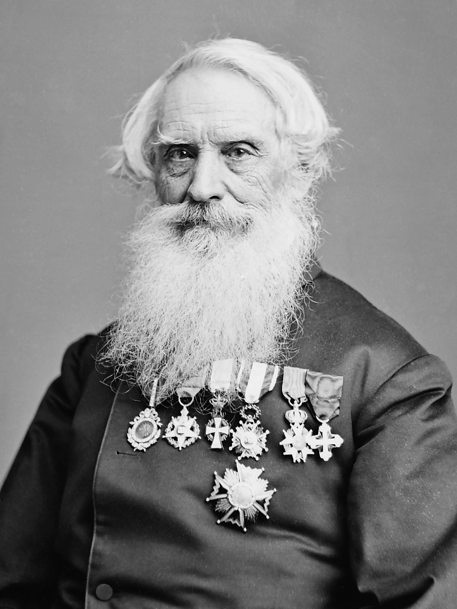
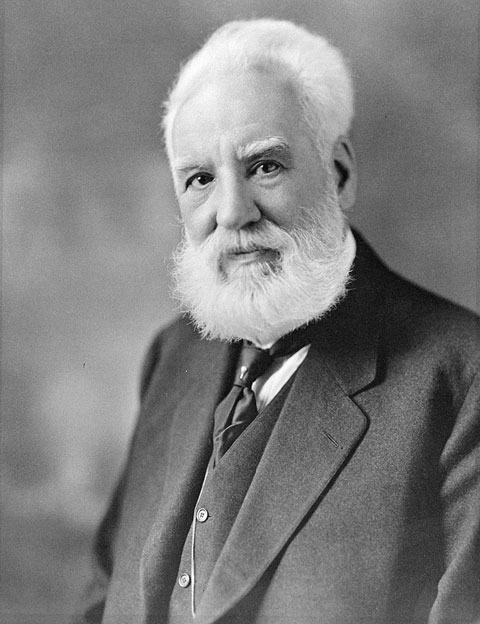
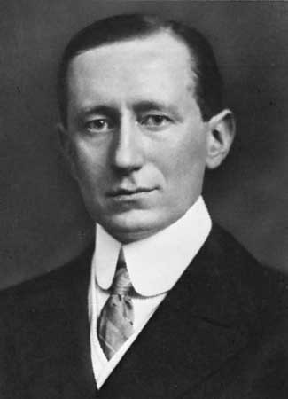
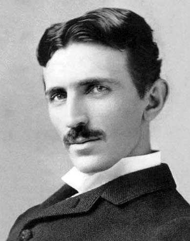
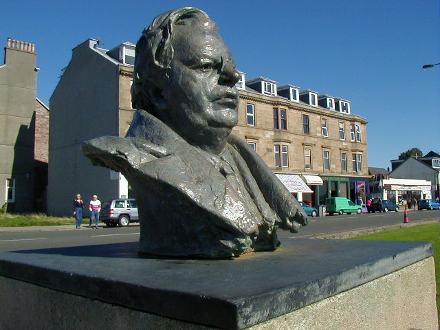
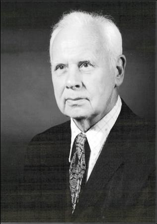
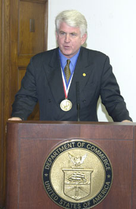
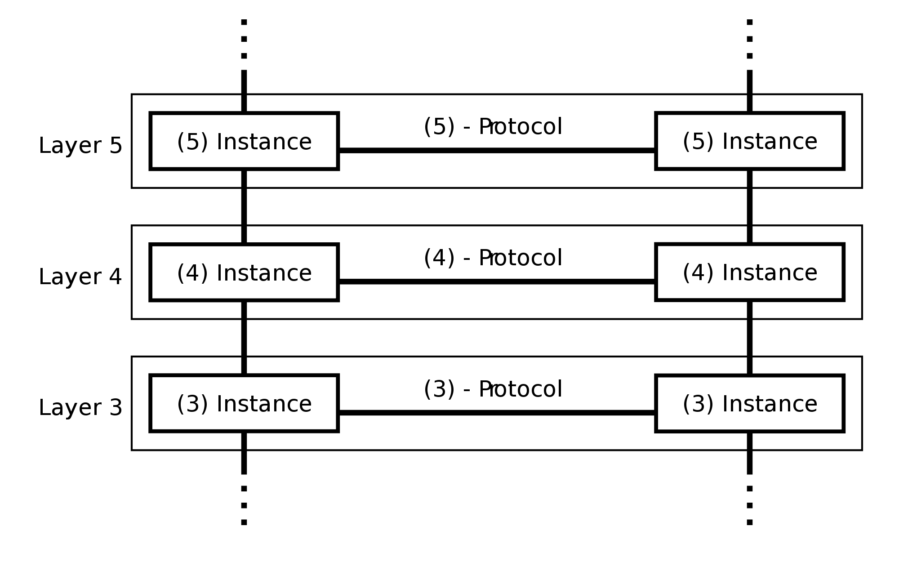
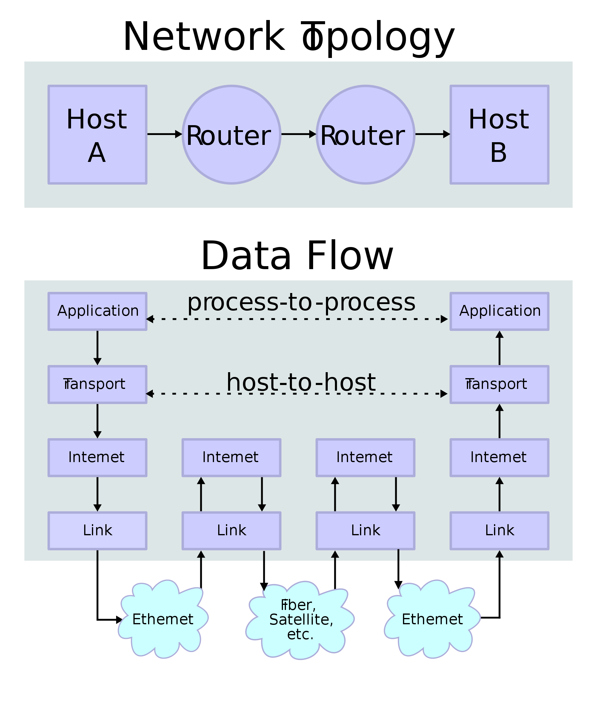
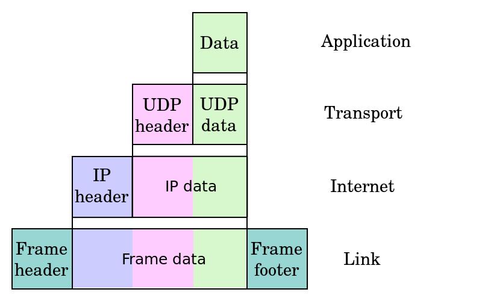

<!-- .slide: class="title-slide" -->

# Co to jest telekomunikacja?

Mikołaj Leszczuk

---

## Plan wykładu

- pojęcie telekomunikacji,
- rys historyczny: od telegrafu do Internetu,
- architektury systemów telekomunikacyjnych,
- modele ISO/OSI i TCP/IP.

---

<!-- .slide: class="section-slide" -->

# Pojęcie telekomunikacji

---

## Telekomunikacja

> Dziedzina techniki i nauki zajmująca się transmisją wszelkiego rodzaju informacji na odległość.

Przedmiotem transmisji mogą być między innymi: tekst, dźwięk, obraz, dane pomiarowe i dane komputerowe.

---

<!-- .slide: class="section-slide" -->

# Rys historyczny

Od znaków elektrycznych do globalnej sieci komputerowej.

---

## Samuel F. B. Morse: telegraf

- W 1832 r. wykorzystał magnetyzm do stworzenia telegrafii elektromagnetycznej.
- Współtworzył kod znany jako alfabet Morse'a.
- Kod korzystał z trzech stanów: brak sygnału, sygnał krótki i długi.

---

## Alexander Graham Bell: telefon

- Szkocki wynalazca telefonu i wielu innych urządzeń telekomunikacyjnych.
- Zajmował się fizjologią dźwięku.
- W ramach badań opatentował głośnik i mikrofon, a potem urządzenie przekazujące dźwięk na odległość.

---

## Guglielmo Marconi: radio

- Pionier radia i przemysłu elektronicznego.
- W 1901 r. nawiązał łączność bezprzewodową między Nową Fundlandią i Kornwalią.
- Laureat Nagrody Nobla z fizyki w 1909 r. za wkład w rozwój telegrafii bezprzewodowej.

---

## Nikola Tesla: radio i sterowanie zdalne

- Autor setek patentów w dziedzinie urządzeń elektrycznych.
- Zaprezentował komunikację radiową już w 1893 r.
- Tworzył także urządzenia zdalnie sterowane drogą radiową.

---

## John Logie Baird: telewizja

- Szkocki inżynier i twórca pierwszego działającego systemu telewizyjnego.
- W 1925 r. zademonstrował transmisję ruchomych obrazów w Londynie.
- Jego prace stały się podstawą eksperymentów BBC z nadawaniem telewizyjnym.

---

## Od komputerów do Internetu

- **George Stibitz:** zdalnie sterowany kalkulator elektromechaniczny; w 1940 r. przesłał zapytanie dalekopisem do komputera w Nowym Jorku.
- **Robert Metcalfe:** współtwórca Ethernetu, technologii łączenia komputerów na krótkich dystansach.

---

<!-- .slide: class="section-slide" -->

# Architektury sieci

---

## Dlaczego warstwy?

- W latach 50. komputery i ich utrzymanie kosztowały miliony dolarów.
- Firmy potrzebowały dostępu do centralnego komputera z odległych filii.
- Rozwiązaniem stały się architektury sieci: uporządkowane sposoby przekazu informacji między urządzeniami końcowymi.

---

## Architektura sieci

Zwykle jest organizowana **warstwowo**. Poszczególne architektury różnią się:

- liczbą warstw,
- sposobem ich realizacji,
- zasadami nawiązywania połączenia między stacjami.

---

## Architektury zamknięte i otwarte

**Zamknięte**

- historycznie pierwsze,
- duży wkład w rozwój komunikacji,
- przykłady: IBM SNA, DEC DNA.

**Otwarte**

- współczesne standardy,
- interoperacyjność urządzeń różnych producentów,
- przykłady: ISO/OSI, TCP/IP.

---

<!-- .slide: class="section-slide" -->

# Model ISO/OSI

---

## ISO/OSI: idea modelu

- Model systemów otwartych: urządzeń zdolnych do wymiany informacji z innymi systemami otwartymi.
- Standard ISO 7498, rozwijany od końca lat 70.
- Siedem niezależnych warstw; każda korzysta z usług warstwy niższej.

---

## Siedem warstw ISO/OSI

  
Aplikacji

Prezentacji

Sesji

Transportowa

Sieciowa

Łącza danych

Fizyczna

Komunikacja między odpowiadającymi sobie warstwami jest logiczna; faktyczna transmisja odbywa się przez medium fizyczne.

---

## Dlaczego model jest użyteczny?

- Nie narzuca fizycznej implementacji warstw.
- Pozwala producentom realizować warstwy niezależnie.
- Ułatwia współpracę urządzeń różnych dostawców.
- Daje programistyczną separację odpowiedzialności.

---

## Materiał: model ISO/OSI

<video controls preload="metadata" poster="media/image8.png"><source src="media/slide-021-media1.mp4" type="video/mp4"></video>

---

## Warstwa 1: fizyczna

- sprzężenie z medium,
- sygnały, parametry elektryczne i mechaniczne,
- strumień bitów.

---

## Warstwa 2: łącza danych

- wykrywanie błędów,
- niezawodność łącza i przepływ,
- przykład: Ethernet, WLAN.

---

## Warstwa 3: sieciowa

- przesyła dane między węzłami sieci,
- wyznacza drogę danych,
- obsługuje błędy komunikacji i podsieć transportową,
- przykłady: IP, IPX.

---

## Warstwa 4: transportowa

- usługi połączeniowe „od końca do końca”,
- przezroczysty transfer danych między stacjami,
- opcjonalny podział danych na mniejsze jednostki,
- przykłady: TCP i UDP.

---

## Warstwy 5–7

**Sesji**

Sterowanie wymianą danych, dialogiem aplikacji i punktami retransmisji.

**Prezentacji**

Format danych, kompresja, kodowanie, szyfrowanie i konwersje.

**Aplikacji**

Usługi komunikacyjne dla programów użytkownika, np. przeglądarek i klientów pocztowych.

---

## Protokoły

- Ustalają zasady komunikacji.
- Definiują format komunikatów i sposób odpowiedzi.
- Określają zachowanie w błędach i sytuacjach wyjątkowych.
- Razem tworzą **stos protokołów**.

---

## Pakiety i ramki

NagłówekDaneOpcjonalne informacje kontrolne

- Warstwy tworzą pakiety i ramki o strukturze zdefiniowanej przez protokół.
- Krótsze jednostki ograniczają skutki błędów i zmniejszają opóźnienia.
- Nagłówek zwykle zawiera adresy, identyfikator, numer części informacji i dane do obsługi błędów.

---

## Protokoły poszczególnych warstw

**Aplikacyjne**

FTP, Telnet, SMTP, SNMP, NetBIOS

**Transportowe**

TCP, SPX, NetBEUI

**Sieciowe**

IP, IPX

Zapewniają adresowanie, routing, weryfikację błędów oraz retransmisję.

---

## Dialog równorzędnych warstw

Przykładowe zadania protokołów:

- żądania, odpowiedzi i potwierdzenia,
- buforowanie i restart transmisji,
- priorytety, kolejność i numerowanie pakietów,
- adresowanie, routing, wykrywanie błędów i retransmisja.

---

## Kapsułkowanie protokołów

**Kapsułkowanie** to przesyłanie pakietu jednego protokołu wewnątrz pakietu innego protokołu.

W drodze od aplikacji do medium dane przy każdej niższej warstwie zyskują nową formę i własny nagłówek. Tunelowanie jest praktycznym zastosowaniem kapsułkowania.

---

## Materiał: pakiety w stosie protokołów

<video controls preload="metadata" poster="media/image12.png"><source src="media/slide-043-media2.mp4" type="video/mp4"></video>

---

## Materiał: przepływ danych przez ISO/OSI

<video controls preload="metadata" poster="media/image13.png"><source src="media/slide-044-media3.mp4" type="video/mp4"></video>

---

## Konwersja protokołów

- Tłumaczenie sygnałów elektrycznych albo formatów danych.
- Umożliwia transmisję między różnymi systemami komunikacyjnymi.
- Może obejmować np. zmianę kodu znaków lub transmisji asynchronicznej na synchroniczną.

---

## Materiał: jak zapamiętać warstwy

<video controls preload="metadata" poster="media/image14.png"><source src="media/slide-046-media4.mp4" type="video/mp4"></video>

---

<!-- .slide: class="section-slide" -->

# Model TCP/IP

---

## Uproszczony stos protokołów

Model TCP/IP łączy funkcje siedmiu warstw OSI w cztery warstwy:

  
Aplikacji

Transportowa

Internetu

Dostępu do sieci

---

## OSI a TCP/IP

| ISO/OSI | TCP/IP |
| --- | --- |
| Aplikacji, prezentacji, sesji | Aplikacji |
| Transportowa | Transportowa |
| Sieciowa | Internetu |
| Łącza danych, fizyczna | Dostępu do sieci |

---

## Warstwa dostępu do sieci

- Odbiera pakiety IP i przesyła je przez konkretną sieć.
- Definiuje sprzęt sieciowy i sterowniki urządzeń.

---

## Warstwa Internetu

- Obsługuje komunikację między maszynami.
- Rozpoznaje odbiorcę i decyduje o wysłaniu bezpośrednio albo przez ruter.
- Kapsułkuje dane, wypełnia nagłówki i weryfikuje dane przychodzące.

---

## Warstwa transportowa TCP/IP

- Komunikacja między programami użytkownika.
- Kontrola przepływu informacji.
- Niezawodność: potwierdzenia po stronie odbiorcy i ponowne wysyłanie utraconych pakietów.

---

## Warstwa aplikacji TCP/IP

- Najwyższy poziom: programy użytkowe.
- Dostęp do usług niższych warstw.
- Dane mogą być przesyłane jako komunikaty lub strumienie bajtów.

---

## Podsumowanie

- Telekomunikacja to transmisja informacji na odległość.
- Warstwowe architektury porządkują złożoność sieci.
- ISO/OSI pomaga opisywać role warstw, TCP/IP jest praktycznym stosem Internetu.
- Protokoły, pakiety, kapsułkowanie i konwersja umożliwiają współpracę systemów.

---

## Materiały dodatkowe

- [ISO](https://www.iso.org/)
- [Wikipedia](https://pl.wikipedia.org/)
- W. R. Stevens, *TCP/IP Illustrated*
- D. Comer, *Internetworking with TCP/IP*
