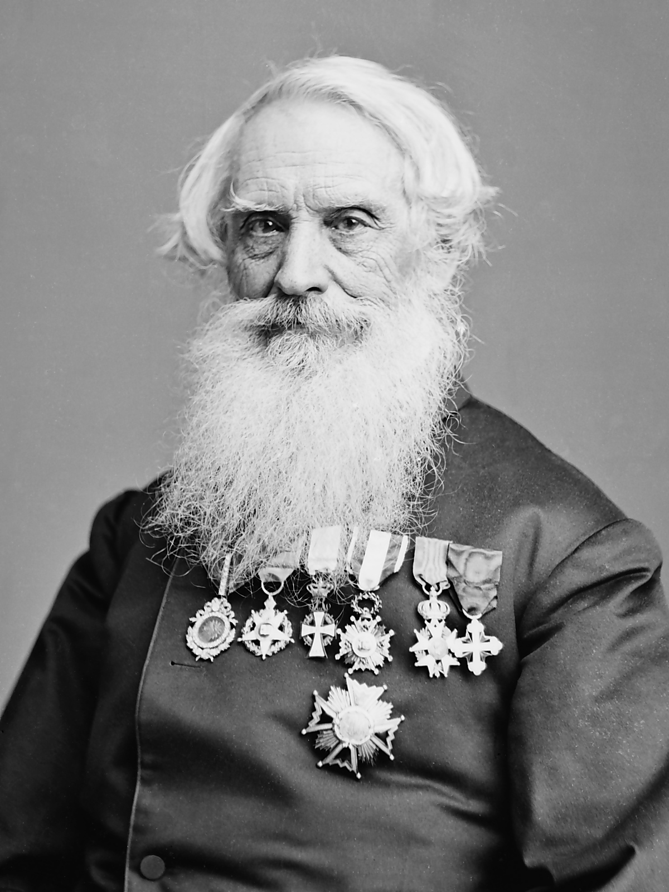
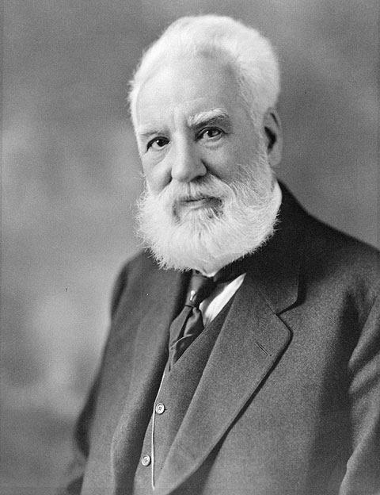
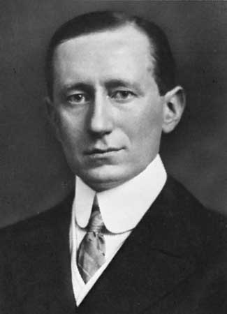
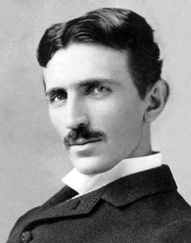
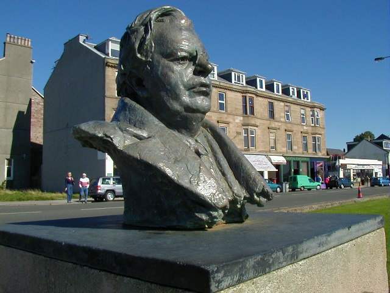
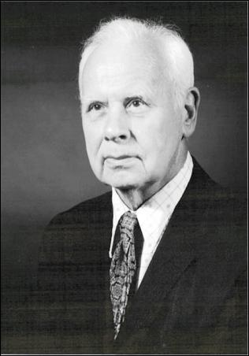
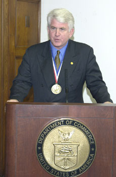
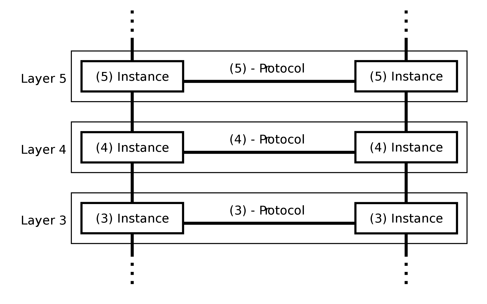
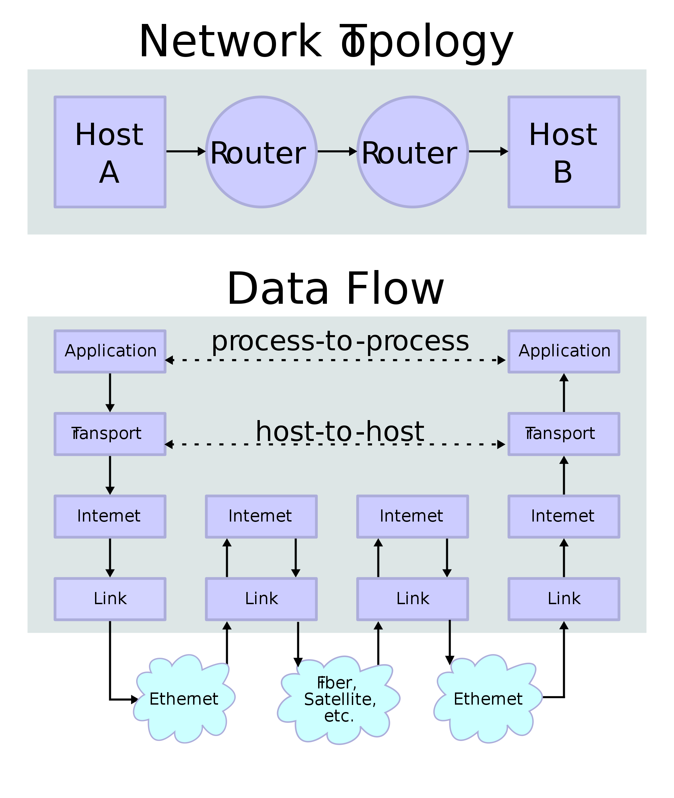
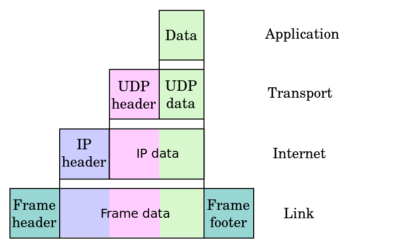

<!-- .slide: class="title-slide" -->

# Co to jest telekomunikacja?

Mikołaj Leszczuk

---

## Plan wykładu

- pojęcie telekomunikacji,
- rys historyczny: od telegrafu do Internetu,
- architektury systemów telekomunikacyjnych,
- modele ISO/OSI i TCP/IP.

---

<!-- .slide: class="section-slide" -->

# Pojęcie telekomunikacji

---

## Telekomunikacja

> Dziedzina techniki i nauki zajmująca się transmisją wszelkiego rodzaju informacji na odległość.

Przedmiotem transmisji mogą być między innymi: tekst, dźwięk, obraz, dane pomiarowe i dane komputerowe.

---

<!-- .slide: class="section-slide" -->

# Rys historyczny

Od znaków elektrycznych do globalnej sieci komputerowej.

---

## Samuel F. B. Morse: telegraf

- Amerykański wynalazca, a także malarz i rzeźbiarz.
- W 1832 r. wykorzystał elektromagnetyzm do prac nad telegrafem.
- Uzyskał patent na własny system telegraficzny; nad podobnymi urządzeniami pracowali także inni wynalazcy.

---

## Alfabet Morse'a

Morse opracowywał kod telegraficzny wraz z **Alfredem Vailem**.

W pierwotnym opisie transmisja rozróżnia trzy stany:

- brak sygnału,
- krótki sygnał,
- długi sygnał.

Odpowiednie sekwencje reprezentują litery i cyfry.

---

## Alexander Graham Bell: telefon

- Szkocki wynalazca telefonu i wielu innych urządzeń telekomunikacyjnych.
- Pracował jako logopeda i nauczyciel muzyki; zajmował się fizjologią dźwięku.
- W 1870 r. wyjechał do Ameryki Północnej, gdzie kontynuował badania nad dźwiękiem.
- W ramach badań opatentował głośnik i mikrofon, a potem urządzenie przekazujące dźwięk na odległość.

---

## Guglielmo Marconi: radio

- Pionier radia i przemysłu elektronicznego.
- W grudniu 1901 r. nawiązał łączność bezprzewodową między St. John's (Nowa Fundlandia) a Poldhu (Kornwalia).
- Laureat Nagrody Nobla z fizyki w 1909 r. za wkład w rozwój telegrafii bezprzewodowej.

---

## Nikola Tesla: radio i sterowanie zdalne

- Autor setek patentów w dziedzinie urządzeń elektrycznych.
- Pracował między innymi nad silnikiem i prądnicą prądu przemiennego oraz transformatorem rezonansowym.
- W 1893 r. zaprezentował komunikację radiową na spotkaniu National Electric Light Association.
- Tworzył także urządzenia zdalnie sterowane drogą radiową.

---

## John Logie Baird: telewizja

- Szkocki inżynier i twórca pierwszego działającego systemu telewizyjnego.
- 25 marca 1925 r. zademonstrował transmisję ruchomych obrazów w londyńskim domu towarowym Selfridges.
- Jego prace stały się podstawą eksperymentów BBC z nadawaniem telewizyjnym rozpoczętych 30 września 1929 r.

---

## George Stibitz: zdalne obliczenia

- W 1937 r. skonstruował elektromechaniczny sumator binarny „Model K”.
- W 1939 r. zbudował zdalnie sterowany kalkulator elektromechaniczny.
- 11 września 1940 r. przesłał dalekopisem zapytanie z Dartmouth do maszyny w Nowym Jorku i otrzymał odpowiedź tą samą drogą.

---

## Robert Metcalfe: Ethernet

- Współtwórca Ethernetu, technologii łączenia komputerów w sieciach lokalnych, oraz współzałożyciel 3Com.
- W 1976 r. opublikował wraz z Davidem Boggsem opis Ethernetu w „Communications of the ACM”.
- Za prace nad sieciami lokalnymi otrzymał w 1980 r. nagrodę Grace Murray Hopper Award, a w 2005 r. National Medal of Technology.

---

<!-- .slide: class="section-slide" -->

# Architektury sieci

---

## Dlaczego warstwy?

- W latach 50. komputery i ich utrzymanie kosztowały miliony dolarów.
- Firmy potrzebowały dostępu do centralnego komputera z odległych filii.
- Rozwiązaniem stały się architektury sieci: uporządkowane sposoby przekazu informacji między urządzeniami końcowymi.

---

## Architektura sieci

Zwykle jest organizowana **warstwowo**. Poszczególne architektury różnią się:

- liczbą warstw,
- sposobem ich realizacji,
- zasadami nawiązywania połączenia między stacjami.

---

## Architektury zamknięte i otwarte

**Zamknięte**

- historycznie pierwsze,
- duży wkład w rozwój komunikacji,
- przykłady: IBM SNA (*Systems Network Architecture*) i DEC DNA (*Digital Network Architecture*).

**Otwarte**

- współczesne standardy,
- interoperacyjność urządzeń różnych producentów,
- przykłady: ISO/OSI, TCP/IP.

---

<!-- .slide: class="section-slide" -->

# Model ISO/OSI

---

## ISO/OSI: idea modelu

- ISO/OSI (*International Organization for Standardization / Open Systems Interconnection*) opisuje model systemów otwartych: urządzeń zdolnych do wymiany informacji z innymi systemami.
- Standard ISO 7498, rozwijany od końca lat 70.
- Siedem niezależnych warstw; każda korzysta z usług warstwy niższej.

---

## Siedem warstw ISO/OSI

  
7<strong>Aplikacji</strong>

  
6<strong>Prezentacji</strong>

  
5<strong>Sesji</strong>

  
4<strong>Transportowa</strong>

  
3<strong>Sieciowa</strong>

  
2<strong>Łącza danych</strong>

  
1<strong>Fizyczna</strong>

Komunikacja między odpowiadającymi sobie warstwami jest logiczna; faktyczna transmisja odbywa się przez medium fizyczne.

---

## Dlaczego model jest użyteczny?

- Nie narzuca fizycznej implementacji warstw.
- Pozwala producentom realizować warstwy niezależnie.
- Ułatwia współpracę urządzeń różnych dostawców.
- Daje programistyczną separację odpowiedzialności.

---

## Materiał: model ISO/OSI

<video controls preload="metadata" poster="media/image8.png"><source src="media/slide-021-media1.mp4" type="video/mp4"></video>

---

## Warstwa 1: fizyczna

- sprzężenie z medium,
- sygnały, parametry elektryczne i mechaniczne,
- strumień bitów.

---

## Warstwa 2: łącza danych

- wykrywanie błędów,
- niezawodność łącza i przepływ,
- przykład: Ethernet, WLAN.

---

## Warstwa 3: sieciowa

- przesyła dane między węzłami sieci,
- wyznacza drogę danych,
- obsługuje błędy komunikacji i podsieć transportową,
- przykłady: IP (*Internet Protocol*) i IPX (*Internetwork Packet Exchange*).

---

## Warstwa 4: transportowa

- usługi połączeniowe „od końca do końca”,
- przezroczysty transfer danych między stacjami,
- opcjonalny podział danych na mniejsze jednostki,
- przykłady: TCP (*Transmission Control Protocol*) i UDP (*User Datagram Protocol*).

---

## Warstwa 5: sesji

Opisuje organizację dialogu między aplikacjami: rozpoczęcie i zakończenie sesji, sterowanie wymianą oraz punkty synchronizacji, które mogą ułatwić wznowienie pracy po przerwaniu.

Model OSI przypisuje te zadania warstwie sesji. W rzeczywistym stosie TCP/IP nie zawsze istnieje dla nich osobna warstwa.

---

## Warstwa 6: prezentacji

Uzgadnia sposób reprezentacji danych między systemami: format, składnię i kodowanie znaków. Może też obejmować kompresję oraz szyfrowanie.

Przykład: nadawca zapisuje tekst w określonym kodowaniu, a odbiorca interpretuje bajty według tej samej reguły.

---

## Warstwa 7: aplikacji

Udostępnia programom usługi komunikacyjne i określa zachowanie protokołów widocznych dla aplikacji, np. HTTP, SMTP i FTP.

Przeglądarka oraz klient pocztowy są programami korzystającymi z usług tej warstwy; same nie są warstwą modelu OSI.

---

## Protokoły

- Ustalają zasady komunikacji.
- Definiują format komunikatów i sposób odpowiedzi.
- Określają zachowanie w błędach i sytuacjach wyjątkowych.
- Razem tworzą **stos protokołów**.

---

## Pakiety i ramki

NagłówekDaneOpcjonalne informacje kontrolne

- Warstwy tworzą pakiety i ramki o strukturze zdefiniowanej przez protokół.
- Krótsze jednostki ograniczają skutki błędów i zmniejszają opóźnienia.
- Protokół określa format i zwykle maksymalną długość jednostki danych.
- Nagłówek może zawierać adresy, identyfikator, numer części informacji, znacznik końca oraz dane do obsługi błędów.

---

## Protokoły poszczególnych warstw

**Aplikacyjne**

FTP (transfer plików), Telnet (zdalny terminal), SMTP (poczta), SNMP (zarządzanie), NetBIOS (usługi LAN)

**Transportowe**

TCP (niezawodny transport), SPX (transport IPX), NetBEUI (historyczny protokół LAN)

**Sieciowe**

IP (*Internet Protocol*), IPX (*Internetwork Packet Exchange*)

Zapewniają adresowanie logiczne i przekazywanie pakietów między sieciami. Ewentualna retransmisja zależy od innych protokołów i warstw.

---

## Dialog równorzędnych warstw

Przykładowe zadania protokołów:

- żądania, odpowiedzi i potwierdzenia,
- buforowanie i restart transmisji,
- priorytety, kolejność i numerowanie pakietów,
- adresowanie, routing, wykrywanie błędów i retransmisja.

---

## Kapsułkowanie protokołów

**Kapsułkowanie** to przesyłanie pakietu jednego protokołu wewnątrz pakietu innego protokołu.

W drodze od aplikacji do medium dane przy każdej niższej warstwie zyskują nową formę i własny nagłówek. Tunelowanie jest praktycznym zastosowaniem kapsułkowania: pozwala połączyć dwie sieci używające tego samego protokołu przez sieć pośrednią używającą innego.

---

## Materiał: pakiety w stosie protokołów

<video controls preload="metadata" poster="media/image12.png"><source src="media/slide-043-media2.mp4" type="video/mp4"></video>

---

## Materiał: przepływ danych przez ISO/OSI

<video controls preload="metadata" poster="media/image13.png"><source src="media/slide-044-media3.mp4" type="video/mp4"></video>

---

## Konwersja protokołów

- Tłumaczenie sygnałów elektrycznych albo formatów danych.
- Umożliwia transmisję między różnymi systemami komunikacyjnymi.
- Może obejmować np. zmianę kodu znaków (historycznie ASCII na inny kod) lub transmisji asynchronicznej na synchroniczną.

---

## Materiał: jak zapamiętać warstwy

<video controls preload="metadata" poster="media/image14.png"><source src="media/slide-046-media4.mp4" type="video/mp4"></video>

---

<!-- .slide: class="section-slide" -->

# Model TCP/IP

---

## Uproszczony stos protokołów

Model TCP/IP (*Transmission Control Protocol / Internet Protocol*) łączy funkcje siedmiu warstw OSI w cztery warstwy:

  
Aplikacji

Transportowa

Internetu

Dostępu do sieci

---

## OSI a TCP/IP

  
ISO/OSI

TCP/IP

  
Aplikacji, prezentacji, sesji

Aplikacji

  
Transportowa

Transportowa

  
Sieciowa

Internetu

  
Łącza danych, fizyczna

Dostępu do sieci

---

## Warstwa dostępu do sieci

- Odbiera pakiety IP i przesyła je przez konkretną sieć.
- Definiuje sprzęt sieciowy i sterowniki urządzeń.

---

## Warstwa Internetu

- Obsługuje komunikację między maszynami.
- Rozpoznaje odbiorcę i decyduje o wysłaniu bezpośrednio albo przez ruter.
- Kapsułkuje dane, wypełnia nagłówki i weryfikuje dane przychodzące.

---

## Warstwa transportowa TCP/IP

- Komunikacja między programami użytkownika.
- TCP zapewnia kontrolę przepływu, potwierdzenia i retransmisję utraconych segmentów.
- UDP nie zapewnia tych mechanizmów samodzielnie; pozostawia je aplikacji, jeśli są potrzebne.

---

## Warstwa aplikacji TCP/IP

- Najwyższy poziom: programy użytkowe.
- Dostęp do usług niższych warstw.
- Dane mogą być przesyłane jako komunikaty lub strumienie bajtów.

---

## Dwa hosty, dwa rutery

Przykładowa droga pakietu: **Host A → R1 → R2 → Host B**. Każdy odcinek może używać innej technologii łącza danych.

Host A tworzy dane aplikacji, segment transportowy i pakiet IP. Na każdym odcinku pakiet IP otrzymuje ramkę właściwą dla lokalnego łącza; ruter zdejmuje tę ramkę, wybiera następny skok i tworzy nową ramkę. Host B rozpakowuje dane w odwrotnej kolejności.

---

## Podsumowanie

- Telekomunikacja to transmisja informacji na odległość.
- Warstwowe architektury porządkują złożoność sieci.
- ISO/OSI pomaga opisywać role warstw, TCP/IP jest praktycznym stosem Internetu.
- Protokoły, pakiety, kapsułkowanie i konwersja umożliwiają współpracę systemów.

---

## Materiały dodatkowe

- [ISO](https://www.iso.org/)
- [Wikipedia](https://pl.wikipedia.org/)
- W. R. Stevens, *TCP/IP Illustrated*
- D. Comer, *Internetworking with TCP/IP*
