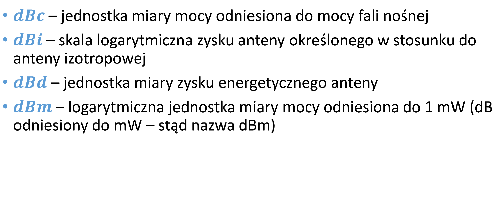
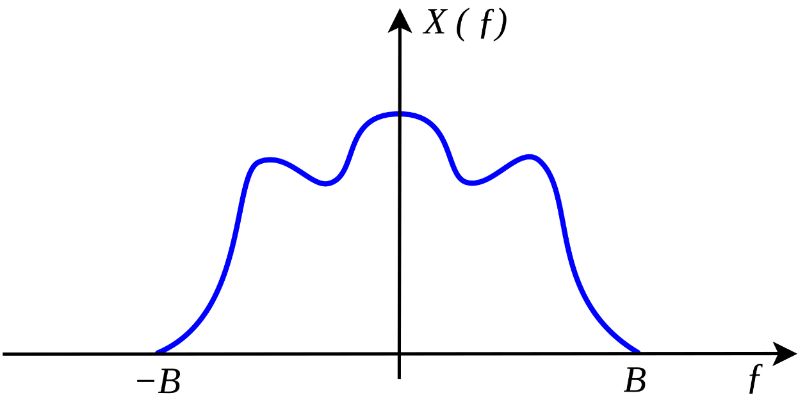
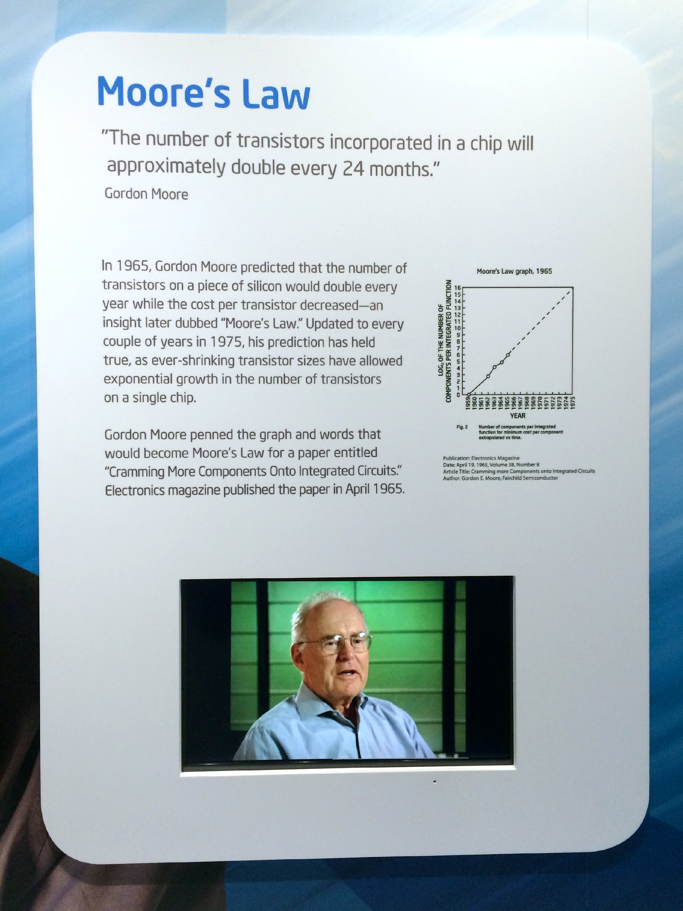
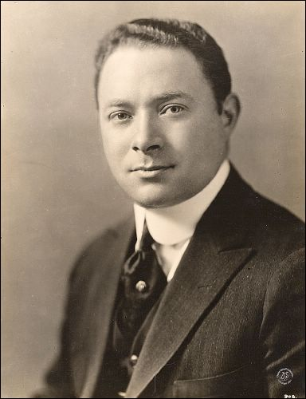
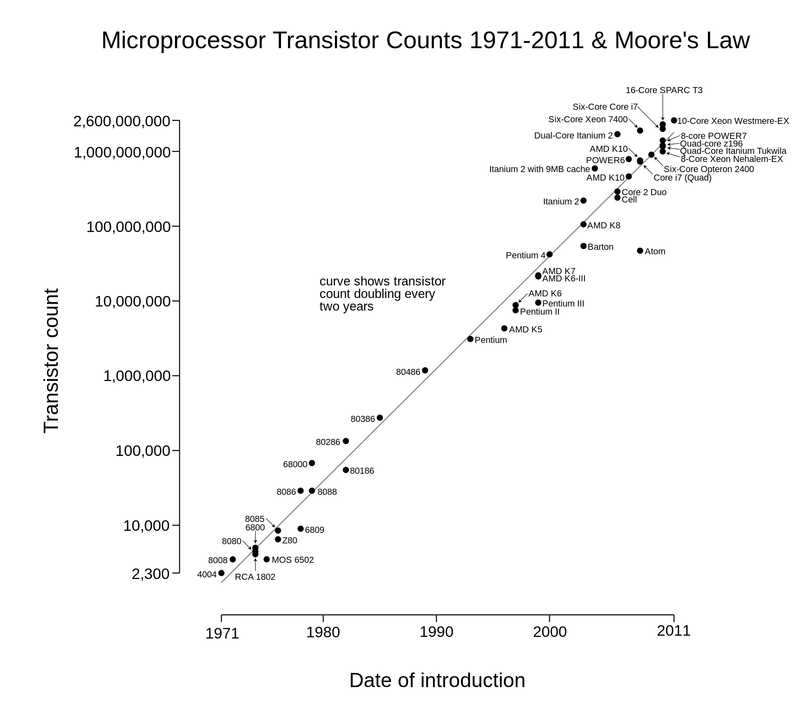
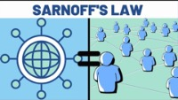
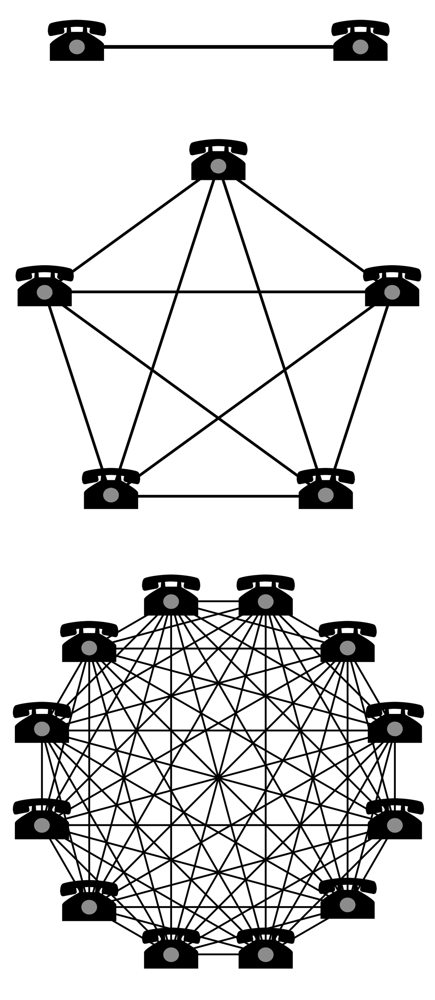

<!-- .slide: class="title-slide" -->

# Podstawowe pojęcia, jednostki i ograniczenia

Mikołaj Leszczuk

---

## Plan wykładu

- sygnał,
- decybel i jednostki pochodne,
- przepustowość oraz przepływność,
- twierdzenie Kotielnikowa-Shannona,
- prawa Moore'a, Sarnoffa i Metcalfe'a.

---

<!-- .slide: class="section-slide" -->

# Sygnał

---

## Czym jest sygnał?

Sygnał to abstrakcyjny model mierzalnej wielkości zmieniającej się w czasie, generowanej przez zjawisko fizyczne albo system.

- opisujemy go matematycznie, na przykład funkcją czasu,
- może nieść informację,
- umożliwia przepływ strumienia informacji.

---

<!-- .slide: class="section-slide" -->

# Decybel

---

## Decybel: po co?

**dB** to logarytmiczna jednostka miary. Używamy jej, gdy:

- wielkości zmieniają się liniowo w bardzo szerokim zakresie,
- interesują nas zmiany względne,
- porównujemy poziomy rejestrowane przez ludzkie zmysły, np. dźwięk.

---

## Skala logarytmiczna

−30 dB 0,001−10 dB 0,10 dB 110 dB 1020 dB 10030 dB 1000

Dla stosunku wielkości `X`:

`dB = 10 · log10(X)`

---

## Jednostki pochodne

Decybel występuje zwykle względem poziomu odniesienia, np.:

- **dBm**: względem 1 mW,
- **dBW**: względem 1 W,
- **dBi**: zysk anteny względem anteny izotropowej,
- **dBµV**: względem 1 µV.

---

<!-- .slide: class="section-slide" -->

# Przepustowość i przepływność

---

## Dwa podobne, ale różne pojęcia

**Przepustowość**

Maksymalna ilość informacji, którą może przesłać kanał lub łącze w jednostce czasu. To cecha toru transmisyjnego.

**Przepływność**

Natężenie strumienia danych faktycznie przepływającego przez kanał, ang. *bit rate* lub *bitrate*.

---

## Wspólna jednostka, różne znaczenie

- Obie wielkości wyraża się w bitach na sekundę albo bajtach na sekundę.
- Potocznie przepustowość bywa błędnie nazywana „szybkością” sieci.
- Przepływność może być niższa od przepustowości wskutek protokołów, zakłóceń i obciążenia.

---

<!-- .slide: class="section-slide" -->

# Granice i prawa

---

## Twierdzenie Kotielnikowa-Shannona

Jeżeli sygnał ciągły nie ma składowych o częstotliwości równej lub większej niż `B`, można go wiernie odtworzyć z próbek pobranych nie rzadziej niż co:

`1 / (2B)`

Inne nazwy: twierdzenie Whittakera-Nyquista-Kotielnikowa-Shannona albo twierdzenie o próbkowaniu.

---

## Prawo Moore'a

- Prawo empiryczne opisujące wykładniczy wzrost ekonomicznie optymalnej liczby tranzystorów w układach scalonych.
- Gordon Moore w 1965 r. zaobserwował podwojenie co około 12 miesięcy.
- W późniejszym ujęciu przyjmowano około 24 miesięcy.

---

## Gordon Moore i rozwój układów scalonych

---

## Dlaczego wzrost ma znaczenie?

Wzrost liczby tranzystorów umożliwiał budowę coraz szybszych, mniejszych i tańszych urządzeń. Prawo Moore'a nie jest prawem fizyki, lecz użytecznym opisem długotrwałego trendu technologicznego.

---

## Prawo Sarnoffa

> Wartość sieci telekomunikacyjnej jest proporcjonalna do liczby jej odbiorców.

Dotyczy przede wszystkim sieci nadawczych: radia, telewizji i portali, w których każdy nowy odbiorca zwiększa wartość sieci liniowo.

---

## Prawo Metcalfe'a

> Użyteczność sieci telekomunikacyjnej rośnie proporcjonalnie do kwadratu liczby podłączonych urządzeń lub użytkowników.

---

## Skąd bierze się wzrost kwadratowy?

- Dla dwóch użytkowników istnieje jedno połączenie.
- Każdy kolejny użytkownik może połączyć się z wszystkimi wcześniejszymi.
- Liczba potencjalnych relacji rośnie znacznie szybciej niż sama liczba użytkowników.

2 użytkowników 1 połączenie3 użytkowników 3 połączenia4 użytkowników 6 połączeńn użytkowników n(n−1)/2 połączeń

---

## Podsumowanie

- Sygnał jest modelem wielkości niosącej informację.
- Decybel wygodnie opisuje szerokie zakresy i zmiany względne.
- Przepustowość jest właściwością kanału, przepływność opisuje faktyczny strumień danych.
- Próbkowanie, rozwój układów oraz wartość sieci mają swoje rozpoznawalne prawa i ograniczenia.
