<!-- .slide: class="title-slide" -->

# Warstwa fizyczna: przekaz elektryczny

## Kable miedziane w telekomunikacji i teleinformatyce

---

## Plan wykładu

- kabel koncentryczny i jego złącza,
- para skręcona: budowa, rodzaje i zastosowania,
- kable specjalne,
- RJ-45 oraz Token Ring.

---

<!-- .slide: class="section-slide" -->

# Kabel koncentryczny

---

## Budowa kabla koncentrycznego

  

  Powłoka zewnętrznaOplot / ekran
  Izolacja wewnętrznaPrzewód miedziany

- Angielska nazwa: *coaxial cable*.
- Ekran ogranicza wpływ zakłóceń elektromagnetycznych.
- W sieciach komputerowych został w większości wyparty przez skrętkę.

---

## Złącze BNC

*Bayonet Neill-Concelman*; dawniej sieci koncentryczne, dziś nadal aparatura pomiarowa.

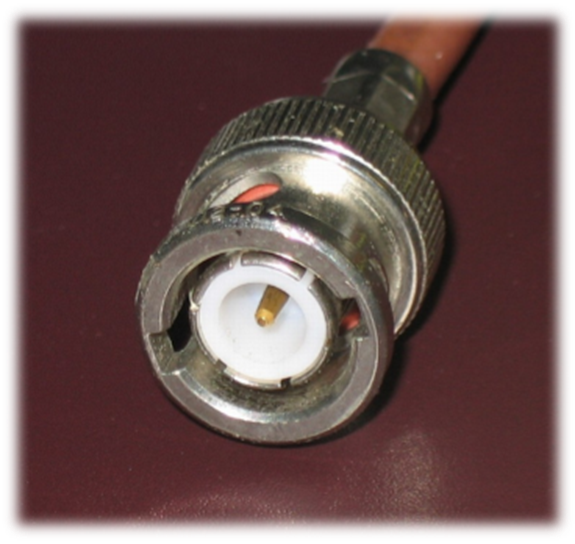

---

## Złącze N

Złącze stosowane dla sygnałów wysokiej częstotliwości, typowo do około 18 GHz. Jest większe i mechanicznie solidniejsze od BNC.

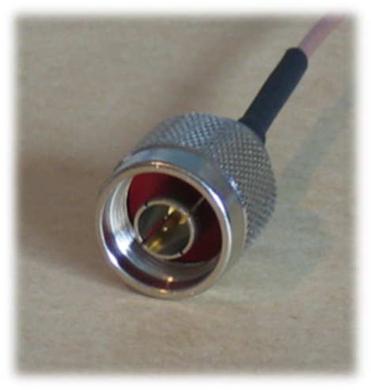

---

<!-- .slide: class="section-slide" -->

# Para skręcona

---

## Skrętka: podstawy

- Angielska nazwa: *twisted pair*.
- Osiem miedzianych żył tworzy cztery pary.
- Każda para jest skręcona w odmienny sposób, co ogranicza przesłuchy i zakłócenia.
- Izolacja żył jest zwykle polietylenowa, a wspólna powłoka z PVC.

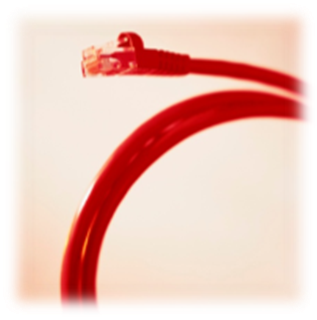

---

## Gdzie stosujemy skrętkę?

- sieci telefoniczne,
- sieci komputerowe,
- okablowanie strukturalne w budynkach.

Jej popularność wynika z dobrego stosunku możliwości do ceny oraz łatwości instalacji.

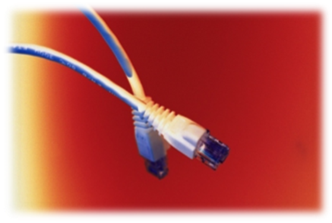

---

## Rodzaje skrętek

**UTP**

Bez ekranowania. Najczęstszy wariant w typowych sieciach LAN.

**FTP / F/UTP**

Folia otacza cały kabel. Przydatna, gdy potrzebna jest dodatkowa ochrona przed zakłóceniami.

**STP**

Określenie handlowe dla kabla ekranowanego; dokładną budowę należy sprawdzić w dokumentacji producenta.

**S/FTP**

Ekran z oplotu wokół kabla oraz folia wokół każdej pary. Stosowany w środowiskach o większych wymaganiach EMC.

---

## Przykłady skrętek

  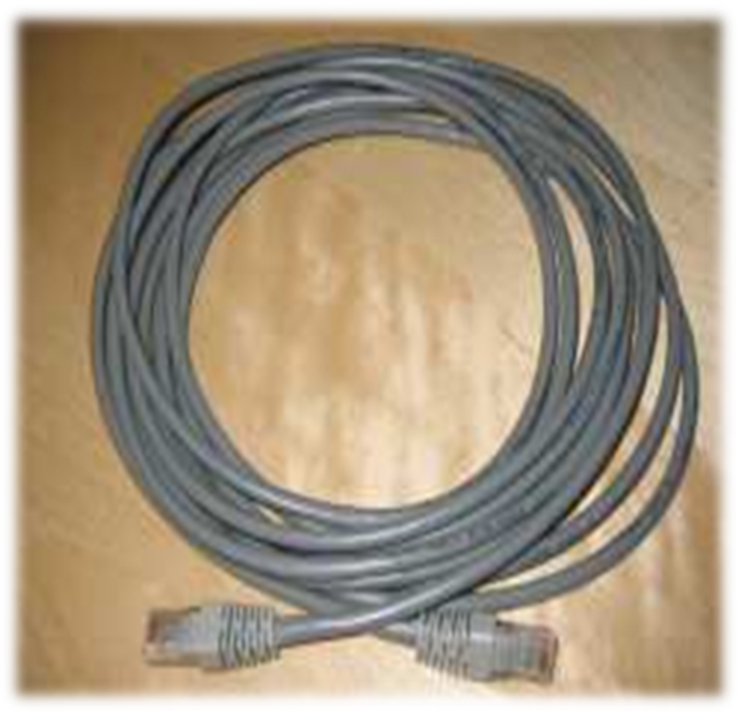
  
  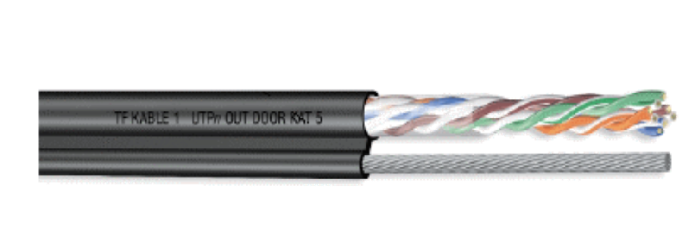

---

## UTP

- *Unshielded Twisted Pair*.
- Brak ekranowania żył.
- Najczęściej stosowany kabel w lokalnych sieciach komputerowych.

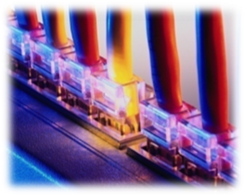

---

## Materiał: skrętka UTP

<video controls preload="metadata" poster="media/image15.png"><source src="media/slide-017-media1.mp4" type="video/mp4"></video>

---

## FTP

- *Foiled Twisted Pair*.
- Ekranowanie folią oraz przewód uziemiający.
- Większa odporność na zewnętrzne zakłócenia elektromagnetyczne.

---

## STP i S/FTP

- **STP:** ekran w postaci oplotu oraz powłoki; możliwe indywidualne ekranowanie par.
- **S/FTP:** dodatkowy ekran z siatki miedzianej lub folii aluminiowej.
- Stosowane, gdy ważna jest zgodność EMC oraz ograniczenie emisji EMI.

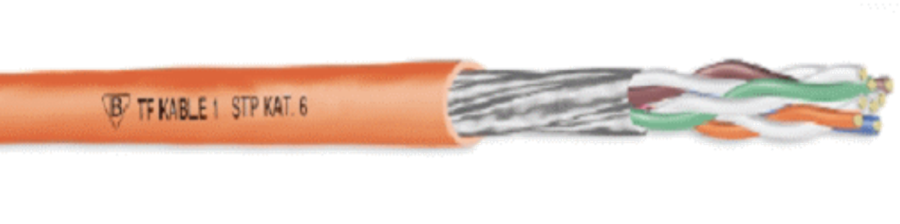

---

## Kable ziemne

Kable z wypełnieniem żelowym zwiększają odporność na warunki atmosferyczne i zakłócenia.

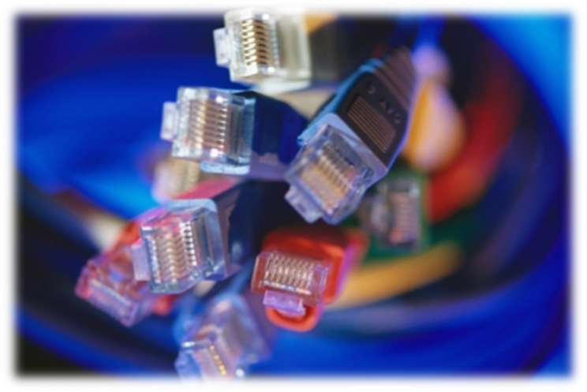

---

## Przewieszki

Kable z linką nośną prowadzi się między budynkami; dostępne są warianty UTP i FTP.

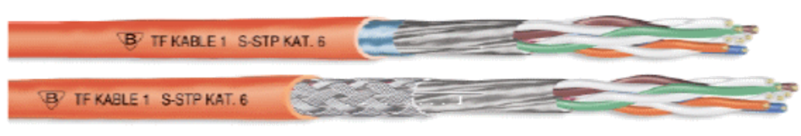

---

<!-- .slide: class="section-slide" -->

# 8P8C (potocznie RJ-45) i Ethernet

---

## Złącze 8P8C (potocznie „RJ-45”)

- Ośmioprzewodowe złącze systemów okablowania strukturalnego.
- W praktyce Ethernetu określenie „RJ-45” jest powszechne, choć technicznie chodzi zwykle o złącze 8P8C.
- Standardy: ISO 8877, ISO/IEC 11801, EN 50173.
- Występuje w panelach krosowych, gniazdach stanowiskowych, kartach sieciowych i kablach połączeniowych.
- Dostępne są wersje ekranowane i nieekranowane.

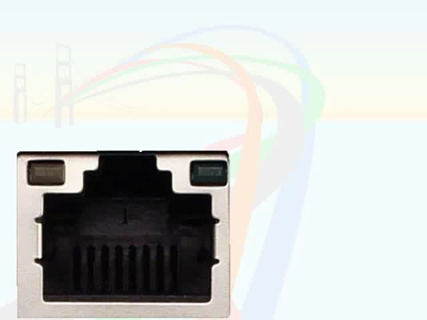
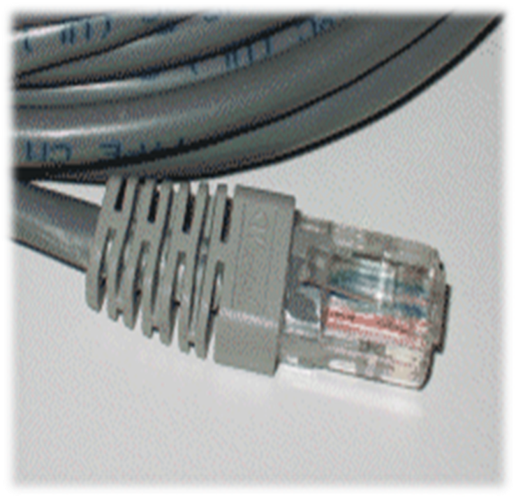
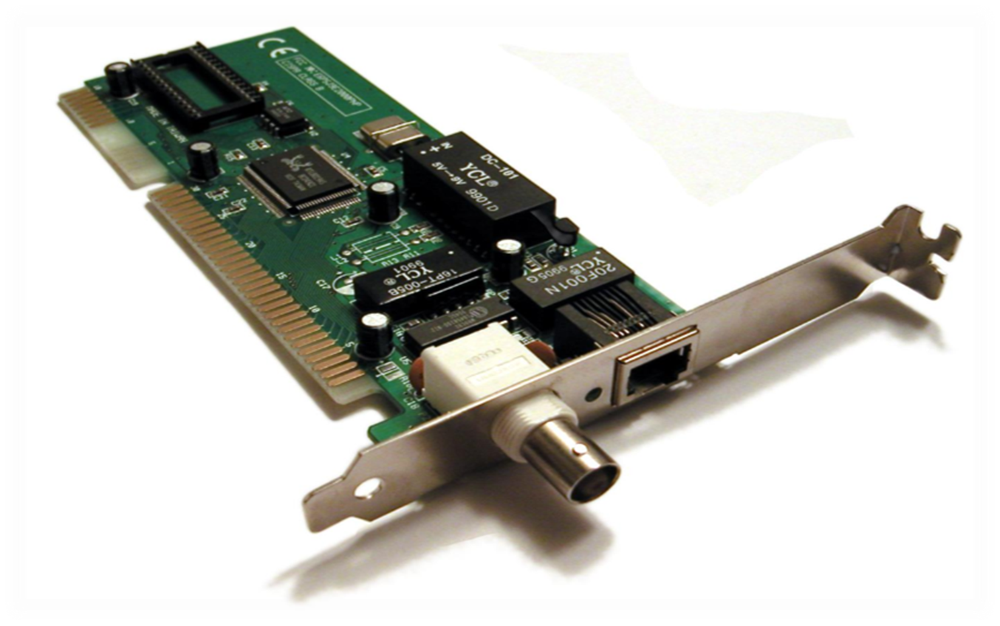
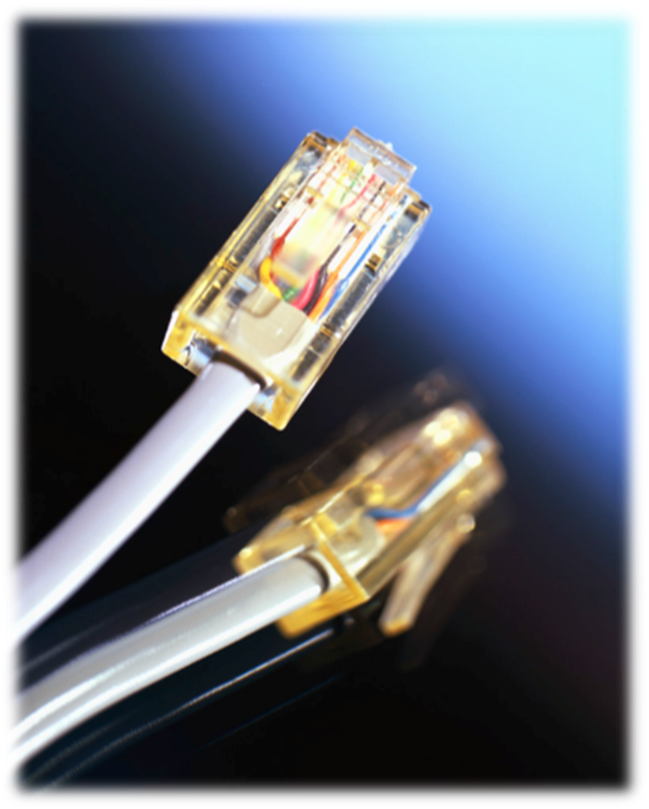

---

## Materiał: podłączanie RJ-45

<video controls preload="metadata" poster="media/image23.png"><source src="media/slide-029-media2.mp4" type="video/mp4"></video>

---

## Piny RJ-45

12345678

W kablu prostym kolejność żył jest taka sama na obu końcach. Kabel skrzyżowany zamienia pary transmisyjne, co historycznie pozwalało łączyć dwa podobne urządzenia bez przełącznika.

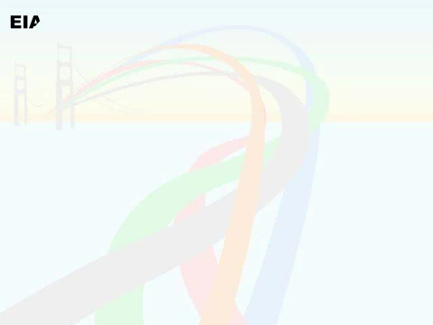
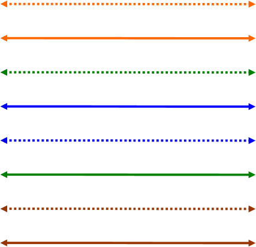
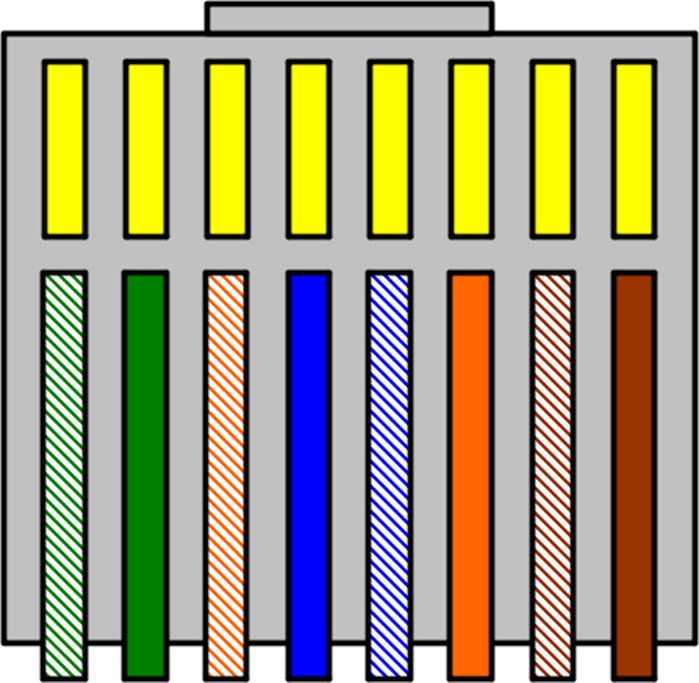
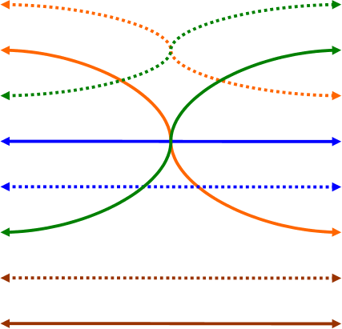

---

## Okablowanie Ethernet UTP

<video controls preload="metadata" poster="media/image26.png"><source src="media/slide-032-media3.mp4" type="video/mp4"></video>

---

## Materiał: zaciskanie RJ-45

<video controls preload="metadata" poster="media/image30.png"><source src="media/slide-036-media4.mp4" type="video/mp4"></video>

---

## Materiał: okablowanie Ethernet

<video controls preload="metadata" poster="media/image31.png"><source src="media/slide-037-media5.mp4" type="video/mp4"></video>

---

## Token Ring

- IEEE 802.5, *Token Ring Access Method*.
- Historyczne rozwiązanie ze złączem hermafrodytycznym.
- Złącza były duże, złożone i mniej wygodne niż współczesne rozwiązania Ethernet.

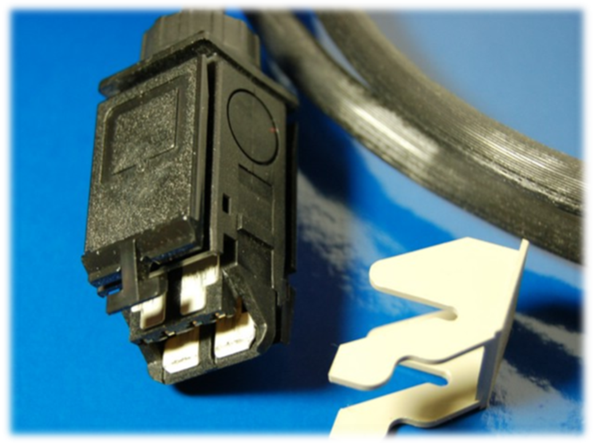
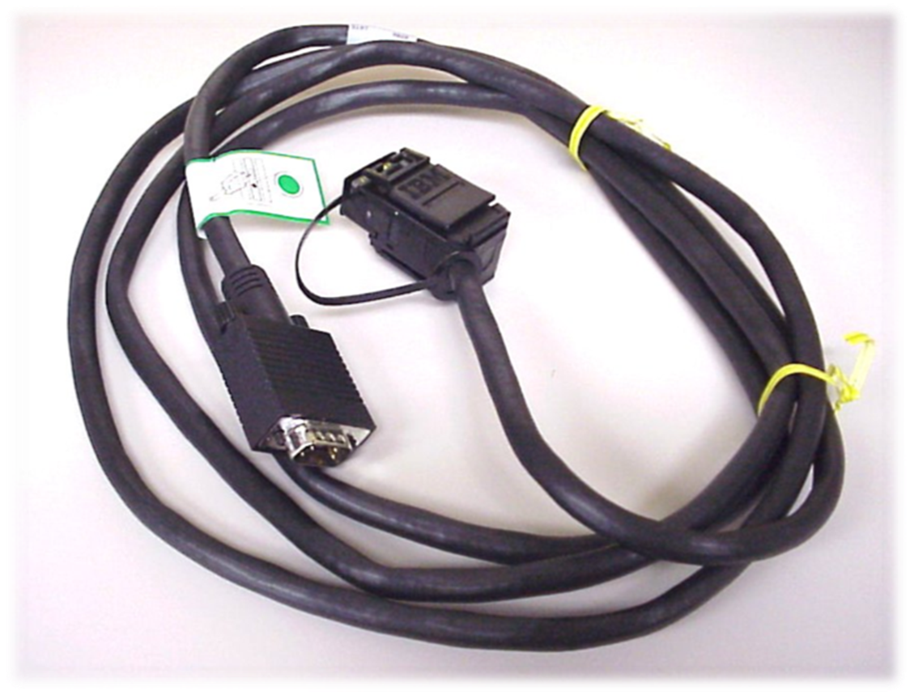

---

## Podsumowanie

- Koncentryk jest odpornym, ale historycznym medium sieciowym.
- Skrętka dominuje w sieciach LAN dzięki cenie, łatwości instalacji i różnym wariantom ekranowania.
- RJ-45 pozostaje podstawowym złączem Ethernetu w okablowaniu miedzianym.
