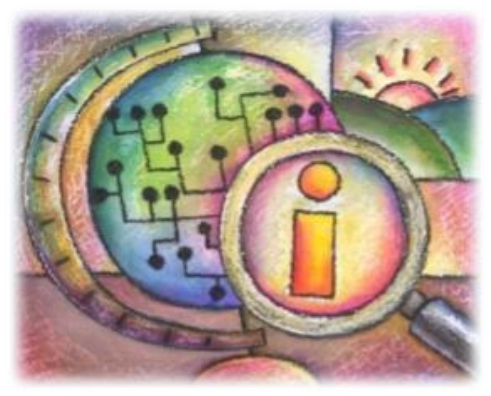
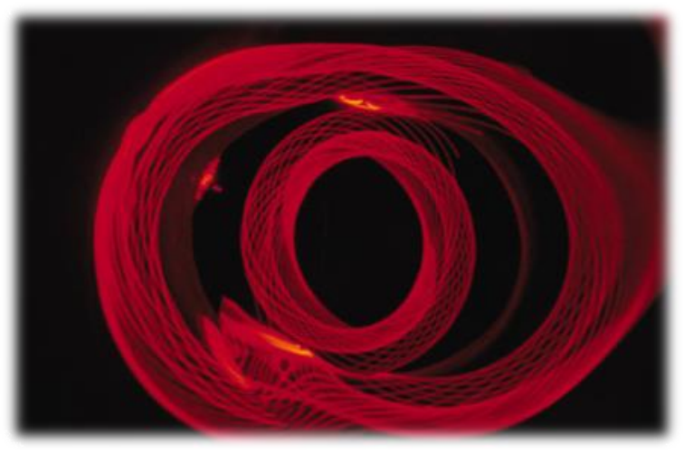
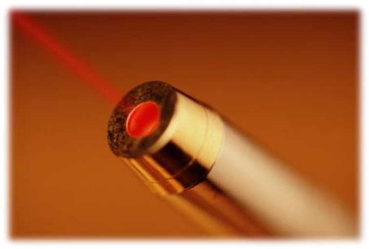

<!-- .slide: class="title-slide" -->

# Media transmisyjne: światłowody

---

## Plan wykładu

- czym jest światłowód,
- zalety transmisji optycznej,
- światłowody jedno- i wielomodowe,
- tłumienie, zgięcia i dyspersja.

---

<!-- .slide: class="section-slide" -->

# Światłowód

---

## Co to jest światłowód?

Światłowód prowadzi światło wewnątrz włókna o odpowiednio dobranych właściwościach optycznych.

RdzeńPłaszczPowłoka ochronna

Informacja jest kodowana jako modulowana wiązka światła, zwykle pochodząca z lasera albo diody LED.

---

## Dlaczego transmisja optyczna?

- bardzo duża przepustowość,
- małe tłumienie na dużych odległościach,
- odporność na zakłócenia elektromagnetyczne,
- brak emisji elektromagnetycznej,
- małe rozmiary i masa kabla.

---

## Materiał: ewolucja światłowodów

<video controls preload="metadata"><source src="media/slide-007-media1.mp4" type="video/mp4"></video>

---

## Laser jako źródło światła

Laser może dostarczyć intensywną, łatwą do modulowania wiązkę światła. W światłowodzie sygnał pozostaje prowadzony przez rdzeń dzięki całkowitemu wewnętrznemu odbiciu.

---

## Materiał: laser jako źródło światła

<video controls preload="metadata"><source src="media/slide-009-media2.mp4" type="video/mp4"></video>

---

## Odporność na błędy

<video controls preload="metadata"><source src="media/slide-012-media3.mp4" type="video/mp4"></video>

---

<!-- .slide: class="section-slide" -->

# Mody propagacji

---

## Podział światłowodów

**Wielomodowe**

Wiele dróg propagacji światła w rdzeniu. Typowe dla krótszych odcinków i sieci lokalnych.

**Jednomodowe**

Jedna dominująca droga propagacji. Mała dyspersja i zastosowanie w długich łączach.

---

## Wielomodowe: gradientowe i skokowe

**Gradientowe**

Współczynnik załamania zmienia się stopniowo, co ogranicza różnice czasu przejścia modów.

**Skokowe**

Współczynnik zmienia się skokowo na granicy rdzenia i płaszcza; różne drogi mają wyraźnie różną długość.

---

## Materiał: wielomodowość

<video controls preload="metadata"><source src="media/slide-021-media4.mp4" type="video/mp4"></video>

---

## Światłowód jednomodowy

- Ma mały rdzeń i prowadzi zasadniczo jeden mod.
- Ogranicza dyspersję międzymodową.
- Jest podstawą łączy dalekiego zasięgu i sieci szkieletowych.

---

## Materiał: światłowód jednomodowy

<video controls preload="metadata"><source src="media/slide-025-media5.mp4" type="video/mp4"></video>

---

<!-- .slide: class="section-slide" -->

# Straty i tłumienie

---

## Tłumienie sygnału

Tłumienie określa, o ile maleje moc optyczna sygnału podczas propagacji. W praktyce liczą się między innymi:

- absorpcja w materiale,
- rozpraszanie,
- niedoskonałości włókna,
- zgięcia i połączenia.

---

## Straty falowodowe

<video controls preload="metadata"><source src="media/slide-031-media6.mp4" type="video/mp4"></video>

---

## Mikro-zgięcia

- Niewielkie, miejscowe odkształcenia włókna.
- Mogą wynikać z nacisku, naprężeń i niedoskonałości konstrukcji kabla.
- Powodują dodatkową utratę mocy.

<video controls preload="metadata"><source src="media/slide-033-media7.mp4" type="video/mp4"></video>

---

## Makro-zgięcia

- Widoczne zgięcia kabla o zbyt małym promieniu.
- Część światła przestaje spełniać warunek całkowitego wewnętrznego odbicia i ucieka z rdzenia.

<video controls preload="metadata"><source src="media/slide-035-media8.mp4" type="video/mp4"></video>

---

## Inne przyczyny strat

- koncentracja zanieczyszczeń w szkle,
- straty na złączach i spawach,
- niewłaściwy montaż,
- starzenie materiału i wpływ środowiska.

---

## Materiał: tłumienie

<video controls preload="metadata"><source src="media/slide-039-media9.mp4" type="video/mp4"></video>

---

<!-- .slide: class="section-slide" -->

# Dyspersja

---

## Czym jest dyspersja?

Dyspersja rozszerza impuls w czasie. Gdy sąsiednie impulsy zaczynają się nakładać, rośnie ryzyko błędnej interpretacji danych.

---

## Typy dyspersji

**Międzymodowa**

Różne mody w światłowodzie wielomodowym przemierzają różne drogi i docierają w różnym czasie.

**Chromatyczna**

Różne długości fali poruszają się z różną prędkością; obejmuje dyspersję materiałową i falowodową.

---

## Dyspersja chromatyczna

- **Materiałowa:** współczynnik załamania zależy od długości fali.
- **Falowodowa:** właściwości propagacji wynikają także z geometrii rdzenia i płaszcza.
- Obie ograniczają maksymalną odległość i przepływność łącza.

---

## Materiały: dyspersja

<video controls preload="metadata"><source src="media/slide-051-media10.mp4" type="video/mp4"></video>

---

## Materiał: dyspersja chromatyczna

<video controls preload="metadata"><source src="media/slide-052-media11.mp4" type="video/mp4"></video>

---

## Podsumowanie

- Światłowód daje dużą przepustowość i odporność na zakłócenia.
- Wybór włókna jedno- albo wielomodowego jest związany z odległością i wymaganiami łącza.
- Tłumienie i dyspersja są podstawowymi ograniczeniami transmisji optycznej.
