<!-- .slide: class="title-slide" -->

# Media transmisyjne: transmisja bezprzewodowa

---

## Plan wykładu

- sieci bezprzewodowe i ich infrastruktura,
- PAN, WLAN, MAN oraz IoT,
- Wi-Fi i rodzina IEEE 802.11,
- WiMAX, LoRa i przyszłość standardów.

---

<!-- .slide: class="section-slide" -->

# Sieci bezprzewodowe

---

## Definicja

Bezprzewodowa sieć komputerowa przesyła dane przez fale radiowe lub inne medium bezprzewodowe, zamiast przez przewody między wszystkimi węzłami.

Kluczowe elementy: urządzenia końcowe, punkty dostępowe, anteny, kontrolery i łącze do sieci szkieletowej.

---

## Przykładowa infrastruktura WLAN

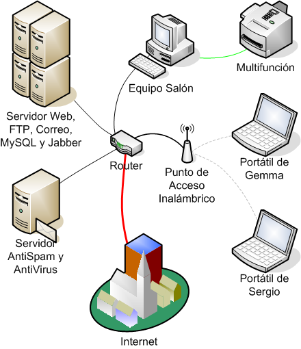

---

## Urządzenia infrastruktury

- karta sieciowa lub moduł radiowy,
- punkt dostępowy albo router,
- antena wewnętrzna lub zewnętrzna,
- łącze przewodowe do sieci szkieletowej.

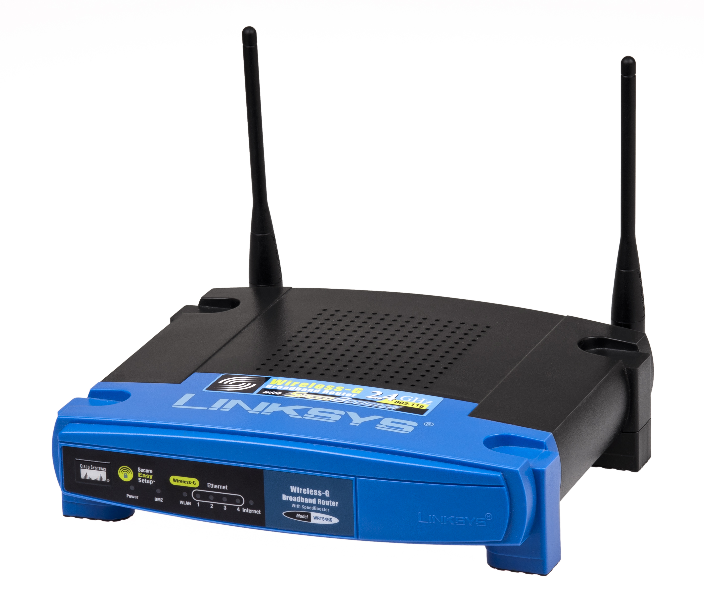

---

## Zalety i ograniczenia

**Zalety**

- mobilność,
- szybkie wdrożenie,
- łatwa rozbudowa,
- dostęp w miejscach trudnych dla kabli.

**Ograniczenia**

- współdzielone widmo,
- zakłócenia i tłumienie,
- zasięg zależny od otoczenia,
- konieczność właściwego zabezpieczenia.

---

## Typy sieci

  
<strong>PAN</strong> osobista

  
<strong>LAN / WLAN</strong> lokalna

  
<strong>MAN</strong> miejska

  
<strong>WAN</strong> rozległa

Rosnący zasięg: od urządzeń osobistych po sieci łączące odległe lokalizacje.

---

## Zakresy sieci - szersza perspektywa

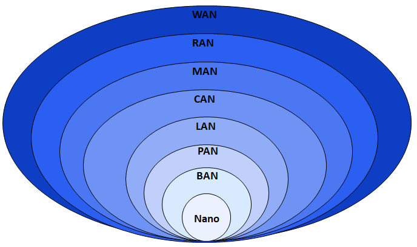

---

## Materiał wideo: rodzaje sieci

<iframe class="video-embed" src="https://www.youtube.com/embed/4_zSIXb7tLQ?feature=oembed" title="Rodzaje sieci komputerowych" referrerpolicy="strict-origin-when-cross-origin" allowfullscreen></iframe>

---

## PAN i Internet rzeczy

- **Bluetooth:** połączenia osobiste, urządzenia peryferyjne i audio.
- **ZigBee / IEEE 802.15.4:** energooszczędne czujniki i automatyka.
- **Z-Wave:** domowa automatyka.
- **Thread:** sieć mesh dla urządzeń IoT, oparta na IPv6.

---

## Moduły małej mocy dla IoT

Niewielki moduł radiowy może być częścią czujnika, sterownika lub urządzenia noszonego. W takich zastosowaniach ważniejsze od wysokiej przepływności bywają zasięg i zużycie energii.

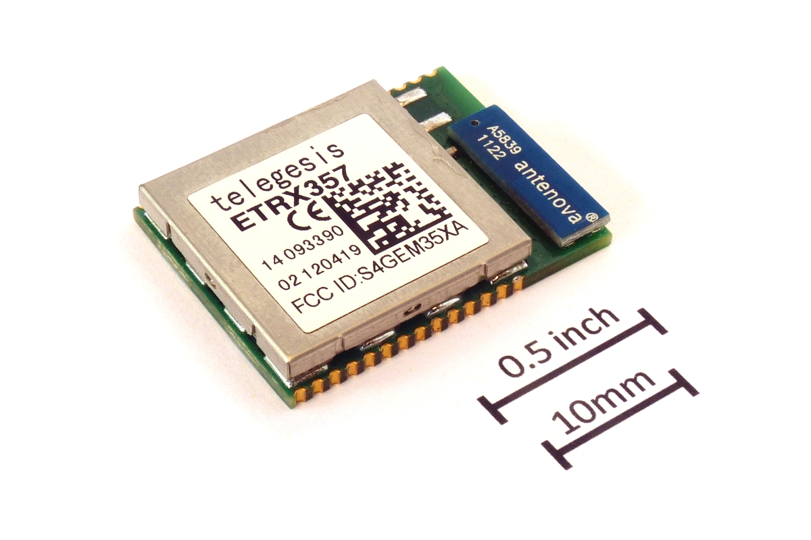

---

## Bluetooth i Z-Wave

  
  

---

## Materiał wideo: Internet rzeczy i PAN

<iframe class="video-embed" src="https://www.youtube.com/embed/iw9pQeFhN74?feature=oembed" title="Internet rzeczy i PAN" referrerpolicy="strict-origin-when-cross-origin" allowfullscreen></iframe>

---

## Materiał wideo: Wi-Fi a ZigBee

<iframe class="video-embed" src="https://www.youtube.com/embed/buV11ZPJ7MQ?feature=oembed" title="Porównanie Wi-Fi i ZigBee" referrerpolicy="strict-origin-when-cross-origin" allowfullscreen></iframe>

---

## Materiał wideo: Z-Wave

<iframe class="video-embed" src="https://www.youtube.com/embed/vhzLYmiwNTk?feature=oembed" title="Z-Wave" referrerpolicy="strict-origin-when-cross-origin" allowfullscreen></iframe>

---

## Materiał wideo: Thread

<iframe class="video-embed" src="https://www.youtube.com/embed/KElUxj12IIY?feature=oembed" title="Thread" referrerpolicy="strict-origin-when-cross-origin" allowfullscreen></iframe>

---

## WLAN

WLAN (*Wireless Local Area Network*) zapewnia lokalny dostęp radiowy. Najczęściej kojarzymy ją z Wi-Fi, czyli implementacjami standardów IEEE 802.11.

---

## Materiał wideo: czym jest WLAN?

<iframe class="video-embed" src="https://www.youtube.com/embed/DAR52r0lEtw?feature=oembed" title="WLAN" referrerpolicy="strict-origin-when-cross-origin" allowfullscreen></iframe>

---

<!-- .slide: class="section-slide" -->

# IEEE 802.11 i Wi-Fi

---

## Pasma Wi-Fi

**2,4 GHz**

Dobry zasięg, duże zatłoczenie, szeroka zgodność urządzeń.

**5 GHz i 6 GHz**

Więcej kanałów i większa przepływność; zwykle krótszy zasięg.

---

## Kanały w paśmie 2,4 GHz

Kanały o szerokości 20 MHz nakładają się. W typowej konfiguracji stosuje się rozdzielone kanały 1, 6 i 11; dostępne kanały zależą od regulacji obowiązujących w danym kraju.

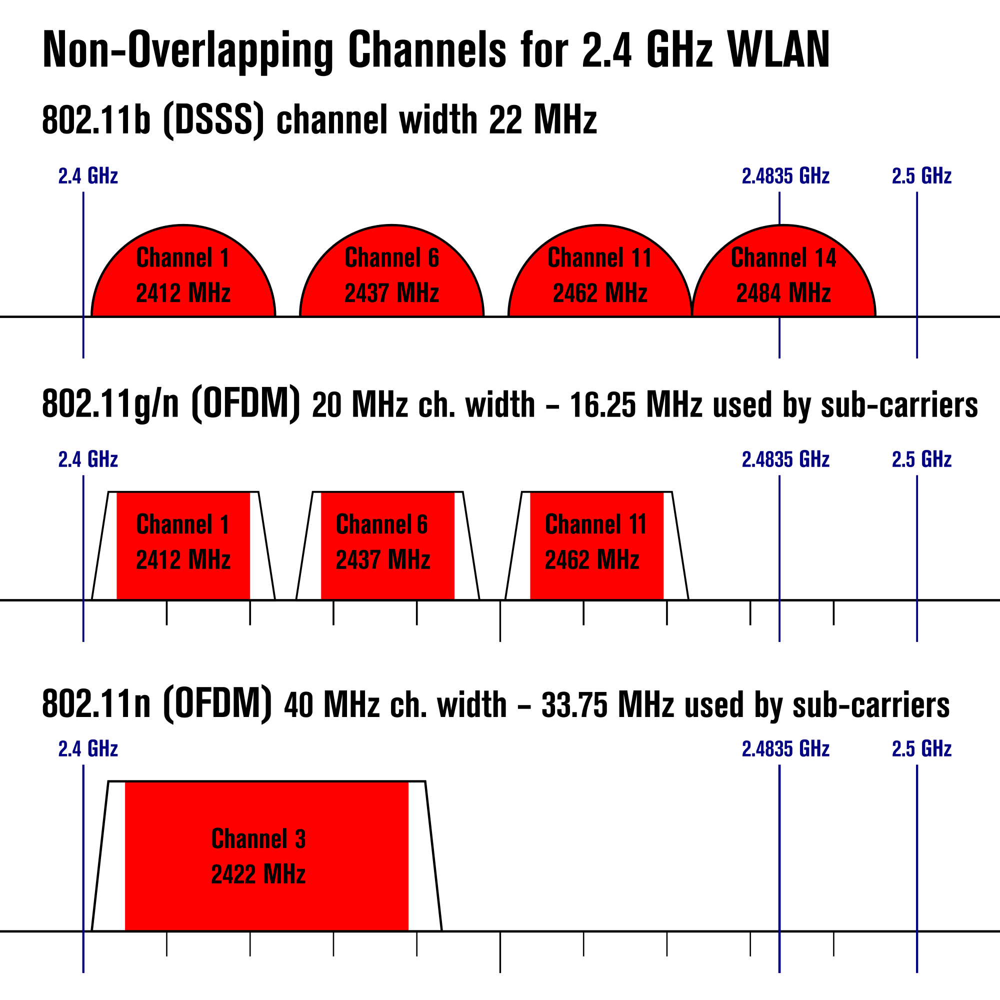

---

## Sprzęt Wi-Fi - dawniej i dziś

  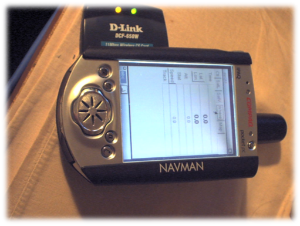
  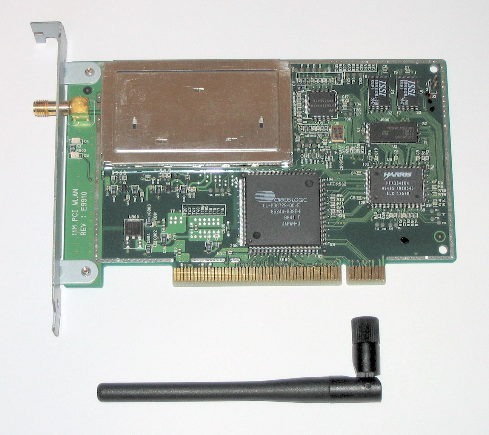
  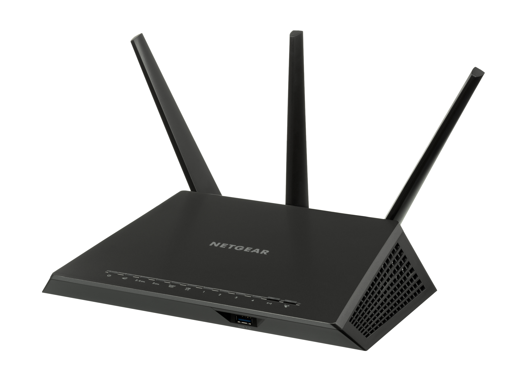

---
## Rozwój Wi-Fi: 1997–2024

  
2 Mb/s<strong>802.11</strong>1997

  
11 Mb/s<strong>Wi-Fi 1</strong>1999

  
54 Mb/s<strong>Wi-Fi 2</strong>1999

  
54 Mb/s<strong>Wi-Fi 3</strong>2003

  
600 Mb/s<strong>Wi-Fi 4</strong>2009

  
6,93 Gb/s<strong>Wi-Fi 5</strong>2013

  
9,61 Gb/s<strong>Wi-Fi 6 / 6E</strong>2021

  
do 46 Gb/s<strong>Wi-Fi 7</strong>2024

Wysokość słupków: skala logarytmiczna maksymalnej przepływności PHY. Kolor: chłodny dla niższej, ciepły dla wyższej szybkości.

---

## Wybrane standardy IEEE 802.11

  
Standard

Rok

Pasmo

Kanał

Maks. PHY

  
802.11 (legacy)

1997

2,4 GHz

20 MHz

2 Mb/s

  
802.11a

1999

5 GHz

20 MHz

54 Mb/s

  
802.11b

1999

2,4 GHz

22 MHz

11 Mb/s

  
802.11g

2003

2,4 GHz

20 MHz

54 Mb/s

  
802.11n

2009

2,4 / 5 GHz

20 / 40 MHz

600 Mb/s

  
802.11ad

2012

60 GHz

2160 MHz

6,76 Gb/s

  
802.11ac

2013

5 GHz

20–160 MHz

6,93 Gb/s

  
802.11ax

2021

2,4 / 5 / 6 GHz

20–160 MHz

9,61 Gb/s

  
802.11be

2024

2,4 / 5 / 6 GHz

do 320 MHz

do 46 Gb/s

Wartości maksymalne warstwy fizycznej; rzeczywista przepływność zależy od konfiguracji, liczby strumieni i warunków radiowych.

---

## Starsze generacje i zgodność

- **802.11b i 802.11g:** pracują w paśmie 2,4 GHz; 802.11g zachowuje zgodność wsteczną z 802.11b.
- **802.11a:** wykorzystuje 5 GHz, więc nie współpracuje radiowo z urządzeniami wyłącznie 2,4 GHz.
- Historyczne standardy są istotne przy obsłudze starszych urządzeń i planowaniu kompatybilności.

---

## 802.11n, ac i ax

- **802.11n:** MIMO, kanały 20/40 MHz.
- **802.11ac:** szerokie kanały w 5 GHz i wielostrumieniowość.
- **802.11ax:** poprawa wydajności w zatłoczonych środowiskach, OFDMA i planowanie transmisji.

---

## MIMO: kilka anten, kilka strumieni

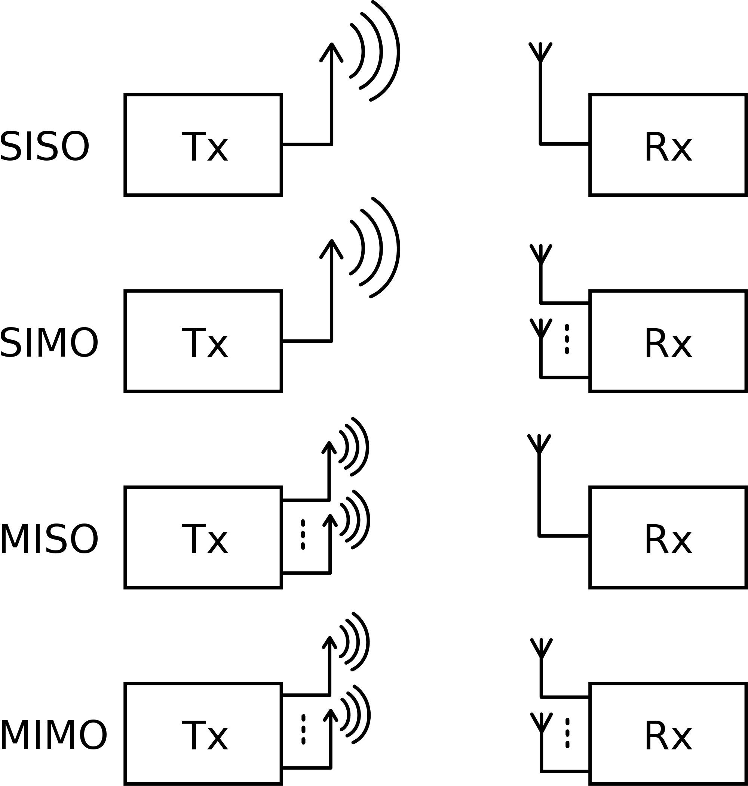

---

## MU-MIMO w 802.11ac

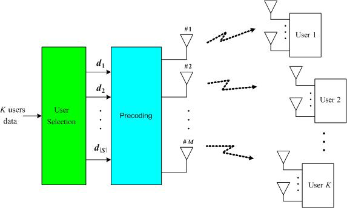

---

## Materiał wideo: 802.11b, g i n

<iframe class="video-embed" src="https://www.youtube.com/embed/KysPKUBo1u4?feature=oembed" title="Różne prędkości Wi-Fi" referrerpolicy="strict-origin-when-cross-origin" allowfullscreen></iframe>

---

## Materiał wideo: 802.11n a 802.11ac

<iframe class="video-embed" src="https://www.youtube.com/embed/DsWJ-ei5jrc?feature=oembed" title="Różnice między 802.11n i 802.11ac" referrerpolicy="strict-origin-when-cross-origin" allowfullscreen></iframe>

---

## 60 GHz i 802.11ad / ay

- Bardzo duża przepływność na krótkim dystansie.
- Silne tłumienie i słaba penetracja przeszkód.
- Zastosowania: łącza punkt-punkt, dokowanie bezprzewodowe, krótkodystansowe transmisje multimedialne.

---

## WiGig i pasmo 60 GHz

---

## Materiał wideo: Wi-Fi przy 60 GHz

<iframe class="video-embed" src="https://www.youtube.com/embed/zcfuTD3z7aA?feature=oembed" title="Wi-Fi i częstotliwość 60 GHz" referrerpolicy="strict-origin-when-cross-origin" allowfullscreen></iframe>

---

## Materiał wideo: Wi-Fi 6 i OFDMA

<iframe class="video-embed" src="https://www.youtube.com/embed/HgIJmdzNyIQ?feature=oembed" title="Wi-Fi 6 i OFDMA" referrerpolicy="strict-origin-when-cross-origin" allowfullscreen></iframe>

---

## Kompatybilność i certyfikacja

- Zgodność standardu radiowego nie zawsze oznacza pełną zgodność funkcji urządzeń.
- Certyfikat Wi-Fi Alliance ułatwia przewidywalną współpracę produktów.
- Planowanie sieci wymaga doboru pasma, kanałów, mocy i zabezpieczeń.

---

<!-- .slide: class="section-slide" -->

# Sieci miejskie i dalekiego zasięgu

---

## WiMAX

- Rodzina IEEE 802.16 dla szerokopasmowych sieci metropolitalnych.
- Przeznaczona do dostępu bezprzewodowego na większych obszarach niż WLAN.
- Historycznie ważna alternatywa dla dostępu przewodowego, obecnie wyparta w wielu zastosowaniach przez sieci komórkowe.

---

## WiMAX - infrastruktura

WiMAX (*Worldwide Interoperability for Microwave Access*) obejmuje technologie szerokopasmowego dostępu radiowego dla sieci miejskich. Stacje bazowe wykorzystują anteny sektorowe i łącza dosyłowe.

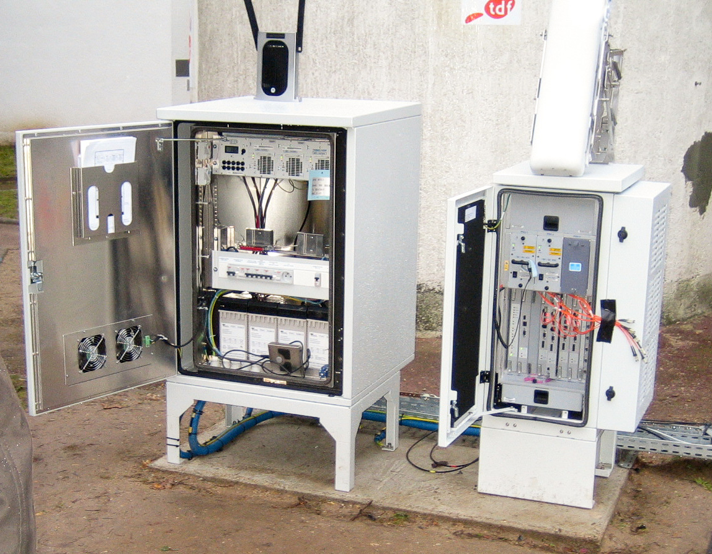

---

## Materiał wideo: WiMAX

<iframe class="video-embed" src="https://www.youtube.com/embed/KQdc5AdJqCg?feature=oembed" title="WiMAX" referrerpolicy="strict-origin-when-cross-origin" allowfullscreen></iframe>

---

## LoRa i LoRaWAN

- Mała przepływność, daleki zasięg i niskie zużycie energii.
- Przeznaczone dla czujników, telemetrii i IoT.
- Nie zastępują Wi-Fi: optymalizują inny kompromis między zasięgiem, energią i ilością danych.

---

## LoRa - urządzenie i obszary zastosowań

  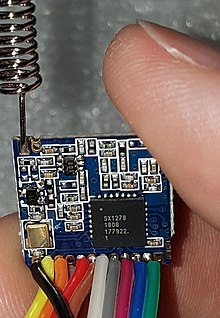
  

---

## Materiał wideo: LoRa

<iframe class="video-embed" src="https://www.youtube.com/embed/m6IvwcjcxQc?feature=oembed" title="LoRa" referrerpolicy="strict-origin-when-cross-origin" allowfullscreen></iframe>

---

## Co dalej z IEEE 802?

- bardziej efektywne użycie widma,
- większa pojemność w gęstych sieciach,
- współdziałanie Wi-Fi z sieciami komórkowymi,
- rozwój urządzeń IoT i sieci o małej mocy.

---

## Materiał wideo: przyszłość standardów IEEE 802

<video controls preload="metadata"><source src="media/fRnGP41TE2s.mp4" type="video/mp4"></video>

---

## Podsumowanie

- Bezprzewodowość daje mobilność, ale wymaga planowania radiowego i zabezpieczeń.
- IEEE 802.11 ewoluował od podstawowego WLAN do wielopasmowej, wysokowydajnej infrastruktury.
- PAN, WiMAX i LoRa odpowiadają na odmienne potrzeby zasięgu, energii i przepływności.
