<!-- .slide: class="title-slide" -->

# Transmisja sygnałów w systemach dostępu wielokrotnego

---

## Plan wykładu

- kanał telekomunikacyjny i medium dzielone,
- dostęp losowy: ALOHA i szczelinowy ALOHA,
- nasłuchiwanie nośnej: CSMA,
- zapobieganie i wykrywanie kolizji: CSMA/CA oraz CSMA/CD.

---

## Medium dzielone

W medium dzielonym wiele stacji korzysta z jednego kanału transmisyjnego. Gdy dwie stacje nadają jednocześnie, ich sygnały mogą utworzyć **kolizję**.

  
Wspólny kanał radiowy

  

A
<strong>Stacja A</strong>nadaje

  

B
<strong>Stacja B</strong>odbiera kanał

  

C
<strong>Stacja C</strong>odbiera kanał

---

## Praca w medium dzielonym

  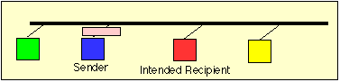
  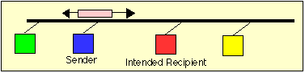
  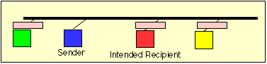
  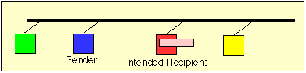

---

## Metody dostępu

**Sporne**

Stacje samodzielnie próbują uzyskać dostęp. Kolizje są możliwe, ale protokół określa reakcję.

**Kontrolowane**

Dostęp jest przydzielany, co ogranicza kolizje kosztem dodatkowej organizacji transmisji.

---

<!-- .slide: class="section-slide" -->

# ALOHA

---

## Zwykłe ALOHA

- Nadaj, gdy masz dane.
- Jeżeli nie nadejdzie potwierdzenie, uznaj kolizję.
- Odczekaj losowy czas i spróbuj ponownie.

To prosty protokół, ale przy większym obciążeniu często dochodzi do kolizji.

---

## Szczelinowy ALOHA

- Czas dzieli się na szczeliny.
- Stacja może rozpocząć nadawanie tylko na początku szczeliny.
- Zmniejsza to obszar, w którym transmisje mogą się nakładać, i poprawia wykorzystanie kanału.

---

## ALOHA: potwierdzenia i kolizje

  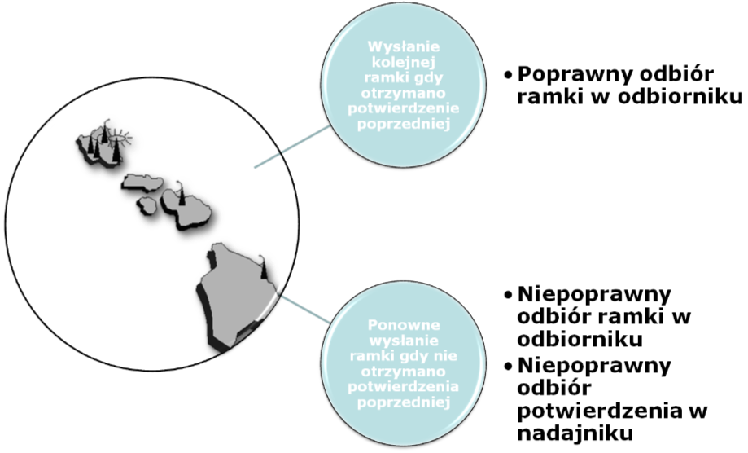
  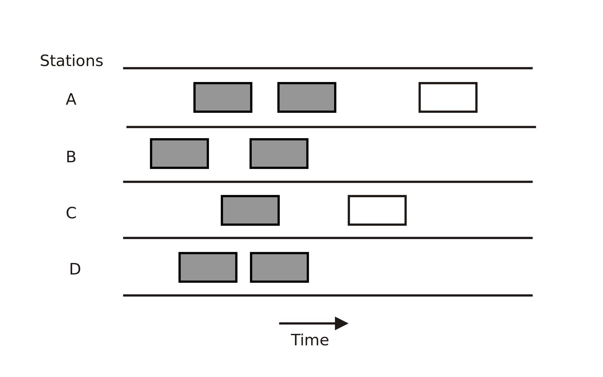
  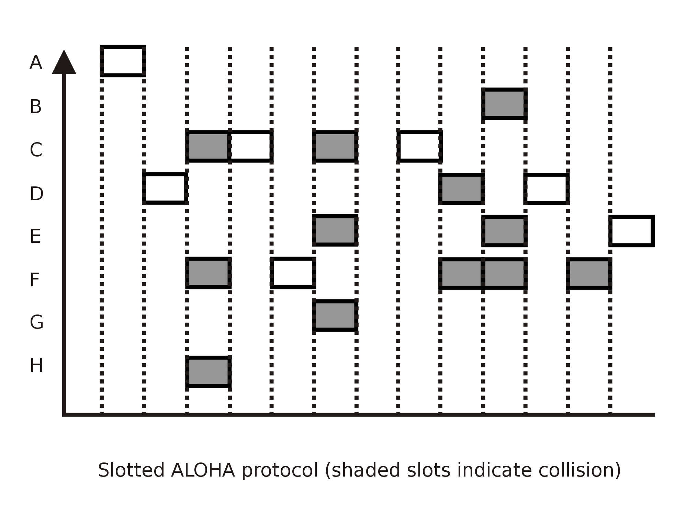

---

<!-- .slide: class="section-slide" -->

# CSMA

---

## CSMA: nasłuchiwanie nośnej

*Carrier Sense Multiple Access*:

1. stacja sprawdza, czy medium jest zajęte,
2. jeśli jest wolne, może rozpocząć nadawanie,
3. jeśli jest zajęte, czeka zgodnie z regułą protokołu.

Kolizja pozostaje możliwa z powodu opóźnienia propagacji.

---

## Warianty CSMA

- **1-persistent:** nadaj natychmiast, gdy medium stanie się wolne.
- **non-persistent:** odczekaj losowo i sprawdź ponownie.
- **p-persistent:** w pracy szczelinowej nadaj z prawdopodobieństwem `p`.

Wybór jest kompromisem między opóźnieniem a ryzykiem kolizji.

---

<!-- .slide: class="section-slide" -->

# CSMA/CA

---

## Unikanie kolizji

*Collision Avoidance* stosuje się w szczególności w Wi-Fi, gdzie wykrywanie kolizji podczas własnego nadawania jest trudne.

- nasłuchiwanie kanału,
- losowy czas oczekiwania (*backoff*),
- opcjonalnie RTS/CTS,
- potwierdzenia odbioru.

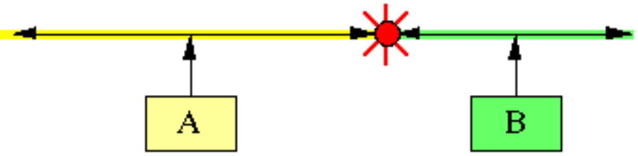

---

## Dlaczego Wi-Fi unika kolizji?

Węzeł radiowy może nie słyszeć innego węzła, choć oba zakłócają odbiornik docelowy. To klasyczny problem **ukrytego terminala**.

Stacja Anie słyszy BStacja Bpunkt dostępowy

---

<!-- .slide: class="section-slide" -->

# CSMA/CD

---

## Wykrywanie kolizji

*Collision Detection* było stosowane w klasycznym, współdzielonym Ethernecie:

1. nasłuchaj medium,
2. rozpocznij transmisję,
3. monitoruj medium podczas nadawania,
4. po wykryciu kolizji przerwij transmisję, wyślij sekwencję zagłuszającą i wykonaj losowy backoff.

---

## CSMA/CD: decyzja po kolizji

  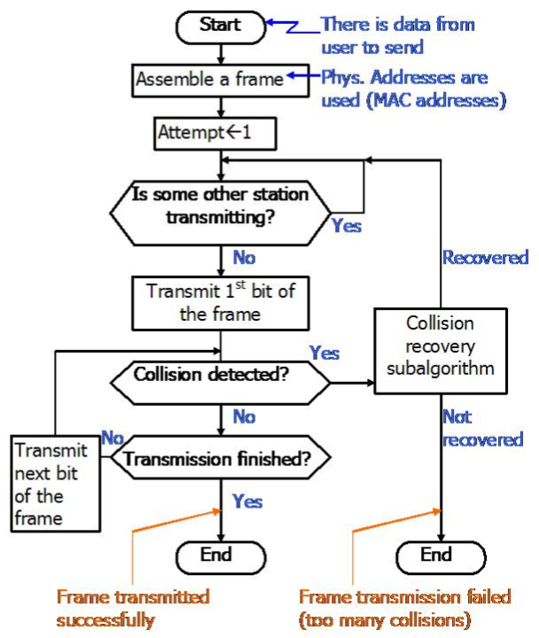
  

---

## Kolizja w CSMA/CD: propagacja

  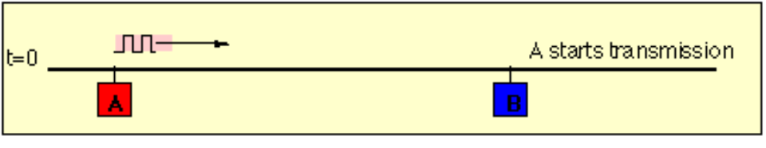
  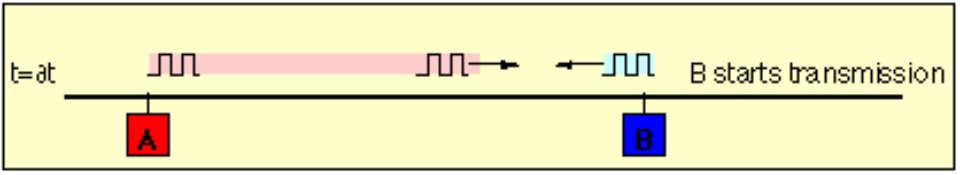
  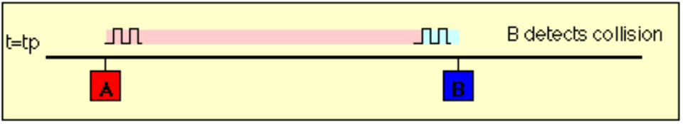
  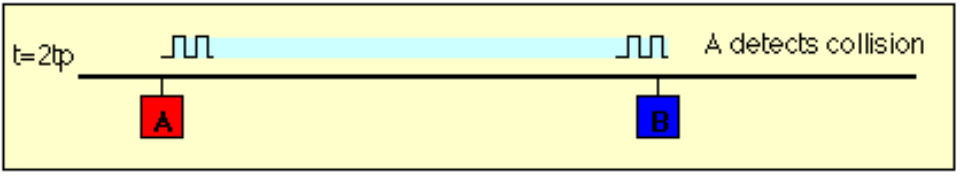

---

## Minimalny rozmiar ramki

Nadawca musi jeszcze transmitować, kiedy ewentualny sygnał kolizji zdąży do niego wrócić z najdalszego punktu sieci. Z tego wynika minimalny rozmiar ramki Ethernetu.

---

## CSMA/CD a współczesny Ethernet

- CSMA/CD było potrzebne przy współdzielonym, półdupleksowym medium.
- Dzisiejszy Ethernet przełączany jest zwykle pełnodupleksowy.
- W takim połączeniu nie ma współdzielonego kanału między dwoma końcami, więc kolizje nie występują.

---

## Porównanie

  
<strong>ALOHA</strong>nadaj, potem reaguj proste systemy radiowe

  
<strong>CSMA</strong>nasłuchaj przed nadaniem współdzielone LAN

  
<strong>CSMA/CA</strong>staraj się uniknąć kolizji Wi-Fi

  
<strong>CSMA/CD</strong>wykryj kolizję podczas nadawania historyczny Ethernet współdzielony

---

## Podsumowanie

- Wspólne medium wymaga zasad dostępu.
- ALOHA jest proste, ale mało wydajne przy obciążeniu.
- CSMA zmniejsza liczbę kolizji przez nasłuchiwanie.
- Wi-Fi używa CSMA/CA, a klasyczny Ethernet używał CSMA/CD.
