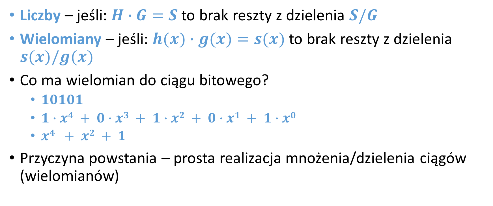
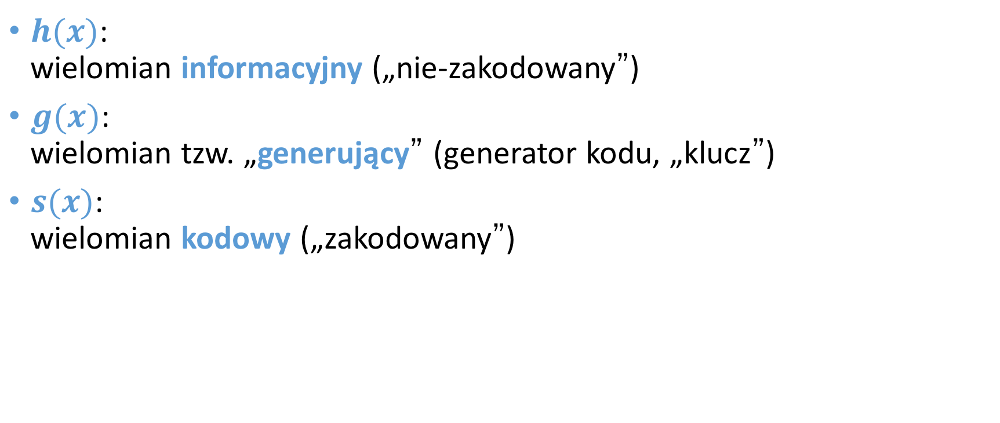
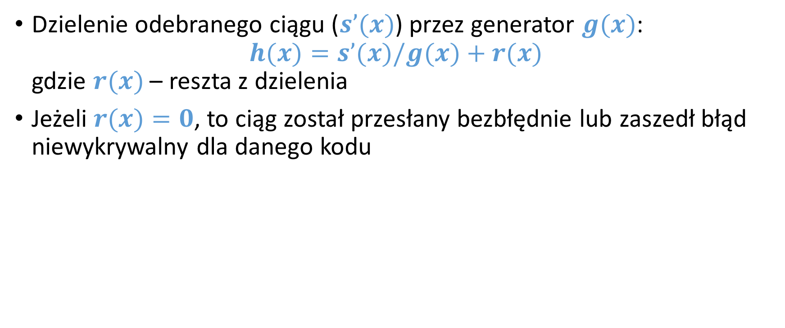

<!-- .slide: class="title-slide" -->

# Kodowanie sygnałów

---

## Plan wykładu

- podstawowe pojęcia kodowe,
- odległość Hamminga i waga kodu,
- maski telekomunikacyjne i właściwości sygnału,
- HDB, kod „2 z 5” oraz kody splotowe.

---

## Kod i słowo kodowe

Kod przypisuje symbolom źródłowym ciągi symboli kodowych. **Słowo kodowe** jest wynikiem takiego przypisania.

Cele kodowania obejmują między innymi reprezentację informacji, synchronizację transmisji oraz wykrywanie i korekcję błędów.

---

## Odległość Hamminga

Odległość Hamminga to liczba pozycji, na których dwa ciągi o tej samej długości się różnią.

`d(10001, 10000) = 1`
`d(00010, 10100) = 3`

Minimalna odległość kodu określa jego zdolność do wykrywania i korekcji błędów.

---

## Waga kodu

Waga słowa kodowego jest liczbą jego niezerowych symboli. Dla kodów binarnych oznacza po prostu liczbę jedynek.

`w(10110100) = 4`

---

## Kody systematyczne i niesystematyczne

**Systematyczne**

Słowo kodowe zawiera wprost bity informacji oraz bity kontrolne.

**Niesystematyczne**

Bity informacji nie są w słowie kodowym bezpośrednio rozpoznawalne; całość jest przekształcona.

---

## Maska telekomunikacyjna

Maska określa dopuszczalne granice parametrów sygnału w czasie, np. amplitudy i narastania zboczy.

Pomiar jest poprawny, gdy rzeczywisty przebieg pozostaje w granicach wyznaczonych przez maskę.

---

## Przykłady masek telekomunikacyjnych

  
  

---

## Pożądane właściwości kodu transmisyjnego

- ograniczone składowe stałe,
- możliwość odzyskania zegara,
- mała liczba długich serii zer lub jedynek,
- odporność na błędy,
- rozsądna nadmiarowość i przepływność.

---

## HDB

Kody HDB (*High Density Bipolar*) zastępują długie serie zer wzorcami zawierającymi impulsy naruszające regułę bipolarności.

Pozwala to utrzymać synchronizację, nawet gdy źródło generuje długi ciąg zer.

---

## Synchronizacja w HDB

000VB000

Wstawione impulsy są rozpoznawalne przez dekoder i nie są traktowane jak zwykłe dane. Dokładny wzorzec zależy od wariantu HDB.

---

## Kod stałowagowy „2 z 5”

- Każde słowo ma pięć bitów, z których dokładnie dwa mają wartość `1`.
- Jest to kod nieliniowy i stałowagowy.
- Nie każde pięciobitowe słowo jest prawidłowe, co umożliwia wykrywanie części błędów.

---

## Odporność na błędy kodu „2 z 5”

Jeżeli podczas transmisji zmieni się pojedynczy bit, liczba jedynek przestaje wynosić dwa. Dekoder może wtedy wykryć błąd, choć nie musi umieć go poprawić.

---

## Koder i dekoder „2 z 5”

**Koder**

Mapuje symbol wejściowy na jedno z dopuszczalnych słów o wadze dwa.

**Dekoder**

Sprawdza wagę słowa, rozpoznaje kod i sygnalizuje nieprawidłową kombinację.

---

## Schematy kodera i dekodera „2 z 5”

  
  

---

## Kod splotowy

Kodowanie splotowe (*convolutional coding*) tworzy ciąg wyjściowy zależny od bieżących i wcześniejszych bitów wejściowych.

Stan kodera jest pamięcią wcześniejszych symboli, a dekodowanie wybiera najbardziej prawdopodobną sekwencję wejściową.

---

## Kodowanie splotowe: intuicja

bit wejściowyrejestr pamięcifunkcje generującebity kodowe

Nadmiarowe bity zwiększają szansę poprawnego odtworzenia informacji po błędach transmisji.

---

## Koder splotowy: realizacja logiczna

  
  
  

---

## Systematyczne a niesystematyczne kodowanie splotowe

- W wersji systematycznej jeden z bitów wyjściowych jest kopią bitu wejściowego.
- W wersji niesystematycznej wszystkie bity wyjściowe są kombinacjami bieżącego i zapamiętanych bitów.
- Oba podejścia są używane zależnie od wymagań systemu i dekodera.

---

## Podsumowanie

- Odległość Hamminga i waga pomagają opisać właściwości kodu.
- Kody transmisyjne mogą wspierać synchronizację i odporność na błędy.
- HDB, „2 z 5” i kody splotowe rozwiązują różne problemy transmisyjne.
