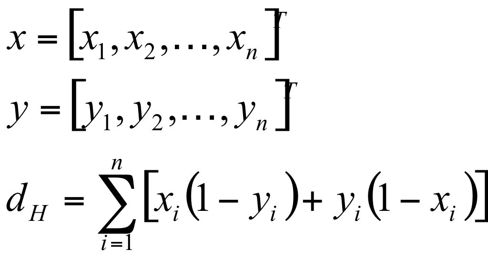
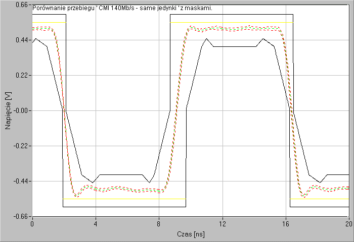
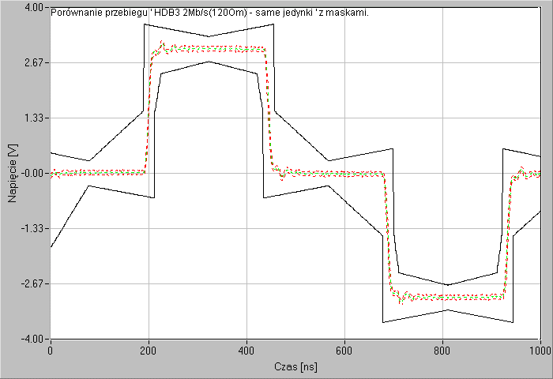
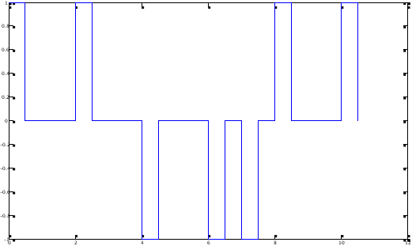
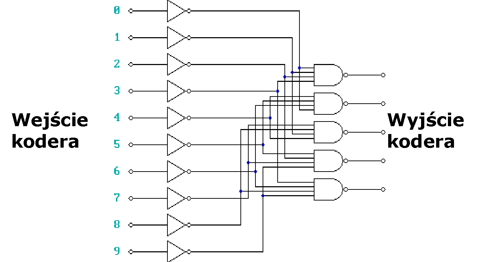
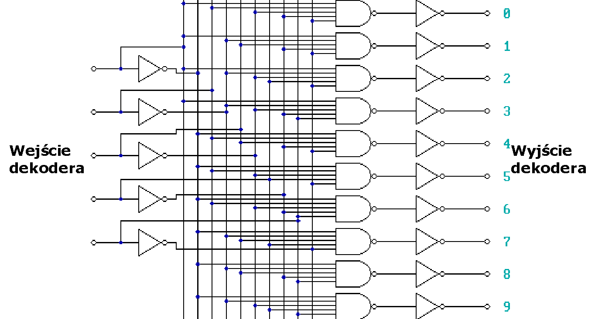
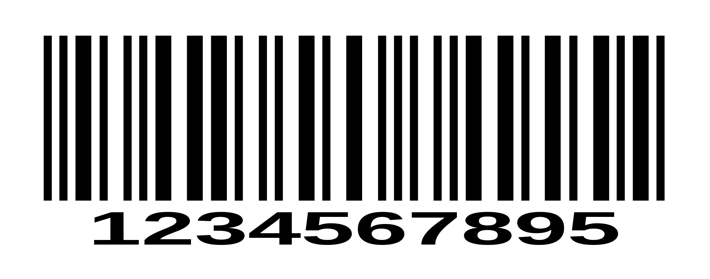

<!-- .slide: class="title-slide" -->

# Kodowanie sygnałów

---

## Plan wykładu

- podstawowe pojęcia kodowe,
- odległość Hamminga i waga kodu,
- maski telekomunikacyjne i właściwości sygnału,
- HDB, kod „2 z 5” oraz kody splotowe.

---

## Kod i słowo kodowe

Kod przypisuje symbolom źródłowym ciągi symboli kodowych. **Słowo kodowe** jest wynikiem takiego przypisania.

Cele kodowania obejmują między innymi reprezentację informacji, synchronizację transmisji oraz wykrywanie i korekcję błędów.

---

## Odległość Hamminga

Odległość Hamminga to liczba pozycji, na których dwa ciągi o tej samej długości się różnią.

`d(10001, 10000) = 1`
`d(00010, 10100) = 3`

Minimalna odległość kodu określa jego zdolność do wykrywania i korekcji błędów.

---

## Wzór na odległość Hamminga

---

## Materiał: odległość Hamminga

<video controls preload="metadata"><source src="media/videos/P02mJhS9qQ4.mp4" type="video/mp4"></video>

---

## Waga kodu

Waga słowa kodowego jest liczbą jego niezerowych symboli. Dla kodów binarnych oznacza po prostu liczbę jedynek.

`w(10110100) = 4`

---

## Kody systematyczne i niesystematyczne

**Systematyczne**

Słowo kodowe zawiera wprost bity informacji oraz bity kontrolne.

**Niesystematyczne**

Bity informacji nie są w słowie kodowym bezpośrednio rozpoznawalne; całość jest przekształcona.

---

## Maska telekomunikacyjna

Maska określa dopuszczalne granice parametrów sygnału w czasie, np. amplitudy i narastania zboczy.

Pomiar jest poprawny, gdy rzeczywisty przebieg pozostaje w granicach wyznaczonych przez maskę.

---

## Maska telekomunikacyjna: PDH 140 Mb/s

  

---

## Maska telekomunikacyjna: PCM 2 Mb/s

  

---

## Pożądane właściwości kodu transmisyjnego

- ograniczone składowe stałe,
- możliwość odzyskania zegara,
- mała liczba długich serii zer lub jedynek,
- odporność na błędy,
- rozsądna nadmiarowość i przepływność.

---

## HDB

Kody HDB (*High Density Bipolar*) zastępują długie serie zer wzorcami zawierającymi impulsy naruszające regułę bipolarności.

Pozwala to utrzymać synchronizację, nawet gdy źródło generuje długi ciąg zer.

---

## Synchronizacja w HDB3

W HDB3 ciąg czterech zer może zostać zastąpiony wzorcem:

AMI (*Alternate Mark Inversion*): kolejne `1` to naprzemienne impulsy `+` i `−`, a `0` to brak impulsu.

<svg class="hdb3-wave-svg" viewBox="0 0 920 260" role="img" aria-label="Przebieg B00V: dwa dodatnie impulsy oddzielone dwoma zerami">
  <line x1="105" y1="165" x2="835" y2="165" class="axis" />
  <line x1="105" y1="55" x2="105" y2="188" class="axis" />
  <text x="65" y="67" class="level">+V</text><text x="73" y="174" class="level">0</text>
  <path d="M105 165 H145 V65 H285 V165 H565 V65 H705 V165 H835" class="wave" />
  <text x="215" y="225" class="label-b">B</text><text x="355" y="225" class="symbol">0</text><text x="495" y="225" class="symbol">0</text><text x="635" y="225" class="label-v">V</text>
</svg>

<strong>B</strong>zwykły impuls zgodny z AMI

<strong>V</strong>impuls o tej samej polaryzacji, celowo naruszający AMI

Ponieważ `B` i `V` mają tu tę samą polaryzację dodatnią, dekoder rozpoznaje `B00V` jako zastąpione zera, a nie dane użytkownika.

---

## Kod stałowagowy „2 z 5”

- Każde słowo ma pięć bitów, z których dokładnie dwa mają wartość `1`.
- Jest to kod nieliniowy i stałowagowy.
- Nie każde pięciobitowe słowo jest prawidłowe, co umożliwia wykrywanie części błędów.

---

## Odporność na błędy kodu „2 z 5”

Jeżeli podczas transmisji zmieni się pojedynczy bit, liczba jedynek przestaje wynosić dwa. Dekoder może wtedy wykryć błąd, choć nie musi umieć go poprawić.

---

## Koder i dekoder „2 z 5”

**Koder**

Mapuje symbol wejściowy na jedno z dopuszczalnych słów o wadze dwa.

**Dekoder**

Sprawdza wagę słowa, rozpoznaje kod i sygnalizuje nieprawidłową kombinację.

---

## Schemat kodera „2 z 5”

  

---

## Schemat dekodera „2 z 5”

  

---

## Zastosowanie kodu „2 z 5”

Jednym z historycznych zastosowań jest kod kreskowy *Interleaved 2 of 5*, używany między innymi do oznaczania przesyłek i produktów.

---

## Kod splotowy

Kodowanie splotowe (*convolutional coding*) tworzy ciąg wyjściowy zależny od bieżących i wcześniejszych bitów wejściowych.

Stan kodera jest pamięcią wcześniejszych symboli, a dekodowanie wybiera najbardziej prawdopodobną sekwencję wejściową.

---

## Kodowanie splotowe: intuicja

  
<strong>Wejście</strong><code>u(k)</code><small>bieżący bit</small>

  
→

  
<strong>Rejestr</strong><code>u(k−1), u(k−2)</code><small>bity z poprzednich chwil</small>

  
→

  
<strong>Generatory</strong><code>XOR mod 2</code><small>wybrane bity są sumowane</small>

  
→

  
<strong>Wyjście</strong><code>c₁(k), c₂(k)</code><small>bity kodowe</small>

Rejestr pamięta wcześniejsze bity, dlatego wynik zależy od bieżącego bitu i historii wejścia. Nadmiarowe bity zwiększają szansę poprawnego odtworzenia informacji po błędach transmisji.

---

## Przykład kodera splotowego `1/2`

  
Rejestr przesuwny: po każdej chwili bit przesuwa się o jedno miejsce w prawo

  

    
<code>u(k)</code><small>bieżący bit</small>
→
    
<code>u(k−1)</code><small>pamięć 1</small>
→
    
<code>u(k−2)</code><small>pamięć 2</small>

  

  

    
<strong>Generator 1</strong>
<code>u(k)</code><b>⊕</b><code>u(k−1)</code><b>⊕</b><code>u(k−2)</code><b>→</b><code>c₁(k)</code>

    
<strong>Generator 2</strong>
<code>u(k)</code><b>⊕</b><code>u(k−2)</code><b>→</b><code>c₂(k)</code>

  

Każdy generator wybiera inne odczepy rejestru. Jeden bit wejściowy tworzy więc dwa bity wyjściowe; stosunek szybkości kodu wynosi `1/2`.

Na następnym slajdzie: dlaczego właśnie dwa różne generatory są użyteczne?

---

## Po co dwa generatory?

Oba generatory obserwują ten sam bieżący bit, ale korzystają z innych odczepów rejestru:

**Generator 1**

Łączy `u(k)`, `u(k−1)` oraz `u(k−2)`.

**Generator 2**

Łączy tylko `u(k)` oraz `u(k−2)`.

Powstają więc dwa różne sprawdzenia tej samej historii wejścia, a nie dwie kopie tego samego bitu.

---

## Co daje nadmiarowość?

Z jednego bitu `u(k)` powstaje para `c₁(k), c₂(k)`. Jeżeli zakłócenie zmieni jeden symbol, drugi symbol oraz zależność od poprzednich chwil pomagają dekoderowi wybrać najbardziej prawdopodobny ciąg wejściowy.

  

u(k)
<strong>1 bit wejściowy</strong>

  
→

  

c₁(k)c₂(k)
<strong>2 bity kodowe</strong>

  
→

  

?
<strong>więcej wskazówek dla dekodera</strong>

Liczba generatorów dobierana jest jako kompromis: większa nadmiarowość zwiększa odporność, ale zajmuje więcej pasma.

---

## Systematyczne a niesystematyczne kodowanie splotowe

- W wersji systematycznej jeden z bitów wyjściowych jest kopią bitu wejściowego.
- W wersji niesystematycznej wszystkie bity wyjściowe są kombinacjami bieżącego i zapamiętanych bitów.
- Oba podejścia są używane zależnie od wymagań systemu i dekodera.

---

## Podsumowanie

- Odległość Hamminga i waga pomagają opisać właściwości kodu.
- Kody transmisyjne mogą wspierać synchronizację i odporność na błędy.
- HDB, „2 z 5” i kody splotowe rozwiązują różne problemy transmisyjne.
