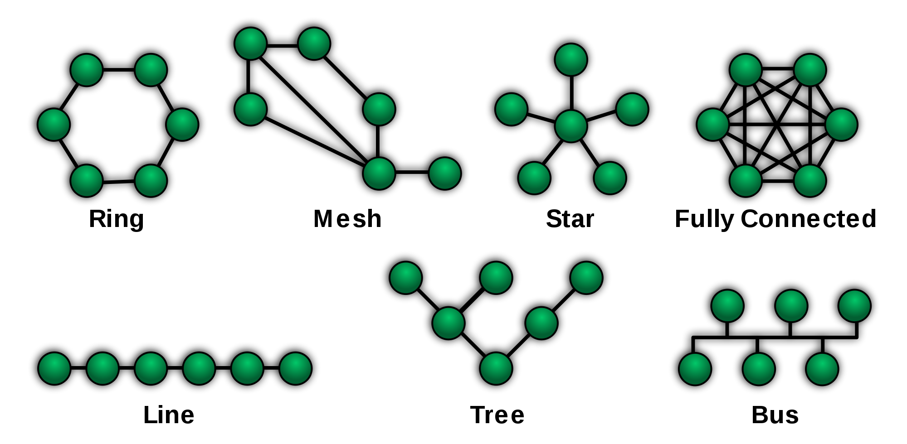
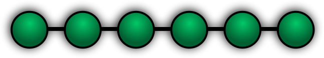
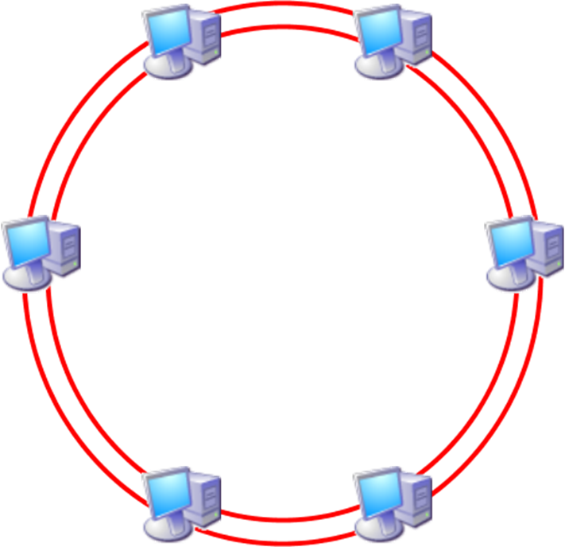
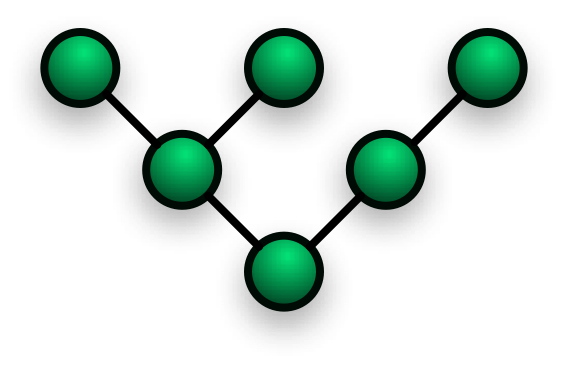
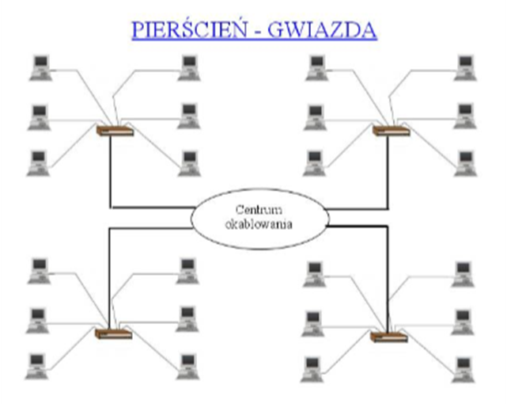
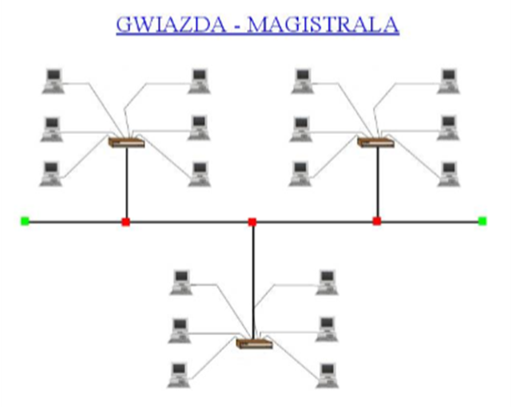
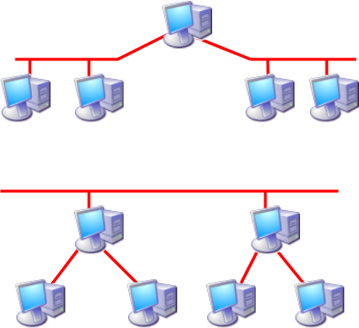
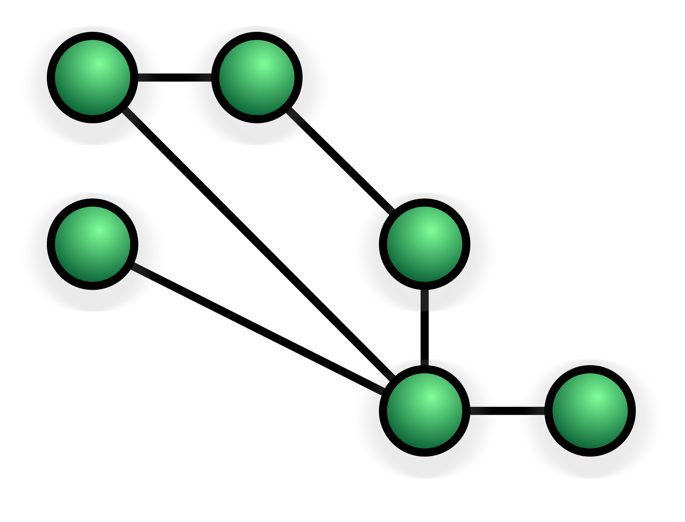
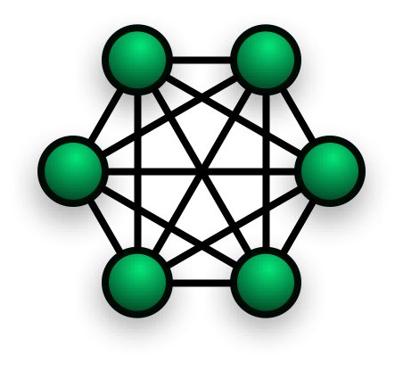

<!-- .slide: class="title-slide" -->

# Podstawowe zagadnienia sieciowe

---

## Plan wykładu

- definicja i funkcje sieci komputerowej,
- rodzaje sieci,
- topologie fizyczne i logiczne,
- topologie: punkt-punkt, magistrala, pierścień, gwiazda, hierarchia i siatka.

---

## Sieć komputerowa

Sieć komputerowa to zbiór połączonych urządzeń, które wymieniają dane i współdzielą zasoby według ustalonych protokołów.

Możliwa jest między innymi komunikacja użytkowników, dostęp do usług, współdzielenie plików, urządzeń i połączenia z Internetem.

---

## Rodzaje sieci

  
<strong>PAN</strong>osobista <small>telefon, zegarek</small>

  
<strong>LAN / WLAN</strong>lokalna <small>dom, biuro, budynek</small>

  
<strong>MAN</strong>miejska <small>kampus, miasto</small>

  
<strong>WAN</strong>rozległa <small>kraje, kontynenty</small>

Podział zależy przede wszystkim od zasięgu i sposobu zarządzania infrastrukturą.

---

<!-- .slide: class="section-slide" -->

# Topologie

---

## Jak czytać topologie?

Topologia opisuje układ połączeń między urządzeniami, a nie tylko ich położenie na rysunku.

---

## Topologia punkt-punkt

  
Węzeł A

dedykowane łącze

Węzeł B

**Łącze stałe**

Zestawione na stałe między tymi samymi dwoma punktami.

**Łącze komutowane**

Tworzone na żądanie przez sieć pośrednią, a po zakończeniu zwalniane.

---

## Topologia liniowa

Węzły są połączone kolejno; urządzenia pośrednie przekazują ruch dalej.

Awaria przewodu albo urządzenia pośredniego może odłączyć dalszą część łańcucha.

---

## Topologia magistrali

  
Wspólny kabel

  
T

T

  
A

B

C

- Wszystkie stacje współdzielą medium.
- Prosta i historycznie tania, ale podatna na kolizje oraz awarię wspólnego segmentu.
- Klasyczny Ethernet koncentryczny był przykładem takiej topologii.

---

## Materiał: magistrala

<video controls preload="metadata" poster="media/image7.png"><source src="media/slide-021-media1.mp4" type="video/mp4"></video>

---

## Topologia pierścienia

  

↻<small>kierunek obiegu danych</small>

  
A

B

C

D

- Dane przechodzą kolejno przez węzły.
- W pierścieniu podwójnym drugi kierunek może zapewniać redundancję.
- Przykładem historycznym był Token Ring.

---

## Materiał: pierścień

<video controls preload="metadata" poster="media/image9.png"><source src="media/slide-024-media2.mp4" type="video/mp4"></video>

---

## Pierścień podwójny

Dwa niezależne kierunki transmisji mogą utrzymać łączność po przerwaniu jednego z odcinków.

---

## Topologia gwiazdy

- Wszystkie urządzenia łączą się z centralnym punktem.
- Awaria pojedynczego kabla zwykle odcina tylko jedno urządzenie.
- Awaria punktu centralnego wpływa na całą sieć.

  

  
Host A

Host B

Host C

  
<strong>Przełącznik</strong><small>punkt centralny</small>

  
Osobne łącze dla każdego hosta

---

## Koncentrator a przełącznik

**Koncentrator (hub)**

Powiela sygnał do wszystkich portów; medium pozostaje współdzielone.

**Przełącznik (switch)**

Kieruje ramkę do właściwego portu; umożliwia równoległą komunikację.

---

## Materiał: gwiazda z koncentratorem

<video controls preload="metadata" poster="media/image12.png"><source src="media/slide-030-media3.mp4" type="video/mp4"></video>

---

## Materiał: gwiazda z przełącznikiem

<video controls preload="metadata" poster="media/image12.png"><source src="media/slide-031-media4.mp4" type="video/mp4"></video>

---

## Materiał: gwiazda z MSAU

<video controls preload="metadata" poster="media/image13.png"><source src="media/slide-032-media5.mp4" type="video/mp4"></video>

---

## Topologie hierarchiczne

- Łączą mniejsze topologie w większą strukturę.
- Przykłady: pierścień-gwiazda, gwiazda-magistrala, magistrala-drzewo.
- Ułatwiają skalowanie, segmentację i zarządzanie dużą siecią.

  
  
  
  

---

## Topologia siatki

**Częściowa siatka**

Tylko najważniejsze węzły mają wiele połączeń. To kompromis między kosztem i redundancją.

**Pełna siatka**

Każdy węzeł łączy się z każdym. Zapewnia wysoką odporność, ale liczba łączy rośnie bardzo szybko.

  
  

---

## Ile łączy ma pełna siatka?

  
c = <i>n² − n</i><small>2</small>

  
<strong>n</strong> liczba węzłów <strong>c</strong> liczba łączy

Każde łącze łączy parę różnych węzłów, a tę samą parę liczymy tylko raz.

<strong>Przykład: 5 węzłów</strong>c = 5 × 4 / 2 = <b>10 łączy</b>

---

## Wybór topologii

Zależy od:

- wymaganej niezawodności,
- liczby urządzeń,
- kosztu okablowania i sprzętu,
- łatwości rozbudowy,
- charakteru ruchu oraz wymagań bezpieczeństwa.

---

## Podsumowanie

- Topologia opisuje organizację połączeń w sieci.
- Gwiazda ze switchem dominuje we współczesnych LAN.
- Hierarchie i siatki zapewniają skalowalność lub redundancję, zależnie od potrzeb.
