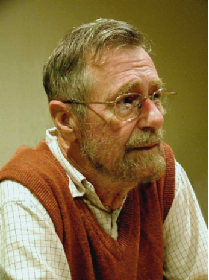

<!-- .slide: class="title-slide" -->

# Routing: algorytmy

---

## Plan wykładu

- routing i rola rutera,
- warstwa sieciowa,
- algorytm Dijkstry,
- Ford-Fulkerson i Dinic,
- związek algorytmów z protokołami warstwy sieciowej.

---

## Routing

Routing to wybór drogi, którą pakiet ma dotrzeć do sieci lub hosta docelowego. Ruter przekazuje pakiety między różnymi sieciami na podstawie tablicy routingu.

---

## Ruter

- odbiera pakiet przez interfejs wejściowy,
- analizuje adres docelowy,
- wybiera trasę zgodnie z tablicą routingu i metryką,
- przekazuje pakiet przez właściwy interfejs wyjściowy.

  
<strong>Sieć A</strong><small>źródłowa</small>

  
→<small>pakiet</small>

  
<strong>R1</strong><small>ruter</small>

  
→

  
<strong>Sieć B</strong><small>tranzytowa</small>

  
→

  
<strong>R2</strong><small>ruter</small>

  
→

  
<strong>Sieć C</strong><small>docelowa</small>

---

## Warstwa sieciowa

Jej zadania obejmują adresowanie logiczne, wybór trasy, przekazywanie pakietów między sieciami oraz obsługę problemów z dostarczeniem danych.

W Internecie kluczowym protokołem tej warstwy jest IP.

---

## Tablica routingu

| Prefiks docelowy | Następny skok | Interfejs | Metryka |
| --- | --- | --- | --- |
| `10.0.0.0/24` | bezpośrednio | LAN 1 | 0 |
| `192.0.2.0/24` | `10.0.0.2` | LAN 1 | 10 |
| domyślna | `10.0.0.1` | WAN | 100 |

Najbardziej szczegółowy pasujący prefiks ma pierwszeństwo.

---

<!-- .slide: class="section-slide" -->

# Algorytm Dijkstry

---

## Edsger W. Dijkstra (1930–2002)

Edsger W. Dijkstra opisał algorytm najkrótszej ścieżki w 1959 roku.

W routingu algorytm ten jest podstawą obliczeń SPF w protokołach stanu łącza, takich jak OSPF.

---

## Problem najkrótszej ścieżki

Mamy graf z nieujemnymi wagami krawędzi. Celem jest znalezienie najkrótszej drogi z węzła źródłowego do pozostałych węzłów.

Wagi mogą oznaczać koszt, opóźnienie, liczbę skoków lub inną metrykę.

---

## Dijkstra: kroki

1. Nadaj źródłu odległość `0`, pozostałym nieskończoność.
2. Wybierz nieodwiedzony węzeł o najmniejszej znanej odległości.
3. Zaktualizuj odległości jego sąsiadów przez relaksację krawędzi.
4. Oznacz węzeł jako odwiedzony.
5. Powtarzaj, aż nie ma osiągalnych węzłów.

---

## Przykład relaksacji

Jeśli bieżący koszt do `A` wynosi `4`, a krawędź `A → B` ma wagę `3`, kandydat dla `B` wynosi `7`.

`dist(B) = min(dist(B), dist(A) + w(A,B))`

---

## Właściwości Dijkstry

- Działa dla wag nieujemnych.
- Po wyborze węzła o najmniejszym koszcie jego wynik jest ostateczny.
- Stanowi podstawę algorytmów stanu łącza, takich jak SPF w OSPF.

---

<!-- .slide: class="section-slide" -->

# Przepływ w sieci

---

## Ford-Fulkerson

Ford-Fulkerson rozwiązuje problem **maksymalnego przepływu**, a nie najkrótszej ścieżki.

- Każda krawędź ma pojemność.
- Szukamy ścieżek powiększających od źródła do ujścia.
- Zwiększamy przepływ o minimalną wolną pojemność na znalezionej ścieżce.

---

## Sieć rezydualna

Po przesłaniu części przepływu pozostaje sieć rezydualna:

- pokazuje, ile przepływu można jeszcze wysłać,
- zawiera też krawędzie wsteczne, pozwalające skorygować wcześniejszą decyzję.

---

## Dinic

Algorytm Dinica usprawnia znajdowanie maksymalnego przepływu:

1. buduje graf poziomów algorytmem BFS,
2. wyszukuje przepływ blokujący w tym grafie,
3. powtarza do braku ścieżki z źródła do ujścia.

---

## Dijkstra, Ford-Fulkerson, Dinic

  
<strong>Dijkstra</strong>najkrótsza ścieżka minimalny koszt dojścia

  
<strong>Ford-Fulkerson</strong>maksymalny przepływ największy możliwy przepływ

  
<strong>Dinic</strong>maksymalny przepływ wydajniejsze przetwarzanie przepływu

---

## Od algorytmów do protokołów

Algorytmy są modelem decyzji trasowania. Protokoły routingu określają, jak rutery wymieniają informacje, budują widok sieci i aktualizują tablice.

---

## Podsumowanie

- Ruter kieruje pakiety według tablicy routingu.
- Dijkstra znajduje najkrótsze ścieżki przy nieujemnych wagach.
- Ford-Fulkerson i Dinic dotyczą maksymalnego przepływu.
- Następny krok to protokoły routingu używane w rzeczywistych sieciach.
