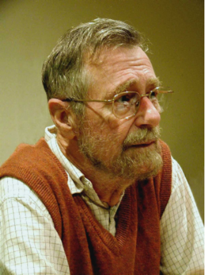

<!-- .slide: class="title-slide" -->

# Routing: algorytmy

---

## Plan wykładu

- routing i rola rutera,
- warstwa sieciowa,
- algorytm Dijkstry,
- Ford-Fulkerson i Dinic,
- związek algorytmów z protokołami warstwy sieciowej.

---

## Routing

Routing to wybór drogi, którą pakiet ma dotrzeć do sieci lub hosta docelowego. Ruter przekazuje pakiety między różnymi sieciami na podstawie tablicy routingu.

---

## Ruter

- odbiera pakiet przez interfejs wejściowy,
- analizuje adres docelowy,
- wybiera trasę zgodnie z tablicą routingu i metryką, czyli liczbowym kosztem trasy,
- przekazuje pakiet przez właściwy interfejs wyjściowy.

  
<strong>Sieć A</strong><small>źródłowa</small>

  
→<small>pakiet</small>

  
<strong>R1</strong><small>ruter</small>

  
→

  
<strong>Sieć B</strong><small>tranzytowa</small>

  
→

  
<strong>R2</strong><small>ruter</small>

  
→

  
<strong>Sieć C</strong><small>docelowa</small>

---

## Warstwa sieciowa

Jej zadania obejmują adresowanie logiczne, wybór trasy, przekazywanie pakietów między sieciami oraz obsługę problemów z dostarczeniem danych.

W Internecie kluczowym protokołem tej warstwy jest IP (*Internet Protocol*).

---

## Ruter: połączenia i realizacja

Ruter przekazuje pakiety pomiędzy odrębnymi sieciami. Zwykle ma co najmniej dwa interfejsy fizyczne, lecz może też obsługiwać kilka sieci logicznych przez jeden interfejs, np. za pomocą VLAN-ów (*Virtual Local Area Network*).

Historyczne sieci ATM (*Asynchronous Transfer Mode*) i Frame Relay rozdzielały taki ruch przez kanały wirtualne: stałe **PVC** (*Permanent Virtual Circuit*) lub zestawiane na żądanie **SVC** (*Switched Virtual Circuit*).

Pierwsze rutery były komputerami ogólnego przeznaczenia. W urządzeniach dużej wydajności przekazywanie pakietów przyspieszają wyspecjalizowane układy; niezawodność poprawiają m.in. pamięć trwała i redundantne zasilanie.

---

## TTL: granica liczby skoków

Każdy ruter zmniejsza pole **TTL** (*Time To Live*) pakietu IPv4 o jeden. Pakiet z wartością `1` nie jest dalej przekazywany; ruter może odesłać komunikat **ICMP Time Exceeded**.

Dzięki temu pakiet nie krąży bez końca, gdy tablice routingu zawierają pętlę.

---

## Trasy statyczne i dynamiczne

- **Statyczna:** administrator wpisuje trasę ręcznie.
- **Dynamiczna:** rutery wymieniają informacje i aktualizują trasy protokołem, np. RIP, OSPF lub IS-IS.
- **Między systemami autonomicznymi:** BGP uwzględnia politykę operatorów i umowy o wymianie ruchu.

IGRP i EIGRP również pojawiały się w oryginalnym wykładzie; są rozwiązaniami związanymi z ekosystemem Cisco.

---

## Wybór trasy i polityka

Metryka trasy może opisywać koszt, opóźnienie lub inne właściwości łącza. Ruter najpierw dopasowuje adres celu do prefiksów w tablicy, a następnie wybiera trasę według reguł protokołu i konfiguracji.

W BGP trasa preferowana przez operatora nie musi być najkrótsza geometrycznie. Znaczenie mają także umowy tranzytowe i peeringowe.

Oprócz adresu celu polityka sieci może uwzględniać obciążenie, jakość usługi lub oznaczenia pakietów, np. DSCP (*Differentiated Services Code Point*). Nie oznacza to, że każdy protokół rutingu analizuje te pola przy każdym pakiecie.

---

## Tablica routingu

| Prefiks docelowy | Następny skok | Interfejs | Metryka |
| --- | --- | --- | --- |
| `10.0.0.0/24` | bezpośrednio | LAN (*Local Area Network*) 1 | 0 |
| `192.0.2.0/24` | `10.0.0.2` | LAN 1 | 10 |
| domyślna | `10.0.0.1` | WAN (*Wide Area Network*) | 100 |

Prefiks określa część adresu należącą do sieci; najbardziej szczegółowy pasujący prefiks ma pierwszeństwo.

---

<!-- .slide: class="section-slide" -->

# Algorytm Dijkstry

---

## Edsger W. Dijkstra (1930–2002)

Edsger W. Dijkstra opisał algorytm najkrótszej ścieżki w 1959 roku.

W routingu algorytm ten jest podstawą obliczeń SPF (*Shortest Path First*) w protokołach stanu łącza, takich jak OSPF (*Open Shortest Path First*).

---

## Problem najkrótszej ścieżki

Mamy graf z nieujemnymi wagami krawędzi. Celem jest znalezienie najkrótszej drogi z węzła źródłowego do pozostałych węzłów.

Wagi mogą oznaczać koszt, opóźnienie, liczbę skoków lub inną metrykę.

---

## Dijkstra: kroki

1. Nadaj źródłu odległość `0`, pozostałym nieskończoność.
2. Wybierz nieodwiedzony węzeł o najmniejszej znanej odległości.
3. Zaktualizuj odległości jego sąsiadów przez relaksację krawędzi.
4. Oznacz węzeł jako odwiedzony.
5. Powtarzaj, aż nie ma osiągalnych węzłów.

---

## Dijkstra: kolejne iteracje

  <svg viewBox="0 0 760 320" role="img" aria-label="Skierowany graf z oryginalnego wykładu: najkrótsza droga s, d, c, t ma wagę 18.">
    <defs><marker id="dijkstra-arrow" markerUnits="userSpaceOnUse" markerWidth="7" markerHeight="7" refX="6" refY="3.5" orient="auto"><path d="M0,0 L6,3.5 L0,7 Z" fill="#9aa9b5"/></marker></defs>
    <g class="algo-edge" data-edge="sd"><line x1="94" y1="148" x2="224" y2="91" marker-end="url(#dijkstra-arrow)"/><text x="150" y="104">9</text></g>
    <g class="algo-edge" data-edge="sa"><line x1="94" y1="172" x2="224" y2="229" marker-end="url(#dijkstra-arrow)"/><text x="150" y="224">15</text></g>
    <g class="algo-edge" data-edge="da"><line x1="250" y1="106" x2="250" y2="214" marker-end="url(#dijkstra-arrow)"/><text x="266" y="163">4</text></g>
    <g class="algo-edge" data-edge="dc"><path d="M276 80 H454" marker-end="url(#dijkstra-arrow)"/><text x="365" y="68">2</text></g>
    <g class="algo-edge" data-edge="cd"><path d="M454 69 Q366 15 278 69" marker-end="url(#dijkstra-arrow)"/><text x="366" y="34">2</text></g>
    <g class="algo-edge" data-edge="ca"><line x1="460" y1="96" x2="276" y2="224" marker-end="url(#dijkstra-arrow)"/><text x="355" y="139">3</text></g>
    <g class="algo-edge" data-edge="ab"><line x1="276" y1="240" x2="454" y2="240" marker-end="url(#dijkstra-arrow)"/><text x="365" y="226">35</text></g>
    <g class="algo-edge" data-edge="ba"><path d="M454 252 Q366 309 278 252" marker-end="url(#dijkstra-arrow)"/><text x="366" y="303">16</text></g>
    <g class="algo-edge" data-edge="bc"><line x1="480" y1="214" x2="480" y2="106" marker-end="url(#dijkstra-arrow)"/><text x="497" y="163">6</text></g>
    <g class="algo-edge" data-edge="ct"><line x1="505" y1="90" x2="664" y2="148" marker-end="url(#dijkstra-arrow)"/><text x="595" y="106">7</text></g>
    <g class="algo-edge" data-edge="tb"><line x1="665" y1="174" x2="505" y2="229" marker-end="url(#dijkstra-arrow)"/><text x="595" y="222">5</text></g>
    <g class="algo-edge" data-edge="bt"><path d="M506 251 Q635 298 676 184" marker-end="url(#dijkstra-arrow)"/><text x="623" y="277">21</text></g>
    <g class="algo-node" data-node="s"><circle cx="70" cy="160" r="25"/><text class="node-name" x="70" y="166">s</text><text class="node-distance" x="70" y="205">0</text></g>
    <g class="algo-node" data-node="d"><circle cx="250" cy="80" r="25"/><text class="node-name" x="250" y="86">d</text><text class="node-distance" x="218" y="129">∞</text></g>
    <g class="algo-node" data-node="a"><circle cx="250" cy="240" r="25"/><text class="node-name" x="250" y="246">a</text><text class="node-distance" x="250" y="285">∞</text></g>
    <g class="algo-node" data-node="c"><circle cx="480" cy="80" r="25"/><text class="node-name" x="480" y="86">c</text><text class="node-distance" x="513" y="129">∞</text></g>
    <g class="algo-node" data-node="b"><circle cx="480" cy="240" r="25"/><text class="node-name" x="480" y="246">b</text><text class="node-distance" x="480" y="285">∞</text></g>
    <g class="algo-node" data-node="t"><circle cx="690" cy="160" r="25"/><text class="node-name" x="690" y="166">t</text><text class="node-distance" x="690" y="205">∞</text></g>
  </svg>
  
<button class="dijkstra-prev" type="button" title="Poprzednia iteracja" aria-label="Poprzednia iteracja">←</button><strong class="dijkstra-caption"></strong><button class="dijkstra-next" type="button" title="Następna iteracja" aria-label="Następna iteracja">→</button>

  
Klikaj strzałki, aby przejść przez kolejne iteracje.

  

---

## Przykład relaksacji

Jeśli bieżący koszt do `A` wynosi `4`, a krawędź `A → B` ma wagę `3`, kandydat dla `B` wynosi `7`.

`dist(B) = min(dist(B), dist(A) + w(A,B))`

`w(A,B)` to **waga krawędzi** prowadzącej z `A` do `B` (w tym przykładzie: `3`).

---

## Właściwości Dijkstry

- Działa dla wag nieujemnych.
- Po wyborze węzła o najmniejszym koszcie jego wynik jest ostateczny.
- Stanowi podstawę algorytmów stanu łącza, takich jak SPF w OSPF.

---

<!-- .slide: class="section-slide" -->

# Przepływ w sieci

---

## Ford-Fulkerson

Ford-Fulkerson rozwiązuje problem **maksymalnego przepływu**, a nie najkrótszej ścieżki.

- Każda krawędź ma pojemność.
- Szukamy ścieżek powiększających od źródła do ujścia.
- Zwiększamy przepływ o minimalną wolną pojemność na znalezionej ścieżce.
- Wartość całkowita jest sumą przepływów przesłanych kolejnymi ścieżkami.

---

## Szukanie ścieżki w przykładzie

W oryginalnym przykładzie zaczynamy w `s` i idziemy do `a`. Jeśli wybierzemy następnie `b`, trafimy w ślepy zaułek: z `b` nie ma drogi do ujścia `t`. Cofamy się więc do `a` i próbujemy przez `d`.

Pierwsza znaleziona ścieżka to `s → a → d → t`. Podczas jednego poszukiwania nie odwiedzamy ponownie węzła, który już leży na tej ścieżce.

---

## Ford-Fulkerson: ścieżka powiększająca

  

  <svg viewBox="0 0 700 270" role="img" aria-label="Sieć przepływowa z węzłami s, a, b, c, d i t.">
    <defs><marker id="flow-arrow" markerUnits="userSpaceOnUse" markerWidth="9" markerHeight="9" refX="7" refY="4.5" orient="auto"><path d="M0,0 L8,4.5 L0,9 Z"/></marker></defs>
    <g class="flow-edge" data-edge="sa"><line x1="88" y1="150" x2="234" y2="82" marker-end="url(#flow-arrow)"/><text class="flow-capacity" data-edge="sa" x="151" y="93">3</text></g>
    <g class="flow-edge" data-edge="sc"><line x1="88" y1="155" x2="234" y2="218" marker-end="url(#flow-arrow)"/><text class="flow-capacity" data-edge="sc" x="151" y="229">5</text></g>
    <g class="flow-edge" data-edge="ca"><line x1="250" y1="194" x2="250" y2="106" marker-end="url(#flow-arrow)"/><text class="flow-capacity" data-edge="ca" x="268" y="156">3</text></g>
    <g class="flow-edge" data-edge="ab"><line x1="275" y1="92" x2="405" y2="92" marker-end="url(#flow-arrow)"/><text class="flow-capacity" data-edge="ab" x="340" y="70">2</text></g>
    <g class="flow-edge" data-edge="ad"><line x1="270" y1="105" x2="410" y2="210" marker-end="url(#flow-arrow)"/><text class="flow-capacity" data-edge="ad" x="323" y="187">7</text></g>
    <g class="flow-edge" data-edge="at"><line x1="275" y1="79" x2="596" y2="145" marker-end="url(#flow-arrow)"/><text class="flow-capacity" data-edge="at" x="478" y="93">2</text></g>
    <g class="flow-edge" data-edge="cd"><line x1="270" y1="220" x2="410" y2="220" marker-end="url(#flow-arrow)"/><text class="flow-capacity" data-edge="cd" x="340" y="246">1</text></g>
    <g class="flow-edge" data-edge="dt"><line x1="445" y1="208" x2="594" y2="158" marker-end="url(#flow-arrow)"/><text class="flow-capacity" data-edge="dt" x="530" y="214">4</text></g>
    <g class="flow-node source"><circle cx="65" cy="155" r="26"/><text x="65" y="162">s</text></g><g class="flow-node"><circle cx="250" cy="80" r="26"/><text x="250" y="87">a</text></g><g class="flow-node"><circle cx="250" cy="220" r="26"/><text x="250" y="227">c</text></g><g class="flow-node"><circle cx="430" cy="80" r="26"/><text x="430" y="87">b</text></g><g class="flow-node"><circle cx="430" cy="220" r="26"/><text x="430" y="227">d</text></g><g class="flow-node sink"><circle cx="620" cy="155" r="26"/><text x="620" y="162">t</text></g>
  </svg>
  

    <strong>Macierz pojemności</strong>
    <small>wiersz: skąd, kolumna: dokąd</small>
    <table class="flow-matrix" aria-label="Macierz pojemności krawędzi">
      <thead><tr><th></th><th>s</th><th>a</th><th>b</th><th>c</th><th>d</th><th>t</th></tr></thead>
      <tbody>
        <tr><th>s</th><td>–</td><td data-edge="sa">3</td><td>0</td><td data-edge="sc">5</td><td>0</td><td>0</td></tr>
        <tr><th>a</th><td>0</td><td>–</td><td data-edge="ab">2</td><td>0</td><td data-edge="ad">7</td><td data-edge="at">2</td></tr>
        <tr><th>b</th><td>0</td><td>0</td><td>–</td><td>0</td><td>0</td><td>0</td></tr>
        <tr><th>c</th><td>0</td><td data-edge="ca">3</td><td>0</td><td>–</td><td data-edge="cd">1</td><td>0</td></tr>
        <tr><th>d</th><td>0</td><td>0</td><td>0</td><td>0</td><td>–</td><td data-edge="dt">4</td></tr>
        <tr><th>t</th><td>0</td><td>0</td><td>0</td><td>0</td><td>0</td><td>–</td></tr>
      </tbody>
    </table>
  

  

  
<button class="flow-prev" type="button" title="Poprzedni krok" aria-label="Poprzedni krok">←</button><strong class="flow-caption"></strong><button class="flow-next" type="button" title="Następny krok" aria-label="Następny krok">→</button>

  

  
Klikaj strzałki, aby śledzić wybór ścieżki i odpowiadające mu pola macierzy.

  

---

## Sieć rezydualna

Po przesłaniu części przepływu pozostaje sieć rezydualna:

- pokazuje, ile przepływu można jeszcze wysłać,
- zawiera też krawędzie wsteczne, pozwalające skorygować wcześniejszą decyzję.

---

## Dinic

Algorytm Dinica usprawnia znajdowanie maksymalnego przepływu:

1. buduje graf poziomów algorytmem BFS,
2. wyszukuje przepływ blokujący w tym grafie,
3. powtarza do braku ścieżki z źródła do ujścia.

**BFS** (*Breadth-First Search*, przeszukiwanie wszerz) odwiedza najpierw wszystkich sąsiadów źródła, potem ich sąsiadów. Dzięki temu przypisuje węzłom kolejne poziomy odległości od źródła.

---

## Dinic: graf poziomów

  <svg viewBox="0 0 760 250" role="img" aria-label="Graf poziomów algorytmu Dinica: źródło, dwa poziomy pośrednie i ujście.">
    <defs><marker id="dinic-arrow" markerUnits="userSpaceOnUse" markerWidth="8" markerHeight="8" refX="6" refY="4" orient="auto"><path d="M0,0 L7,4 L0,8 Z"/></marker></defs>
    <g class="level-band"><rect x="15" y="25" width="105" height="190"/><text x="67" y="48">poziom 0</text></g><g class="level-band"><rect x="175" y="25" width="145" height="190"/><text x="247" y="48">poziom 1</text></g><g class="level-band"><rect x="390" y="25" width="145" height="190"/><text x="462" y="48">poziom 2</text></g><g class="level-band"><rect x="635" y="25" width="105" height="190"/><text x="687" y="48">poziom 3</text></g>
    <g class="dinic-edge" data-edge="sx"><line x1="102" y1="125" x2="210" y2="83" marker-end="url(#dinic-arrow)"/><text class="dinic-capacity" data-edge="sx" x="151" y="91">5</text></g><g class="dinic-edge" data-edge="sy"><line x1="102" y1="125" x2="210" y2="167" marker-end="url(#dinic-arrow)"/><text class="dinic-capacity" data-edge="sy" x="151" y="180">5</text></g><g class="dinic-edge" data-edge="yx"><line x1="250" y1="148" x2="250" y2="103" marker-end="url(#dinic-arrow)"/><text class="dinic-capacity" data-edge="yx" x="270" y="133">5</text></g><g class="dinic-edge" data-edge="xu"><line x1="280" y1="83" x2="425" y2="83" marker-end="url(#dinic-arrow)"/><text class="dinic-capacity" data-edge="xu" x="350" y="70">5</text></g><g class="dinic-edge" data-edge="uy"><line x1="435" y1="94" x2="279" y2="158" marker-end="url(#dinic-arrow)"/><text class="dinic-capacity" data-edge="uy" x="365" y="116">5</text></g><g class="dinic-edge" data-edge="yw"><line x1="280" y1="167" x2="425" y2="167" marker-end="url(#dinic-arrow)"/><text class="dinic-capacity" data-edge="yw" x="350" y="155">5</text></g><g class="dinic-edge" data-edge="ut"><line x1="495" y1="83" x2="652" y2="125" marker-end="url(#dinic-arrow)"/><text class="dinic-capacity" data-edge="ut" x="572" y="91">5</text></g><g class="dinic-edge" data-edge="wt"><line x1="495" y1="167" x2="652" y2="125" marker-end="url(#dinic-arrow)"/><text class="dinic-capacity" data-edge="wt" x="572" y="180">5</text></g>
    <g class="dinic-node"><circle cx="80" cy="125" r="22"/><text x="80" y="132">s</text></g><g class="dinic-node"><circle cx="250" cy="80" r="22"/><text x="250" y="87">x</text></g><g class="dinic-node"><circle cx="250" cy="170" r="22"/><text x="250" y="177">y</text></g><g class="dinic-node"><circle cx="465" cy="80" r="22"/><text x="465" y="87">u</text></g><g class="dinic-node"><circle cx="465" cy="170" r="22"/><text x="465" y="177">w</text></g><g class="dinic-node"><circle cx="680" cy="125" r="22"/><text x="680" y="132">t</text></g>
  </svg>
  
<button class="dinic-prev" type="button" title="Poprzedni krok" aria-label="Poprzedni krok">←</button><strong class="dinic-caption"></strong><button class="dinic-next" type="button" title="Następny krok" aria-label="Następny krok">→</button>

  

  
Klikaj strzałki, aby przejść od grafu poziomów do przepływu blokującego.

  

---

## Dijkstra, Ford-Fulkerson, Dinic

  
<strong>Dijkstra</strong>najkrótsza ścieżka minimalny koszt dojścia

  
<strong>Ford-Fulkerson</strong>maksymalny przepływ największy możliwy przepływ

  
<strong>Dinic</strong>maksymalny przepływ wydajniejsze przetwarzanie przepływu

---

## Od algorytmów do protokołów

Algorytmy są modelem decyzji trasowania. Protokoły routingu określają, jak rutery wymieniają informacje, budują widok sieci i aktualizują tablice.

---

## Historyczny protokół IPX

**IPX** (*Internetwork Packet Exchange*) był protokołem warstwy sieciowej w sieciach Novell NetWare. Zapewniał adresowanie i przekazywanie pakietów między sieciami lokalnymi oraz rozległymi.

Podobnie jak IP, sam IPX nie gwarantował dostarczenia każdego pakietu. W rodzinie protokołów współpracował z **SPX** (*Sequenced Packet Exchange*), który realizował usługi transportowe.

---

## Podsumowanie

- Ruter kieruje pakiety według tablicy routingu.
- Dijkstra znajduje najkrótsze ścieżki przy nieujemnych wagach.
- Ford-Fulkerson i Dinic dotyczą maksymalnego przepływu.
- Następny krok to protokoły routingu używane w rzeczywistych sieciach.
