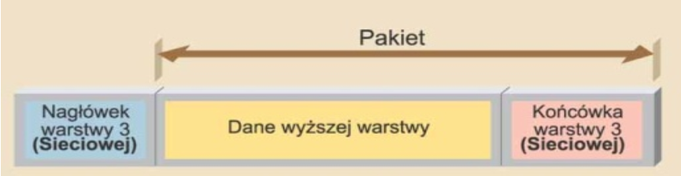
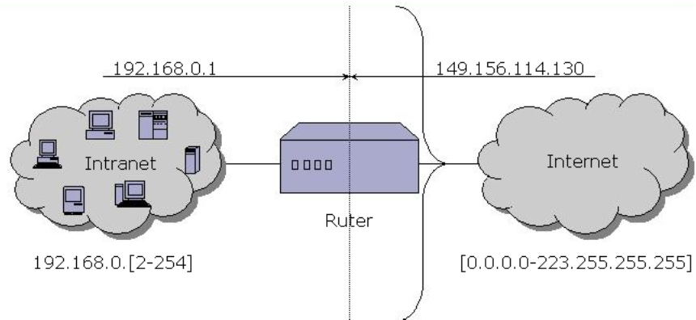

<!-- .slide: class="title-slide" -->

# Routing: protokoły

---

## Plan wykładu

- protokoły i usługi związane z warstwą sieciową,
- IP i jego nagłówek,
- adresacja i konfiguracja hosta,
- DNS,
- BGP oraz routing między systemami autonomicznymi.

---

## Warstwa sieciowa

Warstwa trzecia odpowiada za dostarczanie pakietów między sieciami. Jej podstawowe zadania to adresowanie logiczne, wybór trasy i przekazywanie pakietów.

---

## IPX i IP

**IPX — Internetwork Packet Exchange**

Historyczny protokół sieciowy używany między innymi w środowiskach Novell NetWare.

**IP — Internet Protocol**

Podstawowy protokół warstwy sieciowej Internetu. Współdziała z TCP (*Transmission Control Protocol*), UDP (*User Datagram Protocol*) oraz protokołami routingu.

---

## Zadania IP

- adresowanie źródła i celu,
- przesyłanie datagramów między sieciami,
- przekazywanie pakietów przez rutery,
- fragmentacja w IPv4, gdy jest konieczna.

IP jest protokołem bezpołączeniowym i nie gwarantuje dostarczenia, kolejności ani braku duplikatów.

---

## Nagłówek IPv4

Wersja / IHLDSCP / ECNDługość całkowitaIdentyfikacjaFlagi / przesunięcie fragmentuTTLProtokółSuma kontrolna

Następnie występują adresy źródłowy i docelowy, opcje oraz dane.

---

## IHL, DSCP i ECN

**IHL — Internet Header Length**

Określa długość nagłówka IP.

**DSCP — Differentiated Services Code Point**

Oznacza priorytet obsługi pakietu.

**ECN — Explicit Congestion Notification**

Pozwala sygnalizować przeciążenie bez odrzucenia pakietu.

---

## Ważne pola IPv4

- **TTL — Time To Live:** ogranicza liczbę skoków; każdy ruter zmniejsza go o jeden.
- **Protocol:** wskazuje protokół wyższej warstwy, np. TCP, UDP albo ICMP (*Internet Control Message Protocol*).
- **Fragmentation:** identyfikacja, flagi i przesunięcie umożliwiają składanie fragmentów.
- **Header checksum:** kontroluje poprawność samego nagłówka.

---

## Fragmentacja

Jeżeli pakiet IPv4 jest większy niż MTU (*Maximum Transmission Unit*, największa jednostka danych przenoszona przez łącze) i nie ma ustawionej flagi *Don't Fragment*, może zostać podzielony na fragmenty. Fragmenty są składane przez host docelowy.

W praktyce preferuje się unikanie fragmentacji przez odpowiedni dobór MTU i mechanizmy *Path MTU Discovery*.

---

## Adres IPv4

Adres IPv4 ma 32 bity, zwykle zapisane jako cztery oktety, np. `192.0.2.25`.

Maska albo długość prefiksu rozdziela część sieciową i hosta, np. `192.0.2.0/24`.

---

## Konfiguracja hosta

Host potrzebuje zwykle:

- adresu IP i prefiksu,
- bramy domyślnej,
- serwerów DNS,
- opcjonalnie informacji przekazanych automatycznie przez DHCP (*Dynamic Host Configuration Protocol*).

---

## Brama domyślna

Gdy cel nie należy do lokalnej sieci, host wysyła pakiet do bramy domyślnej. Ruter podejmuje dalszą decyzję trasowania.

HostBrama domyślnaInternetSieć docelowa

---

## DNS

DNS (*Domain Name System*) tłumaczy nazwy, np. `example.org`, na adresy IP i przechowuje inne rekordy związane z domeną.

**Resolver**

Przyjmuje zapytanie od hosta i szuka odpowiedzi.

**Serwery autorytatywne**

Utrzymują rekordy dla konkretnych stref DNS.

---

## Rekordy DNS

  
<strong>A / AAAA</strong>adres IPv4 / IPv6 hosta

  
<strong>CNAME</strong>alias nazwy

  
<strong>MX</strong>serwer pocztowy domeny

  
<strong>NS</strong>serwer autorytatywny strefy

  
<strong>TXT</strong>dane tekstowe, m.in. polityki domeny

---

<!-- .slide: class="section-slide" -->

# BGP

---

## System autonomiczny

System autonomiczny (AS) to zbiór sieci zarządzanych według wspólnej polityki routingu. Internet jest siecią wielu AS-ów.

Każdy AS ma numer ASN (*Autonomous System Number*).

---

## BGP-4

*Border Gateway Protocol* jest protokołem routingu między systemami autonomicznymi. Działa nad TCP, ale steruje wyborem tras między AS-ami.

- wymienia osiągalne prefiksy,
- korzysta z polityki, nie tylko najkrótszego kosztu,
- używa atrybutów tras: `AS_PATH` (lista przebytych AS-ów), `LOCAL_PREF` (lokalna preferencja) i `MED` (*Multi-Exit Discriminator*, sugestia preferowanego wejścia do sąsiedniego AS).

---

## Dlaczego BGP jest inne?

Routing wewnątrz jednej organizacji może optymalizować metrykę techniczną. Routing między operatorami i dużymi sieciami musi uwzględniać także biznesową politykę tranzytu (odpłatnego przenoszenia ruchu), peeringu (bezpośredniej wymiany ruchu) i bezpieczeństwa.

---

## Podsumowanie

- IP dostarcza datagramy między sieciami, ale nie gwarantuje ich dostarczenia.
- Prawidłowa konfiguracja hosta obejmuje adres, prefiks, bramę i DNS.
- DNS mapuje nazwy na dane potrzebne aplikacjom.
- BGP kieruje ruchem między systemami autonomicznymi Internetu.
