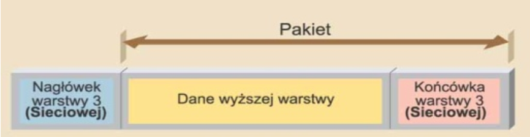
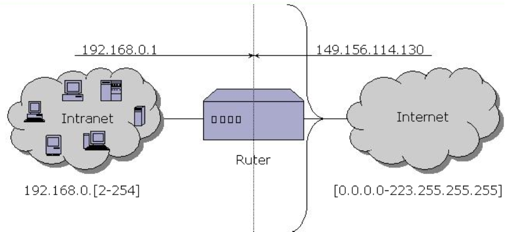

<!-- .slide: class="title-slide" -->

# Routing: protokoły

---

## Plan wykładu

- protokoły i usługi związane z warstwą sieciową,
- IP i jego nagłówek,
- adresacja, NAT i konfiguracja hosta,
- przykłady datagramów i ćwiczenia,
- DNS,
- BGP oraz routing między systemami autonomicznymi.

---

## Warstwa sieciowa

Warstwa trzecia odpowiada za dostarczanie pakietów między sieciami. Jej podstawowe zadania to adresowanie logiczne, wybór trasy i przekazywanie pakietów.

---

## IPX i IP

**IPX — Internetwork Packet Exchange**

Historyczny protokół sieciowy używany między innymi w środowiskach Novell NetWare.

**IP — Internet Protocol**

Podstawowy protokół warstwy sieciowej Internetu. Współdziała z TCP (*Transmission Control Protocol*), UDP (*User Datagram Protocol*) oraz protokołami routingu.

---

## Zadania IP

- adresowanie źródła i celu,
- przesyłanie datagramów między sieciami,
- przekazywanie pakietów przez rutery,
- fragmentacja w IPv4, gdy jest konieczna.

IP jest protokołem bezpołączeniowym i nie gwarantuje dostarczenia, kolejności ani braku duplikatów.

---

## Nagłówek IPv4

<svg class="ipv4-header-svg" viewBox="0 0 1120 520" role="img" aria-label="Schemat nagłówka IPv4 z polami ułożonymi w wierszach po 32 bity.">
  
  <text class="bit" x="100" y="28">0</text><text class="bit" x="1095" y="28" text-anchor="end">31 bit</text>
  <g transform="translate(100,42)">
    <rect class="field" x="0" y="0" width="125" height="66" fill="#dceef2"/><text class="label" x="62" y="29" text-anchor="middle">Wersja</text><text class="detail" x="62" y="51" text-anchor="middle">4 bity</text>
    <rect class="field" x="125" y="0" width="125" height="66" fill="#dceef2"/><text class="label" x="187" y="29" text-anchor="middle">IHL</text><text class="detail" x="187" y="51" text-anchor="middle">4 bity</text>
    <rect class="field" x="250" y="0" width="188" height="66" fill="#e7edf6"/><text class="label" x="344" y="29" text-anchor="middle">DSCP</text><text class="detail" x="344" y="51" text-anchor="middle">6 bitów</text>
    <rect class="field" x="438" y="0" width="63" height="66" fill="#e7edf6"/><text class="label" x="469" y="29" text-anchor="middle">ECN</text><text class="detail" x="469" y="51" text-anchor="middle">2</text>
    <rect class="field" x="501" y="0" width="499" height="66" fill="#f7e8d1"/><text class="label" x="750" y="29" text-anchor="middle">Długość całkowita</text><text class="detail" x="750" y="51" text-anchor="middle">16 bitów: rozmiar całego pakietu</text>
    <rect class="field" x="0" y="66" width="500" height="66" fill="#eff0df"/><text class="label" x="250" y="95" text-anchor="middle">Identyfikacja</text><text class="detail" x="250" y="117" text-anchor="middle">16 bitów: łączy fragmenty jednego pakietu</text>
    <rect class="field" x="500" y="66" width="94" height="66" fill="#eff0df"/><text class="label" x="547" y="95" text-anchor="middle">Flagi</text><text class="detail" x="547" y="117" text-anchor="middle">3</text>
    <rect class="field" x="594" y="66" width="406" height="66" fill="#eff0df"/><text class="label" x="797" y="95" text-anchor="middle">Przesunięcie fragmentu</text><text class="detail" x="797" y="117" text-anchor="middle">13 bitów</text>
    <rect class="field" x="0" y="132" width="250" height="66" fill="#f7e8d1"/><text class="label" x="125" y="161" text-anchor="middle">TTL</text><text class="detail" x="125" y="183" text-anchor="middle">8 bitów: liczba skoków</text>
    <rect class="field" x="250" y="132" width="250" height="66" fill="#f7e8d1"/><text class="label" x="375" y="161" text-anchor="middle">Protokół</text><text class="detail" x="375" y="183" text-anchor="middle">8 bitów: TCP, UDP, ICMP</text>
    <rect class="field" x="500" y="132" width="500" height="66" fill="#f7e8d1"/><text class="label" x="750" y="161" text-anchor="middle">Suma kontrolna nagłówka</text><text class="detail" x="750" y="183" text-anchor="middle">16 bitów</text>
    <rect class="field" x="0" y="198" width="1000" height="60" fill="#dceef2"/><text class="label" x="500" y="234" text-anchor="middle">Adres źródłowy · 32 bity</text>
    <rect class="field" x="0" y="258" width="1000" height="60" fill="#e7edf6"/><text class="label" x="500" y="294" text-anchor="middle">Adres docelowy · 32 bity</text>
    <rect class="field" x="0" y="318" width="1000" height="54" fill="#f1f4f5" stroke-dasharray="7 5"/><text class="label" x="500" y="351" text-anchor="middle">Opcje i dopełnienie · występują tylko, gdy IHL &gt; 5</text>
  </g>
</svg>

Każdy z trzech pierwszych wierszy ma 32 bity. Za nagłówkiem występują dane pakietu.

---

## IHL, DSCP i ECN

**IHL — Internet Header Length**

Określa długość nagłówka IP.

**DSCP — Differentiated Services Code Point**

Oznacza priorytet obsługi pakietu.

**ECN — Explicit Congestion Notification**

Pozwala sygnalizować przeciążenie bez odrzucenia pakietu.

---

## Ważne pola IPv4

- **TTL — Time To Live:** ogranicza liczbę skoków; każdy ruter zmniejsza go o jeden.
- **Protocol:** wskazuje protokół wyższej warstwy, np. TCP, UDP albo ICMP (*Internet Control Message Protocol*).
- **Fragmentation:** identyfikacja, flagi i przesunięcie umożliwiają składanie fragmentów.
- **Header checksum:** kontroluje poprawność samego nagłówka.

---

## Fragmentacja

Jeżeli pakiet IPv4 jest większy niż MTU (*Maximum Transmission Unit*, największa jednostka danych przenoszona przez łącze) i nie ma ustawionej flagi *Don't Fragment*, może zostać podzielony na fragmenty. Fragmenty są składane przez host docelowy.

W praktyce preferuje się unikanie fragmentacji przez odpowiedni dobór MTU i mechanizmy *Path MTU Discovery*.

---

## Najprostszy datagram IPv4

Nagłówek bez opcji ma **5 słów po 32 bity**, czyli `20 bajtów` (`IHL = 5`).

Przykład z oryginalnego wykładu: `1 bajt` danych daje **21 bajtów** długości całkowitej. Flaga `MF = 0` i przesunięcie `0` oznaczają, że nie jest to fragment większego datagramu.

---

## Fragmentacja: pakiet wejściowy

Przykład obliczeniowy: nagłówek `20 B` i dane `2000 B` dają datagram o długości **2020 B**. Łącze ma `MTU = 1500 B`.

Każdy fragment potrzebuje własnego nagłówka. W pierwszym zmieści się najwyżej `1480 B` danych; wielkość fragmentów oprócz ostatniego musi być wielokrotnością `8 B`.

---

## Fragmentacja: dwa fragmenty

| Fragment | Dane | Długość całkowita | Offset | MF |
| --- | ---: | ---: | ---: | ---: |
| Pierwszy | `1480 B` | `1500 B` | `0` | `1` |
| Drugi | `520 B` | `540 B` | `185` | `0` |

Offset liczymy w blokach po `8 B`: `1480 / 8 = 185`. Oba fragmenty mają tę samą wartość pola **Identyfikacja**, aby odbiorca mógł je złożyć.

---

## Datagram z opcjami

Pole `IHL` podaje długość nagłówka w słowach po `4 B`. Dla `IHL = 6` nagłówek ma `24 B`: standardowe `20 B` oraz `4 B` opcji lub dopełnienia.

**Długość całkowita** nadal obejmuje nagłówek i dane. Przy `100 B` danych wynosi więc `124 B`.

---

## Kolejność transmisji IPv4

Oktety nagłówka i danych są przesyłane kolejno, od pierwszego do ostatniego. W obrębie nagłówka najpierw występują pola widoczne po lewej stronie pierwszego wiersza schematu, potem następne wiersze; po nagłówku następują dane.

To kolejność bajtów w datagramie, nie kolejność odwiedzania ruterów.

---

## Adres IPv4

Adres IPv4 ma 32 bity, zwykle zapisane jako cztery oktety, np. `192.0.2.25`.

Maska albo długość prefiksu rozdziela część sieciową i hosta, np. `192.0.2.0/24`.

---

## Adres sieci i maska

Adres sieci powstaje przez bitowe **AND** adresu hosta i maski. Na przykład:

`192.168.0.2 AND 255.255.255.0 = 192.168.0.0`

Maskę `/24` można zapisać jako `255.255.255.0` albo binarnie `11111111.11111111.11111111.00000000`.

---

## Adres sieci i rozgłoszeniowy

Dla `192.168.0.0/24` adres sieci to `192.168.0.0`, a adres rozgłoszeniowy to `192.168.0.255`. Typowe adresy hostów mieszczą się od `192.168.0.1` do `192.168.0.254`.

Przy `h` bitach hosta klasyczna podsieć z adresem rozgłoszeniowym ma `2ʰ − 2` użytecznych adresów. Dla `/24` jest to `254`; dla `/30` są to `2`. Łącza `/31` stanowią osobny przypadek.

---

## Dawny podział adresów na klasy

W historycznym adresowaniu klasowym pierwszy oktet wskazywał klasę: **A** (`0–127`), **B** (`128–191`) albo **C** (`192–223`). Klasa **D** (`224–239`) służy do multicastu.

Współczesne sieci używają prefiksów CIDR, np. `/23` lub `/27`; z samego pierwszego oktetu nie wolno wywnioskować aktualnej maski podsieci.

---

## Adresy prywatne i pętla zwrotna

- `10.0.0.0/8`, `172.16.0.0/12` i `192.168.0.0/16` to zakresy prywatne IPv4.
- Nie są trasowane przez publiczny Internet bez translacji lub tunelowania.
- `127.0.0.1` jest adresem pętli zwrotnej (*loopback*): pakiety zostają na własnym hoście.

---

## NAT i maskarada

NAT (*Network Address Translation*) zmienia adresy w pakietach na granicy sieci. W typowym domowym wariancie wiele hostów z adresami prywatnymi korzysta z jednego publicznego adresu IPv4.

Ruter rozróżnia połączenia także po numerach portów. Ten wariant bywa nazywany **maskaradą** lub PAT (*Port Address Translation*).

---

## Ćwiczenia: konfiguracja hosta (1/3)

Dla każdego przypadku sprawdź, czy adres sieci i brama pasują do adresu IP oraz maski hosta.

1. IP `192.168.0.2`, maska `255.255.255.0`, sieć `192.168.0.0`, brama `172.16.0.1`.
2. IP `192.168.0.2`, maska `255.255.255.0`, sieć `172.16.0.0`, brama `192.168.0.1`.

---

## Ćwiczenia: konfiguracja hosta (2/3)

3. IP `192.168.0.2`, maska `255.255.255.128`, sieć `192.168.0.0`, brama `192.168.0.129`.

4. IP `192.168.0.2`, maska `255.0.0.0`, sieć `192.168.0.0`, brama `192.168.0.1`.

---

## Ćwiczenia: konfiguracja hosta (3/3)

5. IP `127.0.0.1`, maska `255.255.255.0`, sieć `192.168.0.0`, brama `192.168.0.1`.

6. IP `192.168.0.2`, maska `255.255.255.0`, sieć `192.168.0.0`, brama `192.168.0.1`.

---

## Ćwiczenia: odpowiedzi

- **1:** brama jest poza siecią hosta.
- **2:** podany adres sieci jest błędny.
- **3:** brama `192.168.0.129` jest w drugiej podsieci `/25`.
- **4:** przy masce `/8` adres sieci powinien być `192.0.0.0`.
- **5:** `127.0.0.1` jest adresem pętli zwrotnej.
- **6:** konfiguracja jest spójna.

---

## Konfiguracja hosta

Host potrzebuje zwykle:

- adresu IP i prefiksu,
- bramy domyślnej,
- serwerów DNS,
- opcjonalnie informacji przekazanych automatycznie przez DHCP (*Dynamic Host Configuration Protocol*).

---

## Brama domyślna

Gdy cel nie należy do lokalnej sieci, host wysyła pakiet do bramy domyślnej. Ruter podejmuje dalszą decyzję trasowania.

<svg class="gateway-path-svg" viewBox="0 0 1160 360" role="img" aria-label="Pakiet z hosta A przechodzi przez bramę domyślną, rutery Internetu i dociera do hosta B w sieci docelowej.">
  <defs><marker id="gateway-arrow" markerWidth="6" markerHeight="6" refX="5" refY="3" orient="auto"><path d="M0,0 L5,3 L0,6 Z" fill="#176b80"/></marker></defs>
  <rect x="35" y="62" width="250" height="230" rx="4" fill="#e7edf6" stroke="#176b80" stroke-width="2"/>
  <text x="160" y="92" text-anchor="middle" class="zone">Twoja sieć lokalna</text><text x="160" y="115" text-anchor="middle" class="subzone">192.0.2.0 / 24</text>
  <rect x="70" y="150" width="120" height="72" rx="4" class="host-box"/><text x="130" y="180" text-anchor="middle" class="node-title">Host A</text><text x="130" y="205" text-anchor="middle" class="node-detail">192.0.2.25</text>
  <rect x="220" y="140" width="60" height="95" rx="4" class="router-box"/><text x="250" y="173" text-anchor="middle" class="node-title">R1</text><text x="250" y="197" text-anchor="middle" class="node-detail">brama</text><text x="250" y="216" text-anchor="middle" class="node-detail">192.0.2.1</text>
  <line x1="190" y1="186" x2="219" y2="186" class="gateway-link" marker-end="url(#gateway-arrow)"/>
  <line x1="285" y1="186" x2="425" y2="186" class="gateway-link" marker-end="url(#gateway-arrow)"/><text x="355" y="150" text-anchor="middle" class="link-label route-label">cel poza siecią</text><text x="355" y="168" text-anchor="middle" class="link-label route-label">198.51.100.10</text>
  <rect x="430" y="115" width="295" height="142" rx="4" fill="#eff0df" stroke="#4f7f3d" stroke-width="2"/>
  <text x="577" y="151" text-anchor="middle" class="zone">Internet</text><text x="577" y="176" text-anchor="middle" class="subzone">kolejne rutery wybierają trasę</text>
  <circle cx="500" cy="211" r="24" class="router-circle"/><text x="500" y="218" text-anchor="middle" class="node-title">R2</text>
  <circle cx="650" cy="211" r="24" class="router-circle"/><text x="650" y="218" text-anchor="middle" class="node-title">R3</text>
  <line x1="525" y1="211" x2="624" y2="211" class="gateway-link" marker-end="url(#gateway-arrow)"/>
  <line x1="725" y1="186" x2="865" y2="186" class="gateway-link" marker-end="url(#gateway-arrow)"/>
  <rect x="870" y="62" width="255" height="230" rx="4" fill="#f7e8d1" stroke="#b35c2e" stroke-width="2"/>
  <text x="997" y="92" text-anchor="middle" class="zone">Sieć docelowa</text><text x="997" y="115" text-anchor="middle" class="subzone">198.51.100.0 / 24</text>
  <rect x="875" y="140" width="60" height="95" rx="4" class="router-box"/><text x="905" y="173" text-anchor="middle" class="node-title">R4</text><text x="905" y="197" text-anchor="middle" class="node-detail">ruter</text>
  <rect x="965" y="150" width="140" height="72" rx="4" class="host-box"/><text x="1035" y="180" text-anchor="middle" class="node-title">Host B</text><text x="1035" y="205" text-anchor="middle" class="node-detail">198.51.100.10</text>
  <line x1="935" y1="186" x2="964" y2="186" class="gateway-link" marker-end="url(#gateway-arrow)"/>
</svg>

Brama domyślna to pierwszy ruter używany wtedy, gdy adres docelowy nie należy do lokalnej sieci hosta.

---

## Przykład: sieć lokalna, ruter i Internet

---

## DNS

DNS (*Domain Name System*) tłumaczy nazwy, np. `example.org`, na adresy IP i przechowuje inne rekordy związane z domeną.

Warto rozdzielić **rejestrację domeny i publikację jej rekordów** od **bieżącego odpytywania DNS** przez urządzenia szukające adresu. To powiązane, ale różne czynności.

**Resolver**

Przyjmuje zapytanie od hosta i szuka odpowiedzi.

**Serwery autorytatywne**

Utrzymują rekordy dla konkretnych stref DNS.

---

## Rekordy DNS

  
<strong>A / AAAA</strong>adres IPv4 / IPv6 hosta

  
<strong>CNAME</strong>alias nazwy

  
<strong>MX</strong>serwer pocztowy domeny

  
<strong>NS</strong>serwer autorytatywny strefy

  
<strong>TXT</strong>dane tekstowe, m.in. polityki domeny

---

<!-- .slide: class="section-slide" -->

# BGP (Border Gateway Protocol)

---

## System autonomiczny

System autonomiczny (AS) to zbiór sieci zarządzanych według wspólnej polityki routingu. Internet jest siecią wielu AS-ów.

Każdy AS ma numer ASN (*Autonomous System Number*).

---

## BGP-4

*Border Gateway Protocol* (BGP) jest protokołem routingu między systemami autonomicznymi. Działa nad TCP, ale steruje wyborem tras między AS-ami.

- wymienia osiągalne prefiksy,
- korzysta z polityki, nie tylko najkrótszego kosztu,
- używa atrybutów tras: `AS_PATH` (lista przebytych AS-ów), `LOCAL_PREF` (lokalna preferencja) i `MED` (*Multi-Exit Discriminator*, sugestia preferowanego wejścia do sąsiedniego AS).

---

## Jak BGP wymienia trasy?

Sąsiednie rutery BGP utrzymują sesję **TCP na porcie 179**. Dzięki TCP protokół nie musi sam realizować retransmisji, potwierdzeń i porządkowania komunikatów.

Ogłoszenie trasy zawiera prefiks oraz atrybuty. `AS_PATH` pokazuje listę przebytych systemów autonomicznych; ruter odrzuca trasę zawierającą jego własny AS, co pomaga zapobiegać pętlom między AS-ami.

---

## Prefiksy i agregacja w BGP

BGP-4 wymienia prefiksy bezklasowe, np. `203.0.113.0/24`. Sąsiednie prefiksy można czasem ogłosić jako jeden większy prefiks, jeżeli prowadzą tą samą drogą i polityka na to pozwala.

Agregacja zmniejsza liczbę wpisów w tablicach routingu. Nie wynika automatycznie z samej ciągłości adresów: ogłoszenie musi odpowiadać rzeczywistej osiągalności sieci.

---

## Dlaczego BGP jest inne?

Routing wewnątrz jednej organizacji może optymalizować metrykę techniczną. Routing między operatorami i dużymi sieciami musi uwzględniać także biznesową politykę tranzytu (odpłatnego przenoszenia ruchu), peeringu (bezpośredniej wymiany ruchu) i bezpieczeństwa.

---

## Podsumowanie

- IP dostarcza datagramy między sieciami, ale nie gwarantuje ich dostarczenia.
- Prawidłowa konfiguracja hosta obejmuje adres, prefiks, bramę i DNS.
- DNS mapuje nazwy na dane potrzebne aplikacjom.
- BGP kieruje ruchem między systemami autonomicznymi Internetu.
